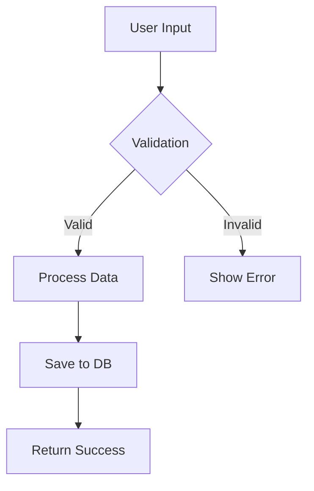
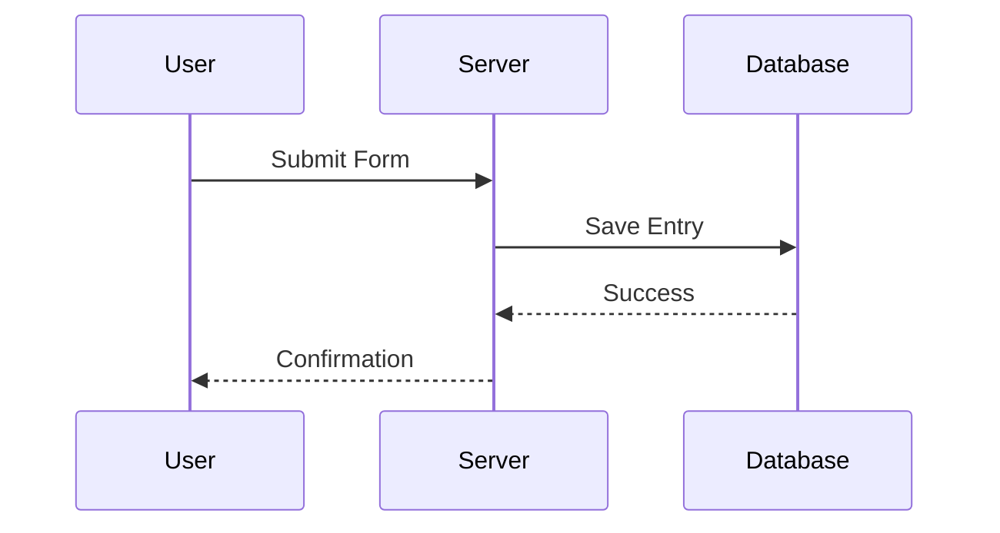
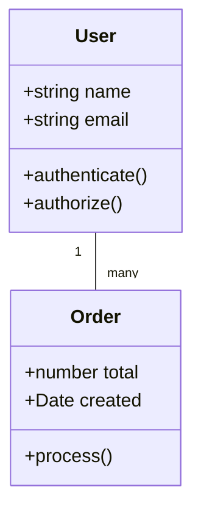
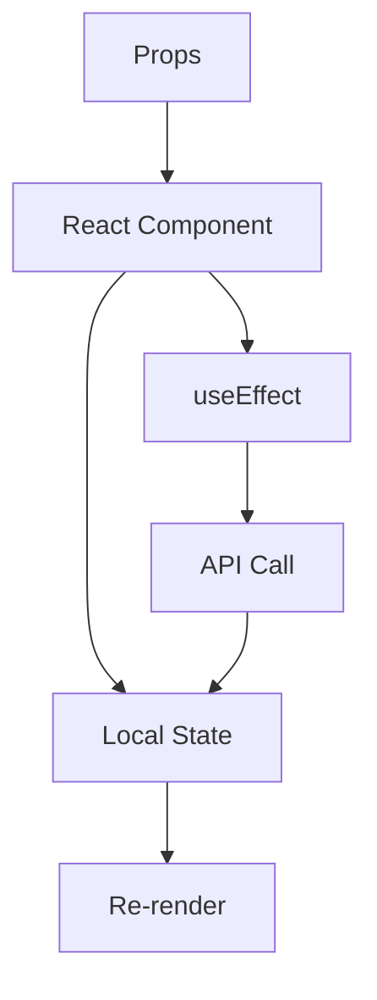

# 📊 Architectural Diagrams Guide

## 🎯 Por que Diagramas?

Diagramas clarificam:
- **Flow control**: Como requests fluem pelo sistema
- **Data lineage**: Rastreamento de dados de input a output  
- **Component interaction**: Como partes se comunicam
- **System structure**: Visão geral da arquitetura

## 🔧 Tipos de Diagrama Mermaid

### 1. Flowchart - Lógica e Sequências


### 2. Sequence Diagram - Interações


### 3. Class Diagram - Estrutura de Objetos


## 🚀 Template para GENERIC


### React Component Flow Template


## 💡 Prompts Efetivos

### Flow Control
```
"Show me how requests go from the controller to the database in a Mermaid flowchart"
```

### Data Lineage  
```
"Trace this userData variable from where it enters to where it ends up, using Mermaid sequence diagram"
```

### Component Structure
```
"Give me a component-level view of this generic service using Mermaid class diagram"
```

## 🔧 Setup Mermaid Extension

1. Abra **Extensions tab** no Cursor
2. Busque por **"Mermaid"**
3. Instale a extensão oficial
4. Agora você pode preview diagramas diretamente

## 🎯 Best Practices

### DO
✅ Start with specific, small diagrams
✅ Use appropriate diagram type for the purpose
✅ Include start and end points clearly
✅ Ask Cursor to explain complex flows
✅ Iterate and refine diagrams

### DON'T  
❌ Try to diagram everything at once
❌ Mix different abstraction levels
❌ Create overly complex single diagrams
❌ Forget to specify Mermaid format
❌ Include irrelevant implementation details
