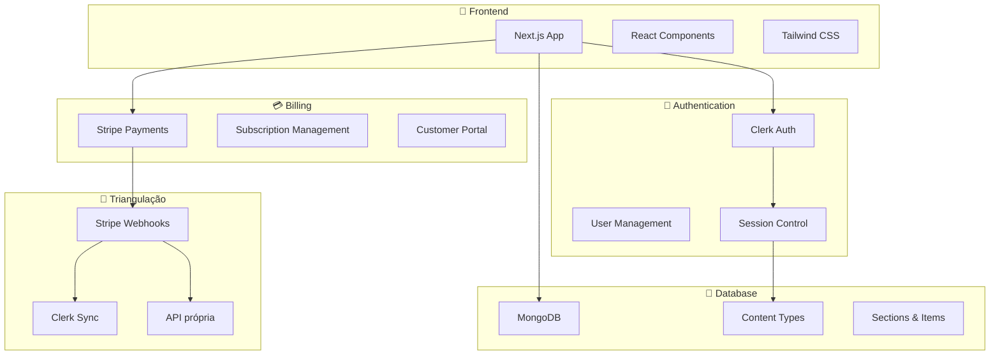
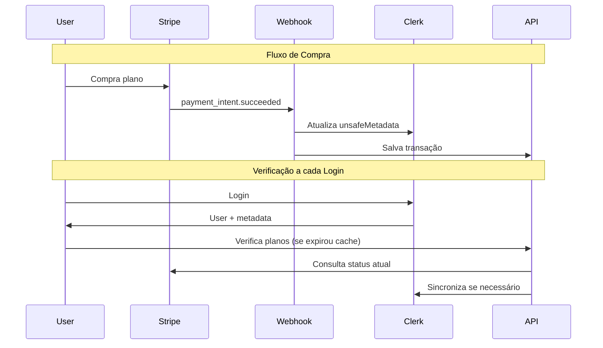

# 🚀 Dashboard Engine - Plataforma SaaS Completa

> **Simplicidade por padrão, poder como opção.**

Solução completa para criar dashboards, CRMs, ERPs e CMSs com autenticação (Clerk) e billing (Stripe) integrados nativamente.

## 🎯 O que é o Dashboard Engine?

Uma plataforma **white-label** que permite criar qualquer tipo de sistema de gestão:

- **📊 Dashboards** - Painéis de controle personalizados
- **👥 CRMs** - Gestão de relacionamento com clientes
- **🏢 ERPs** - Sistemas de gestão empresarial
- **📝 CMSs** - Sistemas de gerenciamento de conteúdo

### 🔥 Diferenciais

- ✅ **Auth + Billing Nativo** - Clerk + Stripe integrados com triangulação automática
- ✅ **Zero Config** - Configure em minutos, não em dias
- ✅ **Escalável** - Suporta de MVP até enterprise
- ✅ **Flexível** - Content Types customizados para qualquer negócio
- ✅ **Moderno** - Next.js 15, React 19, Tailwind CSS

## 🏗️ Arquitetura Geral



## 📁 Estrutura do Projeto

```
📦 dashboard-engine/
├── 🎨 dashboard/          # Aplicação principal Next.js
│   ├── app/              # App Router do Next.js
│   │   ├── api/          # API Routes
│   │   │   ├── billing/  # 💳 APIs de billing e triangulação
│   │   │   ├── content-types/ # 📋 CRUD Content Types
│   │   │   └── sections/ # 📂 CRUD Sections
│   │   ├── dashboard/    # 🔐 Área autenticada
│   │   └── page.js      # 🏠 Landing page com auth
│   ├── components/       # 🧩 Componentes React
│   ├── hooks/           # 🎣 Custom hooks (verificação de planos)
│   └── lib/             # 🛠️ Utilitários e conexões
├── 🚀 netlify/functions/ # ⚡ Serverless functions
│   └── stripe-webhook.js # 🔄 Webhook de triangulação
├── 🤖 ai/               # 🧠 Sistema de IA para automação
└── 📚 docs/             # 📖 Documentação completa
```

## 🚀 Quick Start

### 1. **Clone e Configure**

```bash
# Clone o repositório
git clone <repo-url>
cd dashboard

# Instale dependências
npm install

# Configure variáveis de ambiente
cp .env.example .env.local
```

### 2. **Configure Integrações**

```env
# 🔐 Clerk (Auth)
NEXT_PUBLIC_CLERK_PUBLISHABLE_KEY=pk_test_...
CLERK_SECRET_KEY=sk_test_...

# 💳 Stripe (Billing)
STRIPE_SECRET_KEY=sk_test_...
STRIPE_WEBHOOK_SECRET=whsec_...

# 💾 Database
MONGODB_URI=mongodb://localhost:27017/dashboard_engine

# 🔒 Security
INTERNAL_API_KEY=your_secret_key
ADMIN_EXPORT_KEY=your_admin_key
```

### 3. **Execute o Projeto**

```bash
npm run dev
```

🎉 **Pronto!** Acesse http://localhost:3000

## 💎 Funcionalidades Principais

### 🔐 **Autenticação Completa (Clerk)**

- Login/Signup com modal
- Gestão de usuários
- Sessions persistentes
- Profile management

### 💳 **Billing Integrado (Stripe)**

- Checkout automatizado
- Customer Portal nativo
- Subscriptions e pagamentos únicos
- Triangulação automática de dados

### 🔄 **Sistema de Triangulação**

**Problema resolvido:** Manter Clerk, Stripe e sua API sincronizados.



**Benefícios:**

- ✅ Cache inteligente (24h)
- ✅ Verificação offline
- ✅ Sincronização automática
- ✅ Histórico completo

### 📋 **Content Management**

**Content Types:** Defina estruturas de dados

```javascript
{
  name: "Produtos",
  fields: {
    name: { type: "string", required: true },
    price: { type: "number" },
    category: { type: "select", options: ["A", "B"] }
  }
}
```

**Sections:** Organize em menus

```javascript
{
  name: "Catálogo",
  contentType: "produtos",
  slug: "catalogo"
}
```

**Items:** Dados reais

```javascript
{
  sectionId: "catalogo",
  data: {
    name: "MacBook Pro",
    price: 15000,
    category: "A"
  }
}
```

## 🔧 Como Usar

### **Frontend - Hook de Verificação**

```jsx
import { useUserPlanVerification } from "../hooks/useUserPlanVerification";

function MyComponent() {
  const {
    plans, // { active: ['cupido'], expired: [] }
    isVerifying, // Verificando agora?
    hasPlan, // (planId) => boolean
    manualVerify, // Força verificação
  } = useUserPlanVerification();

  // Controle de acesso baseado em planos
  if (hasPlan("premium")) {
    return <PremiumFeature />;
  }

  return <BasicFeature />;
}
```

### **Backend - APIs Disponíveis**

```javascript
// Verificação de planos
GET /api/billing/verify-user

// Exportação de dados
GET /api/billing/export-users?key=admin_key

// Content Types
GET/POST /api/content-types

// Sections
GET/POST /api/sections
```

### **Webhooks - Stripe Integration**

```javascript
// Eventos processados automaticamente:
-checkout.session.completed - // Compra concluída
  invoice.paid - // Subscription paga
  customer.subscription.deleted; // Cancelamento
```

## 📊 Casos de Uso

### 🏪 **E-commerce Dashboard**

```javascript
// Content Types
Products, Orders, Customers, Inventory

// Sections
"Produtos" → "Catálogo"
"Pedidos" → "Vendas"
"Clientes" → "CRM"
```

### 🏢 **ERP Empresarial**

```javascript
// Content Types
Employees, Projects, Tasks, Invoices

// Sections
"Funcionários" → "RH"
"Projetos" → "Gestão"
"Faturas" → "Financeiro"
```

### 📝 **CMS de Conteúdo**

```javascript
// Content Types
Articles, Pages, Media, Categories

// Sections
"Artigos" → "Blog"
"Páginas" → "Site"
"Mídia" → "Biblioteca"
```

## 🤖 Sistema de IA (Bonus)

Inclui sistema completo de IA para automação:

```bash
cd ai/
npm install
node bin/setup.js  # Configuração automatizada
```

**Funcionalidades:**

- ✅ Setup automatizado de projetos
- ✅ Geração de código
- ✅ Otimização de performance
- ✅ Análise visual de UI

## 📚 Documentação

| Documento                                        | Descrição                |
| ------------------------------------------------ | ------------------------ |
| [🔄 Triangulação](docs/billing-triangulation.md) | Sistema Clerk+Stripe+API |
| [🏗️ Arquitetura](docs/architecture.md)           | Conceitos e fluxos       |
| [🚀 Desenvolvimento](docs/development-guide.md)  | Guia para devs           |
| [📖 API Reference](docs/api-reference.md)        | Endpoints disponíveis    |

## 🔮 Roadmap

### ✅ **MVP (Implementado)**

- Auth com Clerk
- Billing com Stripe
- Triangulação automática
- Content Types & Sections
- Dashboard responsivo

### 🚧 **Em Breve**

- [ ] Multi-tenancy
- [ ] API Keys para integrações
- [ ] Views avançadas (Kanban, Calendar)
- [ ] Webhooks de saída
- [ ] Analytics dashboard

### 🌟 **Futuro**

- [ ] Marketplace de templates
- [ ] White-label completo
- [ ] Mobile app
- [ ] IA integrada

## 🤝 Contribuição

1. **Fork** o projeto
2. **Clone** seu fork
3. **Crie** uma branch: `git checkout -b feature/nova-funcionalidade`
4. **Commit** suas mudanças: `git commit -m 'Adiciona funcionalidade X'`
5. **Push** para a branch: `git push origin feature/nova-funcionalidade`
6. **Abra** um Pull Request

## 📄 Licença

MIT License - Use como quiser!

## 💖 Feito com Amor

Este projeto foi criado para democratizar a criação de dashboards e sistemas de gestão.

**Se te ajudou, deixe uma ⭐!**

---

### 🚀 Começe Agora

```bash
git clone <repo-url>
cd dashboard
npm install
cp .env.example .env.local
# Configure suas variáveis de ambiente
npm run dev
```

**🎉 Em 5 minutos você terá um dashboard completo rodando!**
