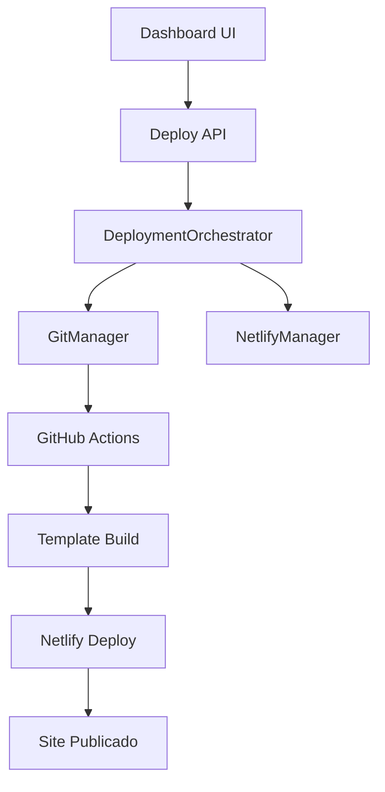

# 🚀 DashMaster.PRO - Plataforma de Gestão de Conteúdo e Deploy Automatizado

## 🧱 Introdução

O **DashMaster.PRO** é uma plataforma modular de gestão de conteúdo e experiências digitais. Como "um CMS dos CMSs", ele permite a construção de Workspaces altamente personalizados com Seções, Tipos de Conteúdo, Lógicas de Acesso, Addons e Serviços.

**🆕 NOVA FUNCIONALIDADE:** Sistema de Deploy Automatizado com GitHub Actions que transforma qualquer workspace em um site estático publicado na Netlify com um clique!

## ✨ Principais Funcionalidades

### 🏗️ CMS Headless Avançado

- **Workspaces isolados** com multi-tenancy
- **Sections e Content Types** personalizáveis
- **API pública robusta** com autenticação por API Keys
- **Importador inteligente** com suporte a múltiplas estratégias (Singleton, Coleção, Agrupamento)
- **Sistema de permissões** granular com super admin

### 🚀 Deploy Automatizado (NOVO!)

- **Deploy com um clique** para Netlify
- **GitHub Actions integrado** para build automatizado
- **Múltiplos templates** suportados
- **Rate limiting e segurança** avançada
- **Monitoramento em tempo real** do progresso do deploy

### 🛡️ Segurança e Performance

- **Rate limiting** implementado em todas as APIs críticas
- **Sanitização de inputs** para prevenir ataques
- **Criptografia de tokens** sensíveis
- **Autenticação centralizada** com Clerk.dev

## 🌌 Arquitetura do Sistema

### Entidades Centrais

| Entidade      | Função                                                     |
| ------------- | ---------------------------------------------------------- |
| `Workspace`   | Espaço isolado de projeto e conteúdo                       |
| `Section`     | Conjunto lógico de Itens baseados em ContentTypes          |
| `ContentType` | Estrutura de campos e addons de uma Section                |
| `ViewType`    | Modo de visualização/interação (Form, Table, Kanban, etc)  |
| `Addon`       | Extensão modular para campos, lógicas ou automações        |
| `Item`        | Entrada de dado criada por usuários dentro de uma Section  |
| `Pipeline`    | Automação de eventos e ações                               |
| `Plan`        | Modelo de cobrança e controle de acesso                    |
| `Role`        | Regras de acesso vinculadas ao usuário dentro do Workspace |
| `Deployment`  | **NOVO:** Registro de deploy automatizado                  |

### Integrações Confirmadas

- **Clerk.dev**: autenticação e gerenciamento de usuários
- **Stripe**: cobrança por plano ou addon
- **Cloudinary**: upload e gerenciamento de mídia
- **MongoDB Atlas**: banco de dados principal
- **Next.js 15 (App Router)** + **Node.js 22**
- **DeckEngine Pipelines**
- **🆕 GitHub Actions**: CI/CD automatizado
- **🆕 Netlify**: hosting de sites estáticos

## 🎯 Sistema de Deploy Automatizado

### Como Funciona

1. **Usuário inicia deploy** no dashboard
2. **Sistema cria repositório privado** no GitHub do usuário
3. **GitHub Action** clona template e faz build
4. **Deploy automático** para Netlify
5. **Monitoramento em tempo real** do progresso

### Fluxo Técnico



### Recursos de Segurança

- **🛡️ Rate Limiting**: 5 deploys por hora por usuário
- **🔐 Sanitização de Inputs**: Validação rigorosa de tokens e URLs
- **🔑 Secrets Management**: Tokens criptografados no GitHub
- **📊 Monitoramento**: Logs detalhados de cada etapa

## 🧩 Addons Disponíveis

### Addons de Campo (`field_addon`)

- `TextField` - Campos de texto simples
- `ImageField` - Upload e gestão de imagens
- `ChoiceField` - Campos de seleção
- `MultiTextField` - Campos de texto múltiplo
- `AI_TextGeneratorField` - **NOVO:** Geração de conteúdo com IA

### Addons de Comportamento (`behavior_addon`)

- `SlugField` - Geração automática de slugs
- `VersionControl` - Controle de versões

### Addons de Acesso e Cobrança

- `AccessAddon` - Controle de visibilidade por Role/Plan
- `PurchaseAddonButton` - Botões de compra integrados

## 👁️ ViewTypes Suportados

| Nome           | Finalidade                                                |
| -------------- | --------------------------------------------------------- |
| `FormStepView` | Interface de formulário dividido em etapas                |
| `TableView`    | Interface administrativa de listagem e edição             |
| `GroupingView` | **NOVO:** Visualização em cards para conteúdo heterogêneo |
| `CheckoutView` | Tela de compra de planos                                  |
| `PDFView`      | Geração e exportação de conteúdo                          |

## 🌐 API Pública Headless

### ✅ Implementação Completa (Janeiro 2025)

A API pública permite consumo de conteúdo por aplicações externas:

- **Endpoint Principal:** `/api/public/content`
- **Autenticação:** API Keys com Bearer token
- **Rate Limiting:** Implementado por chave
- **Cache Inteligente:** Otimizado para performance
- **Multi-workspace:** Suporte completo

### Exemplo de Uso

```javascript
const response = await fetch("https://dashmaster.pro/api/public/content", {
  headers: {
    Authorization: "Bearer YOUR_API_KEY",
  },
});
const content = await response.json();
```

## 🏠 Casos de Uso Validados

### 1. Gatsby Landing Page ✅

Migração bem-sucedida de site estático para headless:

- **100% dinâmico** com eliminação de conteúdo estático
- **Performance otimizada** com cache implementado
- **Atualizações instantâneas** sem rebuild

### 2. Deploy Automatizado ✅

Sistema de "fábrica de sites" implementado:

- **Template padrão** baseado no gatsby-landing
- **Repositórios customizados** suportados
- **GitHub Actions** para build/deploy automatizado

## 🔧 Desenvolvimento e Deploy

### Estrutura do Projeto

```
dash/
├── dashboard/              # Next.js dashboard
│   ├── app/               # App Router (Next.js 15)
│   ├── lib/               # Bibliotecas e utilitários
│   ├── components/        # Componentes React
│   └── scripts/           # Scripts de manutenção
├── deckEngine/            # Engine de pipelines
├── gatsby-landing/        # Template base para sites
└── templates/             # Templates de deploy
```

### Scripts Disponíveis

```bash
# Desenvolvimento
npm run dash:dev          # Iniciar dashboard
npm run dash:build        # Build do dashboard

# Manutenção
npm run cleanup-orphans   # Limpar dados órfãos
npm run cleanup-deploys   # Limpar deploys fantasmas
npm run superadmin        # Gerar chave de super admin
```

### Configuração de Ambiente

```env
# Dashboard (.env.local)
MONGODB_URI=mongodb://...
NEXT_PUBLIC_CLERK_PUBLISHABLE_KEY=pk_...
CLERK_SECRET_KEY=sk_...
CLERK_ENCRYPTION_KEY=generated_key
NEXT_PUBLIC_APP_URL=https://dashmaster.pro

# Opcional para deploy
GITHUB_TOKEN=ghp_...
NETLIFY_TOKEN=nfp_...
```

## 🛡️ Segurança Implementada

### Rate Limiting por Tipo de API

- **Deploy APIs**: 5 requests/hora
- **Webhook APIs**: 30 requests/minuto
- **API Pública**: 100 requests/minuto
- **APIs Gerais**: 60 requests/minuto

### Sanitização de Inputs

- **Nomes de site**: Apenas alfanuméricos e hífens
- **URLs de repositório**: Validação de formato GitHub
- **Tokens de API**: Limpeza e validação de formato
- **Inputs gerais**: Remoção de scripts maliciosos

### Autenticação e Autorização

- **Clerk.dev** para gestão de usuários
- **Super Admin** com chaves de ativação
- **Workspaces isolados** com multi-tenancy
- **API Keys** com escopo por workspace

## 📊 Monitoramento e Analytics

### Métricas de Deploy

- Taxa de sucesso de deploys
- Tempo médio de build
- Erros mais comuns
- Sites ativos por workspace

### Logs Estruturados

- Cada deploy tem ID único
- Status em tempo real
- Histórico completo
- Debugging facilitado

## 🔄 Arquitetura de Deploy com GitHub Actions

### Template Repository

O sistema usa um template base que pode ser:

- **Template padrão**: `dashmaster-gatsby-template`
- **Repositório customizado**: URL fornecida pelo usuário

### GitHub Action Workflow

```yaml
name: Deploy DashMaster.PRO Site to Netlify
on:
  workflow_dispatch:
    inputs:
      workspace_id: { required: true }
      site_name: { required: true }
      template_repo: { required: true }
```

### Estrutura do Repositório Final

```
user-site-repo/
├── website/           # Arquivos estáticos (Netlify)
├── content/          # Backup do conteúdo
├── source/           # Código fonte (opcional)
└── README.md         # Documentação
```

## 🚀 Próximos Passos

### Funcionalidades Planejadas

- **Command Palette** (Ctrl+K) para navegação rápida
- **Brand.json** para personalização automática com IA
- **Templates adicionais** (Next.js, Nuxt, Astro)
- **Marketplace de addons** e templates
- **Analytics avançado** de sites publicados

### Melhorias Técnicas

- **WebSockets** para atualizações em tempo real
- **CDN** para assets estáticos
- **Multi-idioma** para internacionalização
- **Performance** otimizações contínuas

## 📌 Status de Implementação

### ✅ Funcionalidades Implementadas

- ✅ CMS Headless com API pública
- ✅ Sistema de deploy automatizado
- ✅ GitHub Actions integration
- ✅ Rate limiting e segurança
- ✅ Importador inteligente
- ✅ Multi-tenancy com workspaces
- ✅ Autenticação e autorização completa

### 🔄 Em Desenvolvimento

- 🔄 Command Palette (Ctrl+K)
- 🔄 Personalização com IA
- 🔄 Templates adicionais
- 🔄 Analytics avançado

### 📋 Planejado

- 📋 Marketplace de addons
- 📋 Versão mobile/tablet
- 📋 Integração com mais provedores de hosting

## 📞 Suporte e Contribuição

### Links Importantes

- **Dashboard**: [https://dashmaster.pro](https://dashmaster.pro)
- **Documentação**: `/docs/` (neste repositório)
- **Template Base**: `gatsby-landing/`

### Estrutura de Documentação

- `/docs/dashboard/` - Guias do dashboard
- `/docs/regras-de-negocio/` - Lógica de negócio
- `DEBUGGING-GUIDE.md` - Guia de depuração
- `seguranca-performance.md` - Segurança e performance

---

**DashMaster.PRO** - Transformando ideias em sites publicados com a velocidade da IA e a confiabilidade de uma arquitetura enterprise.

_Versão: 2.0 - Janeiro 2025_
