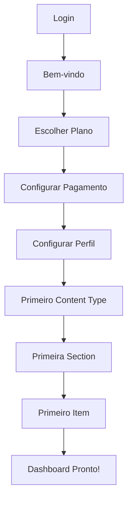

# 🚀 **PLANEJAMENTO ESTRATÉGICO - DASHBOARD ENGINE**

## 🎯 **SITUAÇÃO ATUAL vs FUTURO**

### **✅ IMPLEMENTADO (MVP Funcional)**

- ✅ Content Types com addons dinâmicos
- ✅ Sections com items
- ✅ Sistema de triangulação Clerk + Stripe + API
- ✅ Dashboard com estatísticas
- ✅ Users list com filtros
- ✅ Billing integrado
- ✅ Limites de planos básicos

### **🔄 EM DESENVOLVIMENTO**

- 🔄 Tabela moderna para items (ModernItemsTable)
- 🔄 Verificações de deleção em cascata
- 🔄 Validações de regras de negócio

---

## 🌟 **PLANEJAMENTO: ONBOARDING VISUAL**

### **Conceito: Wizard de Configuração Inicial**



### **Etapas do Onboarding:**

#### **1. Boas-vindas + Explicação**

- 🎥 Video explicativo (2-3 min)
- 📊 Preview do que pode ser criado
- 🎯 Casos de uso comuns (Blog, E-commerce, Portfolio)

#### **2. Setup de Planos (Visual)**

- 💳 Seletor visual de planos
- 📊 Comparação interativa de recursos
- 💎 Período trial de 7 dias para planos pagos

#### **3. Configuração de Pagamento (Contextual)**

- 🔒 Apenas para planos pagos
- 💳 Interface Stripe incorporada
- 📱 Suporte para múltiplos métodos

#### **4. Primeiro Content Type (Guided)**

- 🎨 Templates pré-definidos:
  - 📝 **Blog Post** (título, conteúdo, imagem, tags)
  - 🛍️ **Produto** (nome, preço, descrição, galeria)
  - 👤 **Portfolio** (projeto, imagens, tecnologias, link)
  - 📄 **Página** (título, conteúdo, SEO)
- ⚡ Criação automática da primeira Section

#### **5. Demo Interativo**

- ➕ Criar primeiro item no dashboard
- 👀 Preview do resultado
- 🎉 Celebração de conclusão

---

## ⚙️ **PLANEJAMENTO: PÁGINA DE CONFIGURAÇÕES**

### **Settings Dashboard Avançado**

#### **🔐 Autenticação & SSO**

```javascript
const authProviders = {
  clerk: { enabled: true, primary: true },
  auth0: { enabled: false, clientId: "", domain: "" },
  firebase: { enabled: false, projectId: "", apiKey: "" },
  supabase: { enabled: false, url: "", anonKey: "" },
  custom: { enabled: false, endpoint: "", apiKey: "" },
};
```

**Possibilidades:**

- ✅ **Clerk** (atual - funcional)
- 🔮 **Auth0** (enterprise SSO)
- 🔮 **Firebase Auth** (Google ecosystem)
- 🔮 **Supabase Auth** (open source)
- 🔮 **Custom OAuth** (própria implementação)

#### **💳 Billing & Payments**

```javascript
const paymentProviders = {
  stripe: { enabled: true, primary: true },
  paypal: { enabled: false, clientId: "", clientSecret: "" },
  mercadopago: { enabled: false, accessToken: "" },
  razorpay: { enabled: false, keyId: "", keySecret: "" },
  paddle: { enabled: false, vendorId: "", apiKey: "" },
};
```

**Possibilidades:**

- ✅ **Stripe** (atual - internacional)
- 🔮 **PayPal** (alternativa global)
- 🔮 **Mercado Pago** (América Latina)
- 🔮 **Razorpay** (Índia/Ásia)
- 🔮 **Paddle** (SaaS specialist)

#### **🌐 Integrações & APIs**

- 📧 **Email**: SendGrid, Mailgun, Resend
- 📱 **SMS**: Twilio, Vonage
- 🔍 **Search**: Algolia, Elasticsearch
- ☁️ **Storage**: AWS S3, Cloudinary, Supabase Storage
- 📊 **Analytics**: Google Analytics, Mixpanel, PostHog

#### **🎨 Customização Visual**

- 🎨 **Themes**: Light, Dark, Custom
- 🖼️ **Logo & Branding**: Upload, cores personalizadas
- 📱 **White Label**: Domínio customizado
- 🌍 **Internacionalização**: PT, EN, ES

---

## 🛣️ **ROADMAP COMPLETO - PRÓXIMAS IMPLEMENTAÇÕES**

### **🥇 PRIORIDADE ALTA (Próximas 2-4 semanas)**

#### **1. Proteções Básicas de Deleção**

- ✅ Implementar verificações em Content Types
- ✅ Implementar verificações em Sections
- ✅ Adicionar confirmações visuais
- ✅ Sistema de soft delete para auditoria

#### **2. Tabela Moderna de Items**

- ✅ Integrar ModernItemsTable na página de sections
- ✅ Filtros avançados (status, data, campos customizados)
- ✅ Paginação performática
- ✅ Exportação para CSV

#### **3. Sistema de Limites de Planos**

- ✅ Verificações no backend para todos os CRUDs
- ✅ UI mostrando limites atuais vs utilizados
- ✅ Prompts de upgrade automáticos
- ✅ Graceful degradation para limits atingidos

### **🥈 PRIORIDADE MÉDIA (1-2 meses)**

#### **4. Addons Avançados**

- 🔮 **Rich Text Editor** (TinyMCE/Quill)
- 🔮 **Image Gallery** (upload múltiplo + preview)
- 🔮 **Date/DateTime Picker**
- 🔮 **File Upload** (documentos, PDFs)
- 🔮 **Relationship Fields** (link entre items)
- 🔮 **JSON Editor** (dados estruturados)

#### **5. APIs & Webhooks**

- 🔮 **REST API** completa para externos
- 🔮 **GraphQL** endpoint opcional
- 🔮 **Webhooks** para eventos (create, update, delete)
- 🔮 **API Keys** management
- 🔮 **Rate Limiting** por plano

#### **6. Importação & Exportação**

- 🔮 **Import CSV** para bulk creation
- 🔮 **Export JSON** estruturado
- 🔮 **Backup automático** (S3/Google Drive)
- 🔮 **Clone Projects** entre usuários

### **🥉 PRIORIDADE BAIXA (3-6 meses)**

#### **7. Onboarding & UX Avançado**

- 🔮 **Wizard de Setup** completo
- 🔮 **Templates pré-definidos** por indústria
- 🔮 **Tutorial interativo** in-app
- 🔮 **Help Center** com documentação

#### **8. Configurações Avançadas**

- 🔮 **Multi-provider Auth** (Auth0, Firebase)
- 🔮 **Multi-provider Billing** (PayPal, MercadoPago)
- 🔮 **White Label** completo
- 🔮 **Domain customizado**

#### **9. Colaboração & Teams**

- 🔮 **Multi-user workspaces**
- 🔮 **Roles & Permissions** granulares
- 🔮 **Activity Logs** detalhados
- 🔮 **Comments** em items

---

## 🎯 **ESTRATÉGIA DE IMPLEMENTAÇÃO**

### **Fases de Desenvolvimento:**

#### **Fase 1: Estabilização (Atual)**

- Corrigir bugs críticos
- Implementar proteções básicas
- Melhorar UX existente

#### **Fase 2: Expansão (1-2 meses)**

- Novos addons
- APIs externas
- Importação/Exportação

#### **Fase 3: Scale (3-6 meses)**

- Onboarding visual
- Multi-tenancy
- Integrações avançadas

#### **Fase 4: Enterprise (6+ meses)**

- White label
- SSO empresarial
- Compliance (GDPR, SOC2)

---

## 💰 **MONETIZAÇÃO FUTURA**

### **Tiers de Planos Expandidos:**

#### **🆓 Free (Atual)**

- 3 Content Types, 5 Sections, 50 Items

#### **💖 Cupido (R$ 29,90)**

- 10 Content Types, 25 Sections, 500 Items

#### **💜 Afrodite (R$ 89,90)**

- 50 Content Types, 100 Sections, 5.000 Items

#### **⚡ Zeus (R$ 149,90)**

- Unlimited + API Access

#### **🏢 Enterprise (R$ 499,90)**

- White Label + SSO + Priority Support

#### **🔧 Custom**

- Self-hosted + Custom integrations

---

## 🔮 **VISÃO DE LONGO PRAZO**

### **Dashboard Engine como Plataforma:**

- 🏗️ **No-Code Platform** completa
- 🔌 **Marketplace de Addons** (paid/free)
- 🤝 **Partner Ecosystem** (agencies, devs)
- 🌍 **Multi-region deployment**
- 🚀 **Edge computing** para performance
- 🤖 **AI-powered** content suggestions

### **Possíveis Acquisitions/Partnerships:**

- 🔗 **Zapier Integration** (automations)
- 📧 **Email Marketing** platforms
- 🎨 **Design Tools** (Figma, Canva)
- 📊 **Analytics** platforms
- 🛒 **E-commerce** integrations

Este documento será atualizado conforme evoluímos! 🚀
