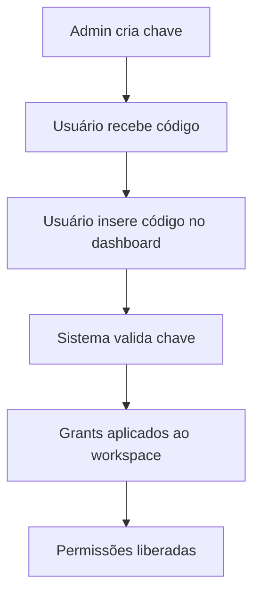

# 🔑 Sistema de Chaves de Acesso - Beta Testers & Promoções

## Visão Geral

O **Sistema de Chaves de Acesso** permite liberar planos, features e recursos sem necessidade de pagamento, ideal para:

- 🧪 **Beta Testers** - Acesso antecipado para testadores
- 🎁 **Promoções** - Campanhas promocionais e parcerias
- 🎓 **Educação** - Acesso para estudantes e educadores
- 💼 **Vendas** - Demonstrações para prospects
- 🤝 **Parcerias** - Acesso especial para parceiros

## Como Funciona

### 1. **Fluxo Básico**



### 2. **Tipos de Chaves**

#### **🏆 Chave de Plano** (`type: "plan"`)

Libera acesso completo a um plano por período determinado.

```javascript
{
  type: "plan",
  grants: {
    planId: "plan_business",
    planDuration: 30 // dias (null = permanente)
  }
}
```

#### **⭐ Chave de Feature** (`type: "feature"`)

Libera features específicas.

```javascript
{
  type: "feature",
  grants: {
    featureIds: ["analytics", "export_advanced"],
    featureDuration: 90 // dias
  }
}
```

#### **🔧 Chave de Addon** (`type: "addon"`)

Libera addons específicos.

```javascript
{
  type: "addon",
  grants: {
    featureIds: ["ai_generator", "gantt_chart"],
    featureDuration: null // permanente
  }
}
```

#### **⚙️ Chave Customizada** (`type: "custom"`)

Regras completamente customizadas.

```javascript
{
  type: "custom",
  grants: {
    customPermissions: ["sections.create", "analytics.view"],
    limitBonus: { sections: 50, items: 1000 }
  }
}
```

## Criação de Chaves

### Via API (Super Admin)

```javascript
POST /api/admin/access-keys

{
  "name": "Beta Tester - Business Plan",
  "description": "Acesso ao plano Business para beta testers",
  "type": "plan",
  "grants": {
    "planId": "plan_business",
    "planDuration": 30
  },
  "usage": {
    "maxUses": 10,
    "allowMultiplePerUser": false,
    "allowMultiplePerWorkspace": false
  },
  "restrictions": {
    "validUntil": "2024-12-31T23:59:59Z",
    "allowedEmails": ["beta1@test.com", "beta2@test.com"],
    "allowedDomains": ["@universidade.edu.br"]
  },
  "tags": ["beta", "business", "q4-2024"]
}
```

### Códigos Gerados Automaticamente

Os códigos seguem o padrão: `{TYPE}{YEAR}-{RANDOM}`

- **Plano:** `PLAN2024-ABC123`
- **Feature:** `FEAT2024-XYZ789`
- **Addon:** `ADDON2024-DEF456`
- **Custom:** `CUST2024-GHI789`

## Ativação pelo Usuário

### 1. **Interface no Dashboard**

```jsx
import { ActivateKeyButton } from "@/components/access-keys/ActivateKeyModal";

// Em qualquer página do dashboard
<ActivateKeyButton className="my-custom-class" />;
```

### 2. **Via API Direta**

```javascript
POST /api/access-keys/activate

{
  "code": "PLAN2024-ABC123",
  "workspaceId": "workspace_id"
}
```

### 3. **Resposta da Ativação**

```javascript
{
  "success": true,
  "message": "Chave 'Beta Tester - Business Plan' ativada com sucesso!",
  "grants": {
    "planId": "plan_business",
    "planDuration": 30
  },
  "expiresAt": "2024-02-15T10:30:00Z"
}
```

## Validações e Restrições

### 1. **Validações Automáticas**

- ✅ Chave existe e está ativa
- ✅ Não atingiu limite máximo de usos
- ✅ Está dentro do período de validade
- ✅ Email/domínio permitido
- ✅ Usuário não usou antes (se configurado)
- ✅ Workspace não usou antes (se configurado)

### 2. **Restrições Configuráveis**

```javascript
restrictions: {
  validFrom: "2024-01-01T00:00:00Z",     // Válida a partir de
  validUntil: "2024-12-31T23:59:59Z",    // Válida até
  allowedEmails: ["user@test.com"],       // Emails específicos
  allowedDomains: ["@empresa.com"],       // Domínios permitidos
  requiredMetadata: {                     // Metadata no Clerk
    plan: "beta_tester",
    company: "TechCorp"
  }
}
```

### 3. **Controle de Uso**

```javascript
usage: {
  maxUses: 5,                    // Máximo 5 ativações
  allowMultiplePerUser: false,   // Usuário só pode usar 1x
  allowMultiplePerWorkspace: true // Workspace pode usar várias vezes
}
```

## Integração com Access Engine

O sistema se integra completamente com o Access Engine:

### 1. **Verificação de Permissões**

```javascript
import { AccessEngine } from "@/lib/access-engine";

const engine = new AccessEngine(workspace, user);
await engine.initialize();

// Automaticamente verifica chaves ativas
const canCreate = await engine.can("create", "sections");
const hasAnalytics = engine.hasFeature("analytics");
```

### 2. **Limits com Bonus**

```javascript
// Chave pode dar bonus nos limites
{
  grants: {
    limitBonus: {
      sections: 20,    // +20 sections
      items: 500,      // +500 items
      storage: 10000   // +10GB storage
    }
  }
}

// No Access Engine
const limits = engine.getEffectiveLimits();
// limits.sections = planLimit + keyBonus
```

### 3. **Features Temporárias**

Chaves podem dar acesso temporário a features:

```javascript
// No workspace ficará registrado:
activeKeys: [
  {
    keyId: "key_id",
    type: "feature",
    expiresAt: "2024-03-01T00:00:00Z",
    grants: {
      featureIds: ["analytics", "export_pdf"],
    },
    status: "active",
  },
];
```

## Gestão Administrativa

### 1. **Listar Chaves**

```javascript
GET /api/admin/access-keys?type=plan&isActive=true&tags=beta
```

### 2. **Estatísticas de Uso**

```javascript
GET /api/admin/access-keys/key_id/stats

{
  "key": "Beta Tester - Business Plan",
  "code": "PLAN2024-ABC123",
  "totalActivations": 8,
  "activeActivations": 6,
  "expiredActivations": 2,
  "usageRate": 80, // 8/10 * 100
  "analytics": {
    "viewCount": 45,
    "attemptCount": 12,
    "successCount": 8
  }
}
```

### 3. **Revogar Chave**

```javascript
POST /api/admin/access-keys/key_id/revoke
{
  "reason": "Término do período beta"
}
```

## Casos de Uso Práticos

### 1. **Beta Testers**

```javascript
// Criar chave para beta testers
{
  name: "Beta Test - Q1 2024",
  type: "plan",
  grants: {
    planId: "plan_business",
    planDuration: 60
  },
  usage: {
    maxUses: 50,
    allowMultiplePerUser: false
  },
  restrictions: {
    validUntil: "2024-03-31T23:59:59Z",
    allowedDomains: ["@betatester.com"]
  },
  tags: ["beta", "q1-2024"]
}
```

### 2. **Demonstração para Vendas**

```javascript
// Chave para demo com prospect
{
  name: "Demo - TechCorp",
  type: "custom",
  grants: {
    customPermissions: [
      "analytics.view",
      "export.pdf",
      "api.read"
    ],
    limitBonus: { sections: 10 }
  },
  usage: {
    maxUses: 1,
    allowMultiplePerWorkspace: false
  },
  restrictions: {
    allowedEmails: ["cto@techcorp.com"],
    validUntil: "2024-02-15T23:59:59Z"
  },
  tags: ["demo", "sales", "techcorp"]
}
```

### 3. **Promoção Black Friday**

```javascript
// Chave promocional
{
  name: "Black Friday 2024 - 6 meses grátis",
  type: "plan",
  grants: {
    planId: "plan_business",
    planDuration: 180
  },
  usage: {
    maxUses: 1000,
    allowMultiplePerUser: false,
    allowMultiplePerWorkspace: false
  },
  restrictions: {
    validFrom: "2024-11-25T00:00:00Z",
    validUntil: "2024-11-30T23:59:59Z",
    isPublic: true
  },
  tags: ["promocao", "blackfriday", "2024"]
}
```

### 4. **Estudantes/Educação**

```javascript
// Chave para estudantes
{
  name: "Programa Educacional 2024",
  type: "plan",
  grants: {
    planId: "plan_business",
    planDuration: 365 // 1 ano
  },
  usage: {
    maxUses: 10000,
    allowMultiplePerUser: false
  },
  restrictions: {
    allowedDomains: [
      "@edu.br",
      "@universidade.br",
      "@estudante.br"
    ]
  },
  tags: ["educacao", "estudantes", "2024"]
}
```

## Monitoramento e Analytics

### 1. **Métricas por Chave**

- 📊 **Taxa de Conversão:** Tentativas vs Ativações
- 👥 **Adoção:** Usuários ativos vs Total de ativações
- ⏱️ **Retenção:** Quantos continuam após expiração
- 🎯 **ROI:** Revenue gerado por usuários de chaves

### 2. **Alertas Automáticos**

```javascript
// Configurar alertas
{
  keyNearLimit: true,      // 90% do maxUses atingido
  keyExpiring: true,       // 7 dias para expirar
  highFailureRate: true,   // >20% de tentativas falharam
  suspiciousActivity: true // Muitas tentativas do mesmo IP
}
```

### 3. **Dashboard de Chaves**

Interface administrativa mostrando:

- 📈 Chaves mais utilizadas
- 🔥 Picos de ativação
- ❌ Taxa de falhas por tipo
- 🌍 Distribuição geográfica
- 📧 Emails mais ativos

## Processamento Automático

### 1. **Expiração de Chaves**

```javascript
// Cron job diário
import { AccessKeys } from "@/lib/access-keys";

// Processar expirações
const result = await AccessKeys.processExpiredKeys();
console.log(`${result.processedCount} chaves expiradas processadas`);
```

### 2. **Limpeza de Dados**

- Remove ativações antigas (>1 ano)
- Arquiva chaves inativas
- Limpa analytics antigas
- Consolida estatísticas

## Segurança

### 1. **Proteções Implementadas**

- 🔒 **Rate Limiting:** Limite de tentativas por IP
- 🕵️ **Auditoria:** Log de todas as ativações
- 🚫 **Blacklist:** IPs/emails suspeitos bloqueados
- 🔐 **Criptografia:** Códigos não são sequenciais
- ⚡ **Throttling:** Delay entre tentativas

### 2. **Monitoramento de Abuso**

```javascript
// Detectar uso suspeito
const alerts = {
  tooManyFailures: 5, // >5 falhas seguidas
  rapidAttempts: 10, // >10 tentativas em 1 min
  sameIPMultipleKeys: 3, // >3 chaves diferentes mesmo IP
  expiredKeyAttempts: 2, // >2 tentativas com chave expirada
};
```

## Testes

### Executar Testes

```bash
# Todos os testes
npm run test

# Testes específicos
npm run test access-keys
npm run test access-engine

# Teste direto
node dashboard/tests/access-keys.test.js
```

### Cobertura dos Testes

- ✅ Geração de códigos únicos
- ✅ Validação de restrições
- ✅ Ativação de chaves
- ✅ Integração com Access Engine
- ✅ Expiração automática
- ✅ Gestão de permissões
- ✅ Aplicação de grants

## Roadmap Futuro

### 🔮 **Funcionalidades Planejadas**

1. **Chaves em Lote**

   - Gerar 100 chaves de uma vez
   - Export para CSV/Excel
   - Import de listas de emails

2. **Marketplace de Chaves**

   - Chaves vendidas por parceiros
   - Revenue sharing
   - Tracking de afiliados

3. **Chaves Condicionais**

   - Ativar apenas se completar onboarding
   - Baseada em uso/engagement
   - Escalonamento automático

4. **Integração Avançada**

   - Webhooks para ativações
   - Slack/Discord notifications
   - CRM sync (HubSpot, Salesforce)

5. **Analytics Avançados**
   - Cohort analysis
   - Funnel de conversão
   - A/B testing de chaves

## Conclusão

O **Sistema de Chaves de Acesso** oferece flexibilidade total para:

- 🎯 **Acquisition:** Atrair novos usuários
- 💼 **Sales:** Demonstrações eficazes
- 🤝 **Partnerships:** Colaborações estratégicas
- 📈 **Growth:** Campanhas de crescimento
- 🧪 **Testing:** Validação de features

**Sistema totalmente integrado** com controle de acesso existente, mantendo segurança e auditoria completas.
