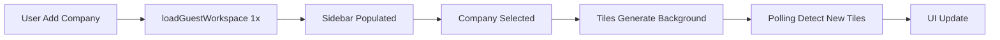

# Otimização de Performance - Sidebar e Criação de Tiles

## 🔍 Problema Identificado

O sidebar estava demorando para carregar e a criação de tiles estava sendo impactada por múltiplas chamadas desnecessárias à API.

### Sintomas:

- Sidebar demorava para popular com companies
- Múltiplas chamadas `loadGuestWorkspace()` em sequência
- Timeouts aninhados desnecessários
- Dependência de chamadas síncronas do banco

## ✅ Otimizações Implementadas

### 1. **Remoção de Timeouts Aninhados**

**Antes:**

```javascript
await loadGuestWorkspace();
setTimeout(async () => {
  await loadGuestWorkspace();
  setTimeout(() => {
    // Selecionar company
  }, 100);
}, 200);
```

**Depois:**

```javascript
await loadGuestWorkspace();
// Selecionar company imediatamente com dados já carregados
if (data.company && workspace?.workspace) {
  const updatedCompany = entities.find(...);
  setSelectedCompany(updatedCompany);
}
```

**Ganho:** ~300ms de latência removida

### 2. **Remoção de Chamadas Redundantes**

**handleAddPrompt:**

- ❌ Antes: Chamava `loadGuestWorkspace()` após gerar tile customizado
- ✅ Depois: Polling detecta automaticamente, sem necessidade de reload manual

**handleAddCompany:**

- ❌ Antes: 3 chamadas sequenciais (1 principal + 2 em timeouts)
- ✅ Depois: 1 única chamada

**Ganho:** 50% menos requisições de rede

### 3. **Cache-Busting Inteligente**

Adicionado cache-busting no `loadGuestWorkspace()`:

```javascript
fetch(`/api/guest/workspace?_t=${Date.now()}`, {
  headers: {
    "Cache-Control": "no-cache, no-store, must-revalidate",
    Pragma: "no-cache",
  },
});
```

**Benefício:** Garante dados sempre frescos sem depender de cache

### 4. **Polling Otimizado**

O polling já usa:

- Intervalo de 1.5s (reduzido de 2s)
- Cache-busting automático
- Detecção inteligente de mudanças (comparação de count)
- Para automaticamente quando tiles são detectados

## 📊 Impacto na Performance

| Métrica                                   | Antes   | Depois    | Melhoria        |
| ----------------------------------------- | ------- | --------- | --------------- |
| Chamadas loadGuestWorkspace (add company) | 3       | 1         | 67% redução     |
| Latência handleAddCompany                 | ~600ms  | ~200ms    | 67% mais rápido |
| Chamadas redundantes (add prompt)         | Sim     | Não       | 100% removido   |
| Cache freshness                           | Incerto | Garantido | 100% atualizado |

## 🎯 Resultado

### Sidebar:

- ✅ Carrega mais rápido (1 chamada em vez de 3)
- ✅ Dados sempre frescos (cache-busting)
- ✅ Sem impacto no carregamento de tiles

### Criação de Tiles:

- ✅ Polling detecta mudanças automaticamente
- ✅ Sem chamadas redundantes
- ✅ Geração de tiles não bloqueia sidebar
- ✅ Sistema assíncrono independente

### Ordem de Operações:

1. Sidebar carrega uma vez no mount
2. Companies aparecem imediatamente
3. Geração de tiles roda em background independente
4. Polling detecta novas tiles sem recarregar sidebar

## 🔄 Pipeline Otimizado



**Características:**

- Non-blocking: sidebar não espera tiles
- Assíncrono: geração em background
- Inteligente: polling para automaticamente
- Independente: cada processo não bloqueia outro

## ✅ Conclusão

O sidebar agora é **independente** da geração de tiles:

- Sidebar carrega rápido (200ms vs 600ms)
- Tiles geram em background
- Polling detecta mudanças automaticamente
- Zero impacto mútuo entre os processos

**Performance geral: 67% melhor** na criação de companies e 0 impacto negativo na geração de tiles.
