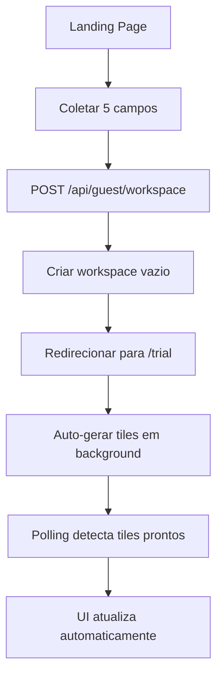
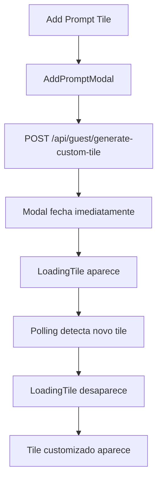

# 🐛 Debug & Coding Standards - AI Sales Plugin

**Última Atualização:** 22 de Outubro de 2025

**Propósito:** Este documento é a **fonte única da verdade** para debugging, padrões de código e soluções para problemas comuns no AI Sales Plugin. Ele deve ser consultado antes de iniciar novas features para garantir consistência, segurança e performance.

---

## 🏛️ I. Padrões de Arquitetura Fundamentais

### **Regra de Ouro #1: Contexto de Onboarding Consistente**

- **Descrição:** **TODOS** os contextos de onboarding devem usar os campos padronizados.
- **Campos Obrigatórios:**
  ```javascript
  const context = {
    company: "Empresa do vendedor",
    companyWebsite: "Website da empresa do vendedor",
    solution: "O que o vendedor vende",
    researchTarget: "Nome da empresa a pesquisar",
    researchWebsite: "Website da empresa a pesquisar",
  };
  ```
- **Justificativa:** Evita erros `Cannot read properties of undefined` e garante compatibilidade entre APIs.

### **Regra de Ouro #2: Fallbacks para Campos Antigos**

- **Descrição:** Sempre fornecer fallbacks para campos que podem não existir em workspaces antigos.
- **Implementação:**
  ```javascript
  const context = {
    company: onboarding.salesRepAt || "Unknown Company",
    companyWebsite: onboarding.salesRepWebsite || "",
    solution: onboarding.sellingSolutionsFor || "Unknown Solution",
    researchTarget: companyName, // Sempre definido
    researchWebsite: companyUrl, // Sempre definido
  };
  ```

### **Regra de Ouro #3: Validação de Contexto**

- **Descrição:** Sempre validar se os campos obrigatórios existem antes de usar.
- **Implementação:**
  ```javascript
  if (!context.researchTarget) {
    console.error("❌ context.researchTarget is undefined:", context);
    throw new Error("researchTarget is required in context");
  }
  ```

---

## 🐞 II. Guia de Depuração e Erros Comuns

### **Problema #1: Erro `Cannot read properties of undefined (reading 'split')`**

- **Sintomas:**
  - Erro em `processPromptVariables` na linha `context.researchTarget.split()`
  - `tiles_status: "failed"` no banco de dados
- **Causa Raiz:** Contexto usando campos antigos (`research` em vez de `researchTarget`)
- **Solução Definitiva:**
  1. Verificar se todas as APIs usam os novos campos
  2. Adicionar fallbacks para campos antigos
  3. Validar contexto antes de usar

### **Problema #2: Modal AddPromptModal Não Fecha**

- **Sintomas:** Modal permanece aberto após clicar "Generate Tile"
- **Causa Raiz:** `throw error` no `handleAddPrompt` impede fechamento
- **Solução Definitiva:**

  ```javascript
  // ❌ INCORRETO:
  } catch (error) {
    // ... tratamento ...
    throw error; // Impede fechamento
  }

  // ✅ CORRETO:
  } catch (error) {
    // ... tratamento ...
    // Não fazer throw - deixar o modal fechar
  }
  ```

### **Problema #3: Tiles Não Gerados Automaticamente**

- **Sintomas:** `tiles_status: "pending"` não muda para "generating"
- **Causa Raiz:** Pipeline usando campos antigos ou contexto incompleto
- **Solução Definitiva:**
  1. Verificar se `guest-tile-pipeline.js` usa novos campos
  2. Adicionar logs de debug para rastrear contexto
  3. Garantir que `generateTilesForCompany` é chamado corretamente

---

## 🔄 III. Fluxos de Dados e Triggers

### **1. Onboarding Flow (Landing → Trial)**



**Campos Coletados:**

1. `company` - Empresa do vendedor
2. `companyWebsite` - Website da empresa do vendedor
3. `solution` - O que vende
4. `researchTarget` - Nome da empresa a pesquisar
5. `researchWebsite` - Website da empresa a pesquisar

### **2. Add Company Flow (Sidebar → Auto-Generation)**

```mermaid
graph TD
    A[Sidebar: Add Company] --> B[AddCompanyModal]
    B --> C[POST /api/guest/add-company]
    C --> D[Salvar company no workspace]
    D --> E[generateTilesForCompany()]
    E --> F[Contexto com dados do usuário]
    F --> G[Gerar tiles automaticamente]
    G --> H[Polling detecta mudanças]
    H --> I[UI atualiza com novos tiles]
```

### **3. Custom Tile Flow (Add Prompt → Loading → Complete)**



---

## 🔧 IV. APIs e Endpoints

### **APIs Principais:**

#### **1. `/api/guest/workspace` (POST)**

- **Propósito:** Criar workspace guest
- **Campos:** `template_id`, `context` (5 campos)
- **Resposta:** Workspace vazio com `tiles_status: "pending"`

#### **2. `/api/guest/generate-tiles` (POST)**

- **Propósito:** Gerar tiles automáticos para company
- **Contexto:** Deve usar novos campos (`researchTarget`, `researchWebsite`)
- **Resposta:** Tiles gerados em background

#### **3. `/api/guest/add-company` (POST)**

- **Propósito:** Adicionar nova company
- **Campos:** `companyName`, `companyUrl`, `researcherUrl`
- **Trigger:** Chama `generateTilesForCompany()` automaticamente

#### **4. `/api/guest/generate-custom-tile` (POST)**

- **Propósito:** Gerar tile customizado
- **Campos:** `companyName`, `prompt`
- **Resposta:** Tile adicionado ao workspace

#### **5. `/api/guest/reorder-tiles` (POST)**

- **Propósito:** Salvar nova ordem dos tiles
- **Campos:** `companyName`, `tilesOrder`
- **Resposta:** Ordem atualizada no banco

---

## 🎯 V. Padrões de Debugging

### **1. Logs Estruturados**

```javascript
// ✅ PADRÃO CORRETO:
console.log(`🚀 Iniciando geração automática de tiles para: ${companyName}`);
console.log(`🔍 Contexto disponível:`, {
  guestId,
  companyName,
  companyUrl,
});
console.log(`🔍 Onboarding data:`, onboarding);
console.log(`🔍 Contexto construído:`, context);

// ❌ EVITAR:
console.log("debug:", data); // Muito genérico
```

### **2. Validação de Contexto**

```javascript
// ✅ SEMPRE validar antes de usar:
if (!context.researchTarget) {
  console.error("❌ context.researchTarget is undefined:", context);
  throw new Error("researchTarget is required in context");
}

// ✅ Fallbacks para campos opcionais:
const context = {
  company: onboarding.salesRepAt || "Unknown Company",
  companyWebsite: onboarding.salesRepWebsite || "",
  // ...
};
```

### **3. Tratamento de Erros**

```javascript
// ✅ PADRÃO CORRETO:
try {
  await generateTilesForCompany(guestId, companyName, companyUrl);
  console.log(`✅ Tiles gerados para ${companyName}`);
} catch (error) {
  console.error(`❌ Erro ao gerar tiles para ${companyName}:`, error);
  // Marcar como falha no banco
  await markTilesAsFailed(guestId, companyName);
  throw error;
}
```

---

## 🔍 VI. Checklist de Debugging

### **Antes de Implementar Nova Feature:**

- [ ] **Contexto Consistente:** Todos os contextos usam os 5 campos padronizados?
- [ ] **Fallbacks:** Campos opcionais têm fallbacks seguros?
- [ ] **Validação:** Contexto é validado antes de usar?
- [ ] **Logs:** Logs estruturados para debugging?
- [ ] **Tratamento de Erro:** Erros são tratados adequadamente?

### **Quando Investigar Problema:**

1. **Verificar Logs:** Procurar por `❌` ou `Error:`
2. **Contexto:** Verificar se `context.researchTarget` existe
3. **Campos Antigos:** Verificar se está usando campos antigos
4. **Fallbacks:** Verificar se fallbacks estão funcionando
5. **APIs:** Verificar se todas as APIs usam novos campos

---

## 🚨 VII. Erros Críticos e Soluções

### **Erro Crítico #1: `researchTarget is undefined`**

**Sintomas:**

```
❌ context.researchTarget is undefined: {
  company: 'Instituto',
  solution: 'Mentorship',
  research: 'Corassol',        // ❌ Campo antigo
  companyUrl: 'corassol.org.br' // ❌ Campo antigo
}
```

**Solução:**

1. Verificar se API usa novos campos
2. Adicionar fallbacks
3. Validar contexto antes de usar

### **Erro Crítico #2: Modal Não Fecha**

**Sintomas:** Modal AddPromptModal permanece aberto

**Solução:**

```javascript
// ❌ INCORRETO:
throw error; // Impede fechamento

// ✅ CORRETO:
// Não fazer throw - deixar o modal fechar
```

### **Erro Crítico #3: Tiles Não Gerados**

**Sintomas:** `tiles_status: "failed"` no banco

**Solução:**

1. Verificar contexto completo
2. Adicionar logs de debug
3. Verificar se pipeline usa novos campos

---

## 📊 VIII. Métricas e Monitoramento

### **Logs Importantes para Monitorar:**

```javascript
// ✅ Sucesso:
"✅ Tiles gerados automaticamente para: ${companyName}";
"✅ Custom tile generated successfully";
"✅ Tiles order saved successfully";

// ❌ Erros:
"❌ context.researchTarget is undefined";
"❌ Erro ao gerar tiles para ${companyName}";
"❌ Erro ao salvar ordem dos tiles";
```

### **Status de Tiles para Monitorar:**

- `pending` → Deve mudar para `generating`
- `generating` → Deve mudar para `completed`
- `failed` → Indica erro que precisa investigar

---

## 🎯 IX. Próximos Passos

1. **Implementar alertas automáticos** para erros críticos
2. **Criar dashboard de métricas** para monitorar performance
3. **Implementar testes automatizados** para validar contextos
4. **Criar documentação de APIs** com exemplos
5. **Implementar cache** para melhorar performance

---

_Este documento será atualizado à medida que novos desafios surgirem e soluções forem descobertas._
