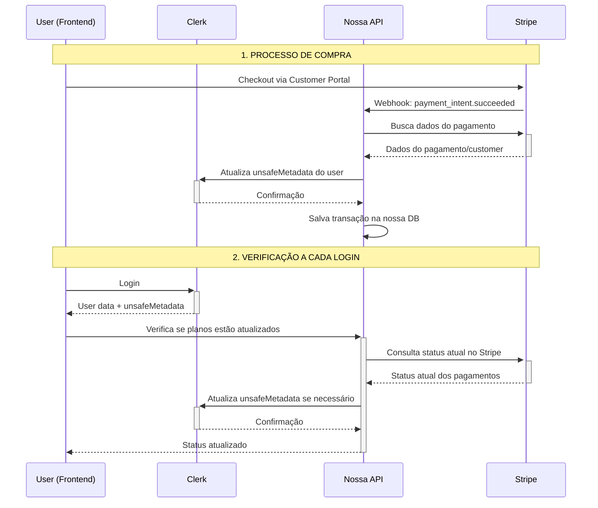

# 🔄 Arquitetura de Triangulação: Clerk + Stripe + API

Este documento detalha a implementação da triangulação entre Clerk, Stripe e nossa API própria para gerenciamento completo de planos e billing.

## 🎯 Objetivo

Implementar um sistema que:

- ✅ Sincroniza automaticamente pagamentos do Stripe com usuários do Clerk
- ✅ Mantém cache inteligente no `unsafeMetadata` do Clerk
- ✅ Verifica planos a cada login (máximo 24h de cache)
- ✅ Mantém histórico completo na nossa API
- ✅ Funciona offline com dados cached

## 🏗️ Arquitetura



## 📊 Estrutura de Dados

### Clerk `unsafeMetadata`

```json
{
  "stripeCustomerId": "cus_stripe123",
  "plans": {
    "active": ["cupido", "afrodite"],
    "expired": ["zeus"],
    "lastVerified": "2024-01-15T10:30:00Z"
  },
  "billing": {
    "totalSpent": 174.0,
    "lastPayment": "2024-01-15T09:00:00Z",
    "lastTransactionType": "checkout_completed",
    "nextVerification": "2024-01-16T10:30:00Z"
  }
}
```

### Nossa DB (Transações)

```json
{
  "_id": "ObjectId",
  "userId": "user_clerk123",
  "stripeCustomerId": "cus_stripe123",
  "stripeSessionId": "cs_session123",
  "planId": "cupido",
  "amount": 47.0,
  "currency": "brl",
  "status": "completed",
  "type": "checkout",
  "timestamp": "2024-01-15T09:00:00Z",
  "createdAt": "2024-01-15T09:00:00Z"
}
```

## 🚀 Implementação

### 1. Webhook do Stripe (`netlify/functions/stripe-webhook.js`)

**Funcionalidades:**

- ✅ Processa eventos de checkout, pagamento e cancelamento
- ✅ Identifica usuário no Clerk pelo email
- ✅ Atualiza `unsafeMetadata` automaticamente
- ✅ Salva transação na nossa API para auditoria
- ✅ Mapeia price_ids do Stripe para nossos plan_ids

**Eventos Suportados:**

- `checkout.session.completed` - Compra concluída
- `invoice.paid` - Pagamento de subscription
- `customer.subscription.deleted` - Cancelamento
- `payment_intent.succeeded` - Pagamento único

### 2. API de Verificação (`/api/billing/verify-user`)

**Funcionalidades:**

- ✅ Verifica se cache expirou (24h)
- ✅ Consulta dados atuais no Stripe
- ✅ Sincroniza com Clerk se necessário
- ✅ Retorna status atualizado

**Fluxo de Cache:**

1. Se verificado há menos de 24h → Retorna cache
2. Se expirado → Consulta Stripe + Atualiza Clerk
3. Se sem Stripe ID → Apenas atualiza timestamp

### 3. Hook React (`useUserPlanVerification`)

**Funcionalidades:**

- ✅ Verificação automática no login
- ✅ Cache local para performance
- ✅ Métodos helper (`hasPlan`, `hasActivePlans`)
- ✅ Verificação manual sob demanda
- ✅ Estado de loading e erro

**Uso:**

```jsx
function MyComponent() {
  const { plans, isVerifying, hasPlan, manualVerify } =
    useUserPlanVerification();

  if (hasPlan("cupido")) {
    return <PremiumFeature />;
  }

  return <BasicFeature />;
}
```

### 4. API de Exportação (`/api/billing/export-users`)

**Funcionalidades:**

- ✅ Exporta todos os usuários + dados de billing
- ✅ Combina dados Clerk + Stripe
- ✅ Formatos JSON e CSV
- ✅ Estatísticas resumidas
- ✅ Proteção por API key

## 🔧 Configuração

### Variáveis de Ambiente

```env
# Clerk
NEXT_PUBLIC_CLERK_PUBLISHABLE_KEY=pk_test_...
CLERK_SECRET_KEY=sk_test_...

# Stripe
STRIPE_SECRET_KEY=sk_test_...
STRIPE_WEBHOOK_SECRET=whsec_...

# Segurança
INTERNAL_API_KEY=your_secret_key
ADMIN_EXPORT_KEY=your_admin_key

# App
NEXT_PUBLIC_APP_URL=http://localhost:3000
```

### Mapeamento de Planos

No webhook e API de verificação, configure o mapeamento:

```javascript
const priceToPlansMap = {
  price_1234: "cupido", // Stripe Price ID → Plan ID
  price_5678: "afrodite",
  price_9012: "zeus",
};
```

## 🔄 Fluxos de Uso

### Compra de Plano

1. **Frontend:** User clica "Comprar Plano"
2. **Netlify Function:** Cria sessão Stripe Checkout
3. **Stripe:** User completa pagamento
4. **Webhook:** Stripe chama nosso webhook
5. **Triangulação:** Webhook atualiza Clerk + salva transação
6. **Frontend:** User recarrega página e vê plano ativo

### Login do Usuário

1. **Clerk:** User faz login
2. **Hook:** `useUserPlanVerification` executa automaticamente
3. **API:** Verifica se cache expirou (24h)
4. **Stripe:** Se expirado, busca dados atuais
5. **Clerk:** Atualiza `unsafeMetadata` se necessário
6. **Frontend:** User vê status atualizado

### Verificação Manual

1. **User:** Clica "Verificar Agora"
2. **Hook:** Chama `manualVerify()`
3. **API:** Força verificação no Stripe
4. **Update:** Dados sincronizados imediatamente

## 📈 Benefícios

### Performance

- ✅ Cache de 24h reduz chamadas desnecessárias
- ✅ Dados disponíveis offline via `unsafeMetadata`
- ✅ Verificação assíncrona não bloqueia UI

### Confiabilidade

- ✅ Dupla fonte da verdade (Stripe + Clerk)
- ✅ Histórico completo na nossa DB
- ✅ Recuperação automática de inconsistências

### Escalabilidade

- ✅ Webhooks processam pagamentos instantaneamente
- ✅ Cache reduz load no Stripe API
- ✅ Exportação para análises externas

## 🐛 Debugging

### Logs do Webhook

```javascript
console.log("🎉 Checkout completed:", session.id);
console.log("✅ User found in Clerk:", user.id);
console.log("📦 Plan identified:", planId);
console.log("✅ Triangulation completed successfully");
```

### Verificação de Status

```javascript
// No componente
{
  process.env.NODE_ENV === "development" && (
    <pre>{JSON.stringify({ plans, billing, lastVerified }, null, 2)}</pre>
  );
}
```

### API de Debug

```bash
# Verificar usuário específico
GET /api/billing/verify-user

# Exportar dados para análise
GET /api/billing/export-users?key=admin_key&format=json
```

## 🚨 Tratamento de Erros

### Webhook Falha

- ✅ Logs detalhados para debugging
- ✅ Não quebra o fluxo de pagamento
- ✅ Usuário pode verificar manualmente

### Stripe API Falha

- ✅ Usa dados cached do Clerk
- ✅ Retry automático na próxima verificação
- ✅ Indicador de erro na UI

### Clerk API Falha

- ✅ Salva transação mesmo assim
- ✅ Retry na próxima verificação
- ✅ Não impacta experiência do user

## 🔮 Próximos Passos

- [ ] **Rate Limiting:** Implementar rate limiting nas APIs
- [ ] **Metrics:** Dashboard de métricas de billing
- [ ] **Alerts:** Notificações para falhas de webhook
- [ ] **Backup:** Backup automático das transações
- [ ] **Analytics:** Análise de conversão e churn
