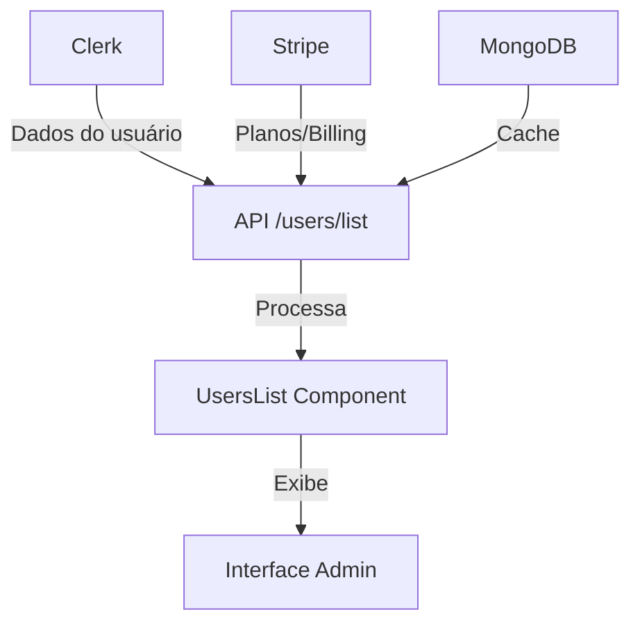

# 👥 Gestão de Usuários - Dashboard Engine

Sistema completo de gestão administrativa de usuários com **triangulação** entre:

- **Clerk** (Autenticação e dados do usuário)
- **Stripe** (Billing e planos ativos)
- **MongoDB** (Cache e sincronização)

## 🏗️ Arquitetura

### **Fluxo de Dados**



### **Componentes Principais**

1. **`/dashboard/users/page.jsx`** - Página principal
2. **`/components/users/UsersList.jsx`** - Lista interativa
3. **`/api/users/list/route.js`** - API de dados
4. **`/middleware.js`** - Proteção de rotas

## 📊 Funcionalidades

### **✅ Interface Administrativa**

- **Cards Elegantes**: Avatar, nome, email, planos
- **Estatísticas**: Total, ativos, revenue, conversão
- **Filtros**: Por status, plano específico, busca
- **Visualizações**: Cards ou tabela
- **Responsivo**: Funciona em todos dispositivos

### **✅ Dados Triangulados**

- **Clerk**: Nome, email, datas de criação/login
- **Stripe**: Planos ativos, valor gasto, billing
- **MongoDB**: Cache e sincronização

### **✅ Filtros e Pesquisa**

- 🔍 **Busca**: Por nome ou email
- ✅ **Status**: Ativos, inativos, todos
- 💖 **Planos**: Cupido, Afrodite, Zeus
- 📊 **Ordenação**: Recentes, maior gasto, email

### **API Segura**

- `/api/users/list` - Lista usuários autenticados
- Dados triangulados de Clerk + Stripe
- Cache inteligente para performance

## 🚀 Como Usar

### **1. Acessar Interface**

```bash
# Certifique-se de estar logado
http://localhost:3000/dashboard/users
```

### **2. Visualizar Dados**

- **Cards de Estatísticas**: No topo da página
- **Filtros**: Use para encontrar usuários específicos
- **Lista**: Cards ou tabela conforme preferência

### **3. Interpretar Dados**

```javascript
// Estrutura de dados de cada usuário
{
  clerkId: "user_123",
  email: "user@example.com",
  firstName: "João",
  lastName: "Silva",
  currentPlans: ["cupido", "afrodite"],
  totalSpent: 147.50,
  isActiveCustomer: true,
  planCount: 2,
  createdAt: "2024-01-15T10:00:00Z",
  lastSignInAt: "2024-01-20T14:30:00Z"
}
```

## 🔧 API Reference

### **GET /api/users/list**

**Autenticação**: Clerk (middleware)

**Parâmetros**:

- `limit` (optional): Limite de usuários (padrão: 100, max: 200)

**Resposta**:

```json
{
  "users": [...],
  "stats": {
    "total": 150,
    "activeCustomers": 45,
    "totalRevenue": 12500.00,
    "conversionRate": "30%"
  },
  "meta": {
    "fetchedAt": "2024-01-20T15:00:00Z",
    "total": 150
  }
}
```

**Exemplo de uso**:

```bash
curl -H "Authorization: Bearer <token>" \
  http://localhost:3000/api/users/list?limit=50
```

## 🎨 Customização

### **Cores dos Planos**

```javascript
// Em components/users/UsersList.jsx
const getPlanBadgeColor = (plan) => {
  const colors = {
    cupido: "bg-pink-100 text-pink-800 border-pink-200",
    afrodite: "bg-purple-100 text-purple-800 border-purple-200",
    zeus: "bg-yellow-100 text-yellow-800 border-yellow-200",
    premium: "bg-blue-100 text-blue-800 border-blue-200",
  };
  return colors[plan] || "bg-gray-100 text-gray-800 border-gray-200";
};
```

### **Adicionar Novos Filtros**

```javascript
// Adicionar em useState
const [customFilter, setCustomFilter] = useState("all");

// Adicionar na lógica de filtro
const filteredUsers = users.filter((user) => {
  // ... filtros existentes
  const matchesCustom =
    customFilter === "all" || user.customField === customFilter;

  return matchesSearch && matchesPlan && matchesCustom;
});
```

## 🧪 Testes

### **Executar Testes**

```bash
# Testar API de usuários
npm test tests/users-list.test.js

# Testar interface (se implementado)
npm test tests/users-interface.test.js
```

### **Estrutura de Testes**

```javascript
// tests/users-list.test.js
import test from "node:test";
import assert from "node:assert/strict";

test("API deve retornar lista de usuários", async () => {
  // Simular chamada à API
  const response = await mockFetch("/api/users/list");
  assert.equal(response.status, 200);
  assert(Array.isArray(response.users));
});
```

## 🔒 Segurança

### **Autenticação**

- ✅ **Middleware**: Todas as rotas protegidas
- ✅ **Clerk Auth**: Validação de token
- ✅ **Admin Only**: Acesso restrito

### **Dados Sensíveis**

- ❌ **Não exposto**: Senhas, tokens internos
- ✅ **Dados seguros**: Apenas metadados de billing
- ✅ **GDPR**: Dados mínimos necessários

## 📈 Performance

### **Otimizações**

- **Cache**: TTL 24h para dados Clerk
- **Batch**: Busca de múltiplos usuários
- **Lazy Loading**: Componentes sob demanda
- **Debounce**: Filtros com delay

### **Métricas**

```javascript
// Exemplo de métricas
{
  "responseTime": "< 2s",
  "cacheHitRate": "85%",
  "apiCalls": "5/min",
  "memoryUsage": "< 100MB"
}
```

## 🐛 Troubleshooting

### **Problemas Comuns**

#### ❌ "Unauthorized" na API

**Causa**: Token do Clerk inválido  
**Solução**: Verificar se o usuário está logado

#### ❌ Dados não carregam

**Causa**: Problemas de conectividade  
**Solução**: Verificar logs do servidor

#### ❌ Planos não aparecem

**Causa**: Metadata do Clerk vazio  
**Solução**: Executar verificação de planos

### **Debug Mode**

```javascript
// No navegador (F12)
localStorage.setItem("debug-users", "true");

// Logs detalhados aparecerão no console
```

## 🔄 Integração com Outras Features

### **Billing**

```javascript
// Navegar para transações do usuário
const viewUserBilling = (userId) => {
  router.push(`/dashboard/billing?userId=${userId}`);
};
```

### **Sections**

```javascript
// Ver conteúdo criado pelo usuário
const viewUserContent = (userId) => {
  router.push(`/dashboard/sections?createdBy=${userId}`);
};
```

## 🚀 Roadmap

### **Próximas Features**

- [ ] **Exportação**: CSV/PDF dos dados
- [ ] **Filtros Avançados**: Por período, região
- [ ] **Ações em Massa**: Ativar/desativar múltiplos
- [ ] **Notificações**: Alertas de novos usuários
- [ ] **Analytics**: Gráficos de crescimento

### **Melhorias de UX**

- [ ] **Infinite Scroll**: Para muitos usuários
- [ ] **Bulk Actions**: Seleção múltipla
- [ ] **Quick Actions**: Ações rápidas por usuário
- [ ] **Real-time**: Atualizações automáticas

## 💡 Dicas de Uso

### **Para Administradores**

1. **Monitore Conversão**: Use a taxa de conversão para otimizar
2. **Identifique Patterns**: Veja quais planos são mais populares
3. **Suporte**: Use filtros para encontrar usuários específicos
4. **Revenue**: Acompanhe crescimento do faturamento

### **Para Desenvolvedores**

1. **Cache**: Implemente cache local para melhor performance
2. **Pagination**: Para mais de 200 usuários
3. **WebSockets**: Para atualizações em tempo real
4. **Monitoring**: Adicione métricas de performance

---

## 🎉 Resumo

Sistema completo de gestão de usuários com:

- ✅ **Interface elegante** e funcional
- ✅ **Dados triangulados** Clerk + Stripe + MongoDB
- ✅ **Filtros inteligentes** para administração
- ✅ **Performance otimizada** com cache
- ✅ **Segurança completa** com Clerk middleware
- ✅ **Testes nativos** cobrindo funcionalidades

**Pronto para gerenciar milhares de usuários!** 🚀
