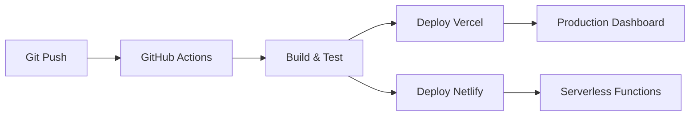

# 🛠️ **TECH STACK - DASHBOARD ENGINE**

## 🏗️ **ARQUITETURA GERAL**
- **Workspace:** Monorepo com `ai/` e `dashboard/`
- **Padrão:** JAMstack + Serverless Functions
- **Deploy:** Vercel + Netlify Functions

---

## ⚛️ **FRONTEND (Dashboard)**

### **Core Framework**
- **Next.js** `15.3.4` - App Router + RSC
- **React** `19.0.0` - Hooks + Context
- **TailwindCSS** `4.0` - Utility-first CSS

### **UI & UX**
- **Componentes:** Custom UI components
- **Icons:** Emojis + Custom SVG
- **Dark Mode:** Sistema nativo
- **Responsive:** Mobile-first design

### **Desenvolvimento**
- **ESLint** `9.0` - Linting moderno
- **Puppeteer** `22.13.1` - E2E testing
- **Node.js** `--test` - Testes nativos

---

## 🔐 **AUTENTICAÇÃO & PAGAMENTOS**

### **Auth Stack**
- **Clerk** `6.23.0` - Auth-as-a-Service
- **JWT** - Token management
- **Middleware** - Route protection

### **Billing Stack** 
- **Stripe** `12.14.0` - Payments + Subscriptions
- **Webhooks** - Event-driven sync
- **Customer Portal** - Self-service billing

---

## 🗄️ **BACKEND & DATA**

### **Database**
- **MongoDB** `6.3.0` - Document database
- **Schemas** - Dynamic content types
- **Indexing** - Performance optimization

### **API Design**
- **REST API** - Standard HTTP methods
- **Route Handlers** - Next.js App Router
- **Triangulação** - Clerk ↔ API ↔ Stripe

---

## ☁️ **DEPLOYMENT & HOSTING**

### **Frontend Hosting**
- **Vercel** - Dashboard deployment
- **Edge Runtime** - Global performance

### **Serverless Functions**
- **Netlify Functions** - Background processing
- **Webhooks** - Stripe event handling
- **CRON Jobs** - Scheduled tasks

---

## 🤖 **AI & AUTOMATION**

### **AI Tools**
- **OpenAI** `4.31.0` - Content generation
- **Claude** - Code assistance
- **Cursor** - AI-powered IDE

### **Developer Experience**  
- **Workspace Scripts** - Automated workflows
- **Health Checks** - System monitoring
- **CLI Tools** - Development automation

---

## 🔧 **DEVELOPMENT TOOLS**

### **Package Management**
- **npm workspaces** - Monorepo management
- **UUID** `11.1.0` - Unique identifiers
- **YAML** `2.3.1` - Configuration files

### **Security & Compliance**
- **bcryptjs** `2.4.3` - Password hashing
- **Environment Variables** - Secrets management
- **CORS** - API security

---

## 📊 **PERFORMANCE & MONITORING**

### **Core Web Vitals**
- **SSR/SSG** - Next.js optimization
- **Image Optimization** - Automatic WebP
- **Code Splitting** - Dynamic imports

### **Error Tracking**
- **Native Error Boundaries** - React 19
- **Console Logging** - Development debugging
- **Health Endpoints** - System status

---

## 🚀 **DEPLOYMENT PIPELINE**

---

**📅 Última atualização:** 27/06/2025  
**🔄 Status:** Atualizado com Stack Moderno 2025
