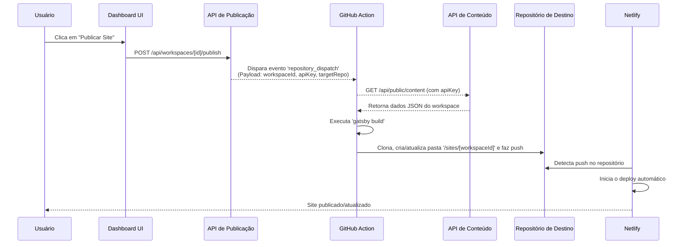

# Arquitetura: Conteúdo como Serviço (CaaS) e Publicação Automatizada

**Data:** 21 de julho de 2025
**Autor:** Milton e Gemini

## 1. Visão Geral

Esta arquitetura transforma o DashMaster.PRO em uma plataforma de **Conteúdo como Serviço (CaaS)**, permitindo que os usuários exponham o conteúdo de seus workspaces através de uma API segura. Sobre essa base, construímos um serviço de **Publicação Automatizada**, que oferece aos usuários a capacidade de gerar e hospedar sites estáticos com um único clique, utilizando serviços como Netlify e GitHub Actions.

A plataforma, portanto, se divide em dois produtos principais:

1.  **A API de Conteúdo (CaaS):** O núcleo do sistema. Uma API headless, segura e isolada por workspace, que permite que qualquer aplicação (web, mobile, IoT) consuma os dados gerenciados no DashMaster. **(Status: ✅ Implementado e funcional em `/api/public/content`)**.
2.  **O Publicador de Site Estático:** Um serviço de valor agregado que utiliza a API de Conteúdo para automatizar o processo de build e deploy de sites estáticos, oferecendo aos usuários uma solução completa de hospedagem.

## 2. Arquitetura do Publicador de Site Estático

Esta é a arquitetura para o serviço de automação, projetada para ser leve, escalável e robusta, utilizando as melhores práticas de CI/CD.

### 2.1. Componentes Principais

| Componente                           | Responsabilidade                                                                     | Tecnologia Proposta                                   |
| :----------------------------------- | :----------------------------------------------------------------------------------- | :---------------------------------------------------- |
| **Dashboard**                        | Interface do usuário para configuração e acionamento do processo de publicação.      | Next.js App Router                                    |
| **API de Publicação**                | Endpoint leve que recebe a solicitação e dispara o gatilho para o processo de build. | API Route no Next.js (`/api/workspaces/[id]/publish`) |
| **Repositório de Templates**         | Repositório(s) Git contendo o código-fonte dos sites (ex: Gatsby, Next.js).          | GitHub                                                |
| **GitHub Action (O Motor de Build)** | Workflow de CI/CD que executa o build do site, busca dados e commita o resultado.    | GitHub Actions (`.github/workflows/publish-site.yml`) |
| **Repositório de Destino**           | Repositório Git que armazena os arquivos estáticos compilados de todos os sites.     | GitHub (Padrão ou Customizado pelo usuário)           |
| **Plataforma de Hospedagem**         | Serviço que hospeda os arquivos estáticos e os serve globalmente.                    | Netlify                                               |

### 2.2. O Fluxo Detalhado

### 2.3. Etapas Chave Explicadas

1.  **Configuração no Dashboard:**

    - O usuário navega para uma nova área de "Publicação".
    - Ele escolhe um template (ex: "Landing Page Gatsby").
    - **Ele escolhe o repositório de destino:**
      - **Opção 1 (Padrão):** Utiliza o repositório padrão da plataforma (ex: `github.com/DashMaster/published-sites`). Esta é a opção de um clique.
      - **Opção 2 (Customizado):** O usuário fornece a URL de um repositório Git próprio e um token de acesso que será armazenado de forma segura.

2.  **Disparando a Ação:**

    - Ao clicar em "Publicar", o frontend chama a `API de Publicação`.
    - Esta API é extremamente leve. Sua única função é validar o usuário e disparar um evento `repository_dispatch` para o repositório do template escolhido. O `payload` do evento contém as informações cruciais: `workspaceId`, a `apiKey` para a API de Conteúdo e a URL do `targetRepo`.

3.  **A Mágica do GitHub Action:**

    - O workflow `.github/workflows/publish-site.yml` no repositório de template é acionado pelo evento.
    - **Build:** O Action usa a `apiKey` para chamar a `API de Conteúdo` e obter os dados. Com os dados em mãos, ele executa o comando de build (ex: `npm run build`).
    - **Commit & Push:** O Action clona o `Repositório de Destino`. Ele copia os arquivos estáticos gerados para uma **pasta específica**, nomeada com o `workspaceId` (ex: `sites/686d0531fe7bd94c697b7751/`). Essa estratégia de pastas é superior a branches por ser mais simples de gerenciar e configurar no provedor de hospedagem. Finalmente, ele faz o commit e o push.

4.  **Deploy Contínuo no Netlify:**
    - A instância do site no Netlify é configurada para monitorar o `Repositório de Destino`.
    - A "Base Directory" do site no Netlify é configurada para a pasta específica do workspace (ex: `sites/686d0531fe7bd94c697b7751/`).
    - Qualquer push para essa pasta no repositório aciona um novo deploy no Netlify, publicando as alterações.

## 3. Conexão com o Plano de Desenvolvimento Atual

Esta visão de longo prazo não altera nosso próximo passo imediato, mas o reforça. A tarefa **Passo 3: Integração com o Gatsby (Landing Page)** do nosso `proximos-passos-21-07-25.md` é o pré-requisito fundamental para esta arquitetura.

Ao ensinar o `gatsby-landing` a buscar e renderizar dados da `API de Conteúdo`, estamos efetivamente construindo a lógica que será usada posteriormente pelo GitHub Action. Estamos criando a base sobre a qual toda essa automação será construída.
