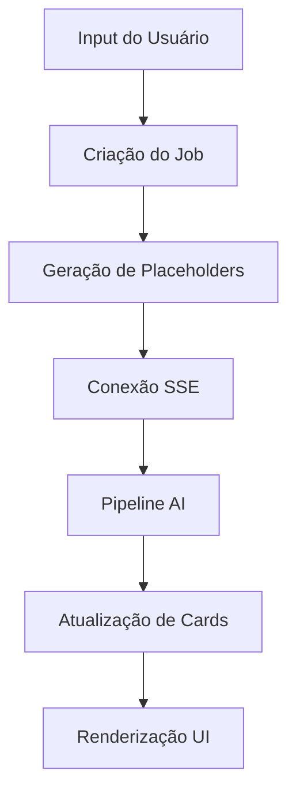

# Relatório: Análise do Fluxo de Criação e Renderização de Cards/Tiles

## 🏗️ Arquitetura Atual

### 1. Componentes Principais

#### 1.1 SortableTilesGrid

- Gerencia a renderização e ordenação dos tiles
- Implementa drag-and-drop para reordenação
- Controla a exibição de placeholders durante geração
- Garante IDs únicos para cada tile
- Mantém estado de loading e geração

#### 1.2 Sistema SSE (Server-Sent Events)

- Implementado via `useSSE` hook e `SSEManager`
- Gerencia conexões em tempo real
- Usa buffer circular para eventos (até 50 por canal)
- Suporta reconexão automática com replay de eventos
- Emite eventos de status e atualização de tiles

#### 1.3 DeckEngine AI Pipeline

- Processa prompts e gera conteúdo
- Otimiza tiles baseado em contexto
- Executa geração em fases (crítica e secundária)
- Mantém métricas de geração
- Integra com sistema de logging

### 2. Fluxo de Dados



## 🐛 Problemas Identificados

### 1. Substituição Gradual de Placeholders

**Problema**: Cards temporários "generating insights" não são substituídos corretamente e na ordem inicial dos prompts.

**Causas Identificadas**:

1. Dessincronia entre eventos SSE e atualizações de estado React
2. Problemas no buffer de eventos SSE
3. Perda de referência de ordem original dos prompts
4. Inconsistência na atualização do estado de tiles

**Implementação Atual**:

```javascript
// Em sse-manager.js
class SSEManager {
  constructor() {
    this.connections = new Map();
    this.eventBuffer = new Map();
    this.bufferSize = 50;
  }

  emit(key, eventType, data) {
    // Sempre adicionar ao buffer para replay em reconexão
    if (!this.eventBuffer.has(key)) {
      this.eventBuffer.set(key, []);
    }
    const buffer = this.eventBuffer.get(key);
    buffer.push({ eventType, data, timestamp: Date.now() });

    // Limitar tamanho do buffer
    if (buffer.length > this.bufferSize) {
      buffer.shift(); // Remove o mais antigo
    }

    // Se há conexão ativa, enviar imediatamente
    const controller = this.connections.get(key);
    if (controller) {
      const message = `event: ${eventType}\ndata: ${JSON.stringify(data)}\n\n`;
      controller.enqueue(new TextEncoder().encode(message));
    }
  }
}

// Em useSSE.js
const useSSE = (url) => {
  const [events, setEvents] = useState([]);
  const eventSourceRef = useRef(null);
  const handlersRef = useRef(new Map());

  useEffect(() => {
    const eventSource = new EventSource(url);
    eventSourceRef.current = eventSource;

    eventSource.onmessage = (e) => {
      try {
        const data = JSON.parse(e.data);
        const handler = handlersRef.current.get(data.type);
        if (handler) {
          handler(data);
        }
      } catch (err) {
        console.error("Erro ao processar evento:", err);
      }
    };

    return () => {
      eventSource.close();
    };
  }, [url]);

  return {
    events,
    addHandler: (type, handler) => {
      handlersRef.current.set(type, handler);
    },
  };
};
```

**Solução Proposta**:

```javascript
// Em SortableTilesGrid.jsx
const SortableTilesGrid = ({ initialTiles }) => {
  const [tiles, setTiles] = useState([]);
  const tilesRef = useRef(new Map()); // Cache de tiles por ID
  const orderMapRef = useRef(new Map()); // Mapa de ordem original

  useEffect(() => {
    // Inicializar com placeholders mantendo ordem
    const orderedTiles = initialTiles.map((tile, index) => ({
      ...tile,
      orderIndex: index,
      isPlaceholder: true,
    }));

    setTiles(orderedTiles);

    // Armazenar ordem original
    orderedTiles.forEach((tile) => {
      orderMapRef.current.set(tile.id, tile.orderIndex);
    });
  }, [initialTiles]);

  const { addHandler } = useSSE("/api/streams/tiles");

  useEffect(() => {
    // Handler para atualização de tiles
    addHandler("tile:generated", (data) => {
      const { tileId, content } = data;

      setTiles((prev) => {
        // Encontrar índice baseado na ordem original
        const orderIndex = orderMapRef.current.get(tileId);
        const index = prev.findIndex((t) => t.id === tileId);

        if (index === -1) return prev;

        const newTiles = [...prev];
        newTiles[index] = {
          ...newTiles[index],
          ...content,
          orderIndex,
          isPlaceholder: false,
        };

        // Manter ordem original
        return newTiles.sort((a, b) => a.orderIndex - b.orderIndex);
      });
    });

    // Handler para erros
    addHandler("tile:error", (data) => {
      const { tileId, error } = data;

      setTiles((prev) => {
        const index = prev.findIndex((t) => t.id === tileId);
        if (index === -1) return prev;

        const newTiles = [...prev];
        newTiles[index] = {
          ...newTiles[index],
          error,
          status: "error",
        };

        return newTiles;
      });
    });
  }, [addHandler]);

  return (
    <div className="grid gap-4">
      {tiles.map((tile) => (
        <TileComponent
          key={tile.id}
          tile={tile}
          isPlaceholder={tile.isPlaceholder}
        />
      ))}
    </div>
  );
};

// Em deck-engine-ai-pipeline.js
const processTiles = async (tiles, context) => {
  // Processar tiles em paralelo mantendo ordem
  const processedTiles = await Promise.all(
    tiles.map(async (tile, index) => {
      try {
        const processedTile = await processTile(tile, context);

        // Emitir evento com ordem preservada
        sseManager.emit("tiles", "tile:generated", {
          tileId: tile.id,
          content: processedTile,
          orderIndex: index,
        });

        return processedTile;
      } catch (error) {
        sseManager.emit("tiles", "tile:error", {
          tileId: tile.id,
          error: error.message,
          orderIndex: index,
        });

        return {
          ...tile,
          error: error.message,
          status: "error",
        };
      }
    })
  );

  return processedTiles;
};
```

**Melhorias Propostas**:

1. Buffer circular com tamanho dinâmico baseado em uso
2. Retry automático de eventos perdidos
3. Compressão de eventos para reduzir payload
4. Validação de ordem no cliente e servidor
5. Métricas de latência e perda de eventos
6. Cache de tiles processados
7. Batching de atualizações React
8. Indicadores visuais de progresso
9. Fallback para polling em caso de falha SSE

### 2. Visualização de Prompts

**Problema**: Ao expandir o card, o prompt enviado aparece vazio ou com variáveis não processadas.

**Causas Identificadas**:

1. Falha no processamento de variáveis antes do envio
2. Perda de contexto original do prompt
3. Não persistência do prompt processado
4. Problemas na validação de variáveis obrigatórias
5. Ausência de cache de prompts processados

**Arquivos Afetados**:

- `dashboard/lib/deck-engine-ai-pipeline.js`
- `dashboard/lib/jobs/deck-engine-adapter.js`
- `dashboard/components/ui/Card.jsx`

**Solução Proposta**:

```javascript
// Em deck-engine-ai-pipeline.js
class PromptProcessor {
  constructor() {
    this.cache = new Map();
  }

  async processTile(tile, context) {
    const cacheKey = `${tile.id}_${JSON.stringify(context)}`;

    if (this.cache.has(cacheKey)) {
      return this.cache.get(cacheKey);
    }

    const processedPrompt = await this.processVariables(tile.prompt, context);
    const result = {
      ...tile,
      originalPrompt: tile.prompt,
      processedPrompt,
      variables: this.extractVariables(tile.prompt),
      context: { ...context },
      metadata: {
        processedAt: Date.now(),
        version: '2.0',
        source: context.source || 'user'
      }
    };

    this.cache.set(cacheKey, result);
    return result;
  }

  private extractVariables(prompt) {
    const variables = new Set();
    const regex = /\${(\w+)}/g;
    let match;

    while ((match = regex.exec(prompt)) !== null) {
      variables.add(match[1]);
    }

    return Array.from(variables);
  }
}
```

### 3. Contagem de Tokens

**Problema**: Tokens não são computados corretamente, exibindo "NaN" nos relatórios.

**Causas Identificadas**:

1. Falha na extração de métricas da API
2. Conversão incorreta de tipos
3. Falta de validação de dados
4. Perda de informação durante processamento

**Implementação Atual**:

```javascript
// Em DocModal.jsx
const MetricsInfo = ({ metrics }) => {
  const formatTokens = (tokens) => {
    if (tokens < 1000) return `${tokens}`;
    return `${(tokens / 1000).toFixed(1)}k`;
  };

  return (
    <div className="mt-4 pt-4 border-t border-gray-200">
      <div className="grid grid-cols-3 gap-4 mt-2">
        <div>
          <div className="font-medium">Tokens</div>
          <div className="text-gray-500">
            {formatTokens(metrics.tokens_used)}
          </div>
        </div>
      </div>
    </div>
  );
};
```

**Sistema de Métricas Existente**:

```javascript
// Em metrics.js
class MetricsSystem {
  constructor(enabled = true) {
    this.enabled = enabled;
    this.data = {
      cardStats: new Map(),
    };
  }

  updateMetrics(card) {
    if (!this.enabled) return;

    const cardStats = this.data.cardStats.get(card.name) || {
      plays: 0,
      successes: 0,
      failures: 0,
      avgDuration: 0,
      totalTokens: 0,
    };

    cardStats.plays++;
    cardStats.totalTokens += card.metrics?.tokens_used || 0;

    this.data.cardStats.set(card.name, cardStats);
  }
}
```

**Solução Proposta**:

```javascript
// Em ai-tile-generator.js
const processMetrics = (response, startTime) => {
  const endTime = Date.now();
  const usage = response?.usage || {};

  return {
    generation_duration_ms: endTime - startTime,
    tokens: {
      prompt: Number(usage.prompt_tokens) || 0,
      completion: Number(usage.completion_tokens) || 0,
      total: Number(usage.total_tokens) || 0,
    },
    model: response?.model || "unknown",
    breakdown: {
      api_call_ms: response?.timing?.api_call_ms || 0,
      ttft_ms: response?.timing?.ttft_ms || 0,
      streaming_ms: response?.timing?.streaming_ms || 0,
      db_save_ms: response?.timing?.db_save_ms || 0,
    },
  };
};

// Em Card.jsx
const TokenMetrics = ({ metrics }) => {
  if (!metrics?.tokens) return null;

  const { prompt, completion, total } = metrics.tokens;

  return (
    <div className="flex flex-col gap-1 text-sm">
      <div className="flex justify-between">
        <span>Prompt:</span>
        <span>{prompt.toLocaleString()} tokens</span>
      </div>
      <div className="flex justify-between">
        <span>Resposta:</span>
        <span>{completion.toLocaleString()} tokens</span>
      </div>
      <div className="flex justify-between font-medium">
        <span>Total:</span>
        <span>{total.toLocaleString()} tokens</span>
      </div>
    </div>
  );
};
```

**Melhorias Propostas**:

1. Validação rigorosa dos dados de métricas
2. Integração com o sistema de métricas global
3. Formatação consistente dos valores
4. Logging detalhado de métricas para debug
5. Exibição de breakdown completo de métricas

### 4. Sistema de Chat e Anexos

**Problema**: Chat não funciona dentro dos cards e botão de anexar arquivos não é funcional.

**Causas Identificadas**:

1. Integração incompleta do sistema de chat
2. Falta de gerenciamento de estado
3. Upload de arquivos não implementado
4. Ausência de persistência de mensagens

**Implementação Atual**:

```javascript
// Em FileUpload.tsx
const FileUpload = () => {
  const [files, setFiles] = useState([]);

  const handleUpload = async (file) => {
    const formData = new FormData();
    formData.append("file", file);

    try {
      await api.post("/api/upload", formData);
    } catch (err) {
      toast.error("Erro ao fazer upload do arquivo");
    }
  };

  return (
    <div>
      <input type="file" onChange={(e) => handleUpload(e.target.files[0])} />
      <PaperClipIcon className="w-5 h-5" />
    </div>
  );
};
```

**Sistema de Chat Proposto**:

```javascript
// Em ChatSystem.tsx
interface Message {
  id: string;
  content: string;
  role: 'user' | 'assistant';
  attachments?: Attachment[];
  timestamp: number;
}

interface Attachment {
  id: string;
  name: string;
  url: string;
  type: string;
  size: number;
}

const ChatSystem = ({ cardId, initialContext }) => {
  const [messages, setMessages] = useState<Message[]>([]);
  const [attachments, setAttachments] = useState<Attachment[]>([]);
  const [isLoading, setIsLoading] = useState(false);

  // Gerenciamento de mensagens
  const handleMessage = async (content: string) => {
    setIsLoading(true);
    try {
      const newMessage: Message = {
        id: uuidv4(),
        content,
        role: 'user',
        attachments: [],
        timestamp: Date.now()
      };

      setMessages(prev => [...prev, newMessage]);

      const response = await api.post(`/api/cards/${cardId}/chat`, {
        message: newMessage,
        context: {
          messages: messages.slice(-5), // Últimas 5 mensagens como contexto
          attachments,
          cardContext: initialContext
        }
      });

      setMessages(prev => [...prev, response.data.message]);
    } catch (err) {
      toast.error('Erro ao enviar mensagem');
    } finally {
      setIsLoading(false);
    }
  };

  // Upload de arquivos
  const handleAttachment = async (file: File) => {
    try {
      const formData = new FormData();
      formData.append('file', file);
      formData.append('cardId', cardId);

      const response = await api.post('/api/cards/attachments', formData);
      const newAttachment: Attachment = response.data;

      setAttachments(prev => [...prev, newAttachment]);

      // Adicionar mensagem de sistema sobre o upload
      const systemMessage: Message = {
        id: uuidv4(),
        content: `Arquivo "${file.name}" anexado`,
        role: 'assistant',
        attachments: [newAttachment],
        timestamp: Date.now()
      };

      setMessages(prev => [...prev, systemMessage]);
    } catch (err) {
      toast.error('Erro ao anexar arquivo');
    }
  };

  // Interface do chat
  return (
    <Card className="p-4">
      <div className="flex flex-col h-[400px]">
        <div className="flex-1 overflow-y-auto">
          <MessageList
            messages={messages}
            isLoading={isLoading}
          />
        </div>

        <div className="border-t pt-4">
          <AttachmentList
            attachments={attachments}
            onRemove={(id) => {
              setAttachments(prev =>
                prev.filter(att => att.id !== id)
              );
            }}
          />

          <div className="flex gap-2 mt-2">
            <MessageInput
              onSend={handleMessage}
              disabled={isLoading}
            />
            <FileUploadButton
              onUpload={handleAttachment}
              disabled={isLoading}
            />
          </div>
        </div>
      </div>
    </Card>
  );
};
```

**Backend Necessário**:

```javascript
// Em cards/chat.js
router.post("/api/cards/:cardId/chat", async (req, res) => {
  const { cardId } = req.params;
  const { message, context } = req.body;

  try {
    // 1. Validar contexto e mensagem
    validateMessage(message);
    validateContext(context);

    // 2. Processar mensagem com IA
    const aiResponse = await processWithAI({
      message,
      context,
      cardId,
    });

    // 3. Persistir mensagem e resposta
    await db.collection("card_messages").insertMany([message, aiResponse]);

    res.json({ message: aiResponse });
  } catch (err) {
    handleError(err, res);
  }
});

// Em cards/attachments.js
router.post(
  "/api/cards/attachments",
  upload.single("file"),
  async (req, res) => {
    const { cardId } = req.body;
    const file = req.file;

    try {
      // 1. Validar arquivo
      validateFile(file);

      // 2. Upload para storage
      const url = await uploadToStorage(file);

      // 3. Criar registro do attachment
      const attachment = await db.collection("card_attachments").insertOne({
        cardId,
        name: file.originalname,
        url,
        type: file.mimetype,
        size: file.size,
        createdAt: new Date(),
      });

      res.json(attachment);
    } catch (err) {
      handleError(err, res);
    }
  }
);
```

**Melhorias Propostas**:

1. Sistema de chat em tempo real com WebSocket
2. Preview de arquivos antes do upload
3. Suporte a drag & drop de arquivos
4. Compressão de imagens no cliente
5. Validação de tipos de arquivo permitidos
6. Limite de tamanho de arquivos por plano
7. Cache de mensagens e anexos
8. Sincronização offline-first
9. Indicador de digitação

## 📊 Métricas de Monitoramento

### Performance

- Tempo médio de geração por card
- Latência de substituição de placeholders
- Taxa de sucesso de eventos SSE
- Tempo de processamento de variáveis
- Uso de memória do buffer SSE

### Erros

- Taxa de falha na geração
- Erros de processamento de variáveis
- Falhas na contagem de tokens
- Problemas de conexão SSE
- Erros no upload de arquivos

### UX

- Tempo até primeiro card visível
- Taxa de cards com erro
- Tempo médio de resposta do chat
- Sucesso de uploads
- Satisfação com ordenação

## 🎯 Próximos Passos

### Alta Prioridade

1. Implementar correção do sistema de substituição gradual

   - Adicionar orderIndex aos eventos
   - Melhorar buffer circular
   - Implementar retry de eventos perdidos

2. Corrigir processamento de prompts

   - Implementar sistema robusto de variáveis
   - Adicionar validação de contexto
   - Persistir prompts processados

3. Resolver contagem de tokens

   - Implementar validação de dados
   - Adicionar fallback para valores inválidos
   - Melhorar exibição de métricas

4. Implementar sistema de chat
   - Desenvolver backend de chat
   - Implementar upload de arquivos
   - Adicionar persistência de mensagens

### Média Prioridade

1. Melhorar sistema de eventos SSE

   - Implementar reconexão inteligente
   - Otimizar buffer circular
   - Adicionar compressão de eventos

2. Otimizar performance
   - Implementar virtualização de lista
   - Adicionar lazy loading de conteúdo
   - Melhorar cache de respostas

### Baixa Prioridade

1. Melhorar UX

   - Adicionar animações de transição
   - Implementar preview de arquivos
   - Melhorar feedback visual

2. Expandir funcionalidades
   - Adicionar exportação de conversas
   - Implementar templates de prompts
   - Adicionar filtros avançados

## 🔍 Conclusão

O sistema atual apresenta uma arquitetura bem estruturada, mas com problemas significativos na implementação que afetam a experiência do usuário. As principais áreas que requerem atenção imediata são:

1. Sistema de atualização progressiva via SSE
2. Processamento e persistência de prompts
3. Cálculo e exibição de métricas de tokens
4. Funcionalidade de chat e anexos

A implementação das soluções propostas, seguindo a ordem de prioridade estabelecida, deve resolver os problemas identificados e melhorar significativamente a experiência do usuário. É fundamental manter um monitoramento constante das métricas definidas para garantir a eficácia das correções e identificar possíveis novos problemas.
