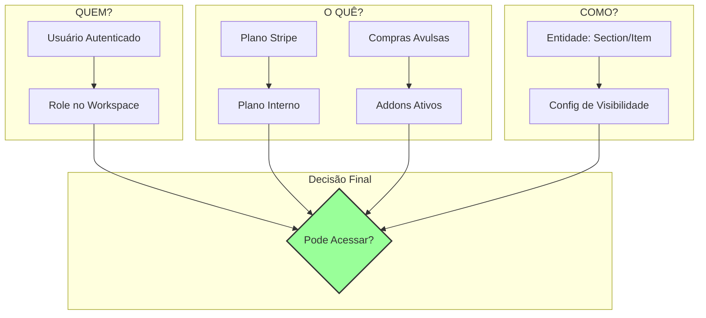

# 🧬 Plano de Acesso Gemini: Arquitetura de Controle de Acesso Evolutiva

## 1. Visão Geral e Princípios Fundamentais

Este documento descreve uma arquitetura de controle de acesso (ACA) projetada para ser **robusta, escalável e comercialmente inteligente**. Ela se baseia nos conceitos do documento `sistema-controle-acesso.md` e os aprimora com foco em modularidade, fluxos de dados claros e uma implementação faseada.

### **Princípios-Chave:**

*   **Fonte Única da Verdade (Single Source of Truth - SSoT):**
    *   **Stripe:** É a SSoT para *o que* o usuário comprou (ex: `price_1PG...`).
    *   **Base de Dados Interna (MongoDB):** É a SSoT para o *estado atual* do usuário/workspace (ex: `planId: 'business'`, `activeAddons: ['ai-generator']`).
    *   **Arquivos de Configuração (`/config`):** São a SSoT para *o que cada plano ou addon significa* (ex: o plano 'business' libera a feature 'analytics').
*   **Abstração Máxima:** O código da aplicação (ex: componentes React, rotas de API) **nunca** deve saber sobre Stripe, roles ou planos diretamente. Ele deve perguntar a um "mecanismo" central: `access.can(user, 'create', 'section')`.
*   **Configuração sobre Código:** As regras de acesso devem ser definidas em arquivos de configuração (`.yml` ou `.js`) sempre que possível, permitindo mudanças rápidas sem a necessidade de deploy.
*   **Inteligência Comercial:** O sistema deve ser projetado para facilitar upsells, fornecer dados para a equipe de negócios e permitir a experimentação com novos modelos de monetização.

---

## 2. A Tríade do Controle de Acesso

O acesso a qualquer recurso é determinado pela intersecção de três eixos:

1.  **QUEM? (Identidade e Role):** Quem é o usuário e qual seu papel no workspace (`owner`, `editor`, `guest`).
2.  **O QUÊ? (Plano e Compras):** O que o workspace assina (`plan: 'business'`) e quais addons avulsos foram comprados (`purchasedAddons: ['addon_analytics_pro']`).
3.  **COMO? (Visibilidade do Recurso):** Como o recurso específico está configurado (`visibility: 'public'`, `visibility: 'role_based'`).



---

## 3. Modelo de Dados e Fluxo de Sincronização

A chave para a robustez do sistema é um fluxo de dados claro e unidirecional desde a compra até a aplicação da permissão.

### **Passo 1: Configuração Centralizada**

Criaremos um "mapa" que conecta os IDs de preço do Stripe aos nossos planos e addons internos.

**`dashboard/config/stripe-map.js` (NOVO)**
```javascript
export const stripePriceMap = {
  // Planos (Preços Mensais)
  'price_1PG...': { type: 'plan', id: 'cupido' },
  'price_1PH...': { type: 'plan', id: 'afrodite' },
  'price_1PI...': { type: 'plan', id: 'zeus' },

  // Addons (Preços Avulsos ou Recorrentes)
  'price_1PJ...': { type: 'addon', id: 'extra_book' },
  'price_1PK...': { type: 'addon', id: 'premium_ai' },
};
```

**`dashboard/config/features.js` (NOVO - Evolução do `plans.yml`)**
Este arquivo define o que cada plano ou addon *realmente faz*.

```javascript
export const featuresConfig = {
  plans: {
    cupido: {
      name: "Plano Cupido",
      permissions: [
        'book:create', 'book:download:pdf',
      ],
      limits: {
        maxBooks: 1,
        maxPagesPerBook: 50,
      },
      features: {
        templates: ['classic', 'modern'],
      }
    },
    afrodite: {
      name: "Plano Afrodite",
      inherits: 'cupido', // Herda permissões e limites do cupido
      permissions: [
        'book:customize:cover', 'suggestions:ai'
      ],
      limits: {
        maxBooks: 3,
        maxPagesPerBook: 100,
      },
      features: {
        templates: '*', // Todos os templates
      }
    },
    zeus: {
      name: "Plano Zeus",
      inherits: 'afrodite',
      permissions: [
        'book:format:advanced', 'review:professional'
      ],
      limits: {
        maxBooks: -1, // Ilimitado
        maxPagesPerBook: -1,
      }
    }
  },
  addons: {
    extra_book: {
      name: "Livro Extra",
      type: 'usage', // Adiciona um "crédito"
      effects: {
        'limits.maxBooks': { operation: 'increment', value: 1 }
      }
    },
    premium_ai: {
      name: "IA Premium",
      type: 'feature',
      permissions: ['suggestions:ai:premium'],
    }
  }
};
```

### **Passo 2: Sincronização via Webhook**

O webhook do Stripe é o gatilho para atualizar nosso banco de dados.

**`dashboard/app/api/webhooks/stripe/route.js` (Lógica a ser implementada)**
```javascript
// 1. Validar a assinatura do webhook

// 2. Extrair o stripePriceId do evento (ex: 'checkout.session.completed')
const stripePriceId = session.line_items.data[0].price.id;

// 3. Consultar nosso mapa
const mapping = stripePriceMap[stripePriceId];
if (!mapping) {
  // Log de erro: ID de preço não mapeado
  return;
}

// 4. Encontrar o Workspace/User associado (via client_reference_id)
const workspaceId = session.client_reference_id;

// 5. Atualizar o documento do Workspace no MongoDB
if (mapping.type === 'plan') {
  await db.collection('workspaces').updateOne(
    { _id: workspaceId },
    { $set: { planId: mapping.id, stripePriceId: stripePriceId, planStatus: 'active' } }
  );
} else if (mapping.type === 'addon') {
  await db.collection('workspaces').updateOne(
    { _id: workspaceId },
    { $addToSet: { activeAddons: mapping.id } }
  );
}
```

### **Passo 3: O Schema do Workspace**

O documento do Workspace no MongoDB se torna a fonte da verdade para o estado de acesso.

**`dashboard/schemas/index.js` (Atualização no `WorkspaceSchema`)**
```javascript
// ... (dentro do WorkspaceSchema)
planId: { type: String, default: 'free' },
planStatus: { type: String, enum: ['active', 'canceled', 'past_due'], default: 'active' },
stripeCustomerId: { type: String },
stripeSubscriptionId: { type: String },
activeAddons: [{ type: String }], // ex: ['premium_ai', 'extra_book_1']
members: [{
  userId: String, // ID do Clerk
  role: { type: String, enum: ['owner', 'admin', 'editor', 'viewer'], default: 'viewer' }
}],
// ... limites e outras configurações
```

---

## 4. O Mecanismo de Acesso (`Access Engine`)

Esta é a peça central que abstrai toda a complexidade. Será uma classe ou um conjunto de funções que pode ser usado em qualquer lugar da aplicação.

**`dashboard/lib/access-engine.js` (NOVO)**
```javascript
import { featuresConfig } from '@/config/features';

class AccessEngine {
  constructor(workspace, user) {
    this.workspace = workspace; // Documento do Workspace do DB
    this.user = user; // Objeto do usuário (incluindo seu role no workspace)
    this.permissions = this._compilePermissions();
    this.limits = this._compileLimits();
  }

  // Compila todas as permissões do plano e addons
  _compilePermissions() {
    const planId = this.workspace.planId || 'free';
    let planConfig = featuresConfig.plans[planId];
    let permissions = new Set();

    // Processa herança de planos
    while (planConfig) {
      planConfig.permissions.forEach(p => permissions.add(p));
      planConfig = planConfig.inherits ? featuresConfig.plans[planConfig.inherits] : null;
    }

    // Adiciona permissões de addons
    this.workspace.activeAddons?.forEach(addonId => {
      const addonConfig = featuresConfig.addons[addonId];
      if (addonConfig?.permissions) {
        addonConfig.permissions.forEach(p => permissions.add(p));
      }
    });

    return permissions;
  }

  // Compila todos os limites
  _compileLimits() {
    // ... (lógica similar para compilar e aplicar limites de planos e addons)
    return { maxBooks: 1, maxPagesPerBook: 50, ... };
  }

  /**
   * A função principal de verificação.
   * @param {string} action - A ação a ser realizada (ex: 'create', 'view', 'download:pdf').
   * @param {string} resourceType - O tipo de recurso (ex: 'book', 'section', 'billing').
   * @param {object} [resource] - O objeto do recurso em si, para verificações de propriedade.
   * @returns {boolean}
   */
  can(action, resourceType, resource = null) {
    const permission = `${resourceType}:${action}`;

    // 1. Verificação baseada em permissão do plano/addon
    if (!this.permissions.has(permission)) {
      return false;
    }

    // 2. Verificação baseada em role (matriz de permissões)
    // (Pode ser uma matriz em config/features.js que mapeia roles para permissões)
    // Ex: se a permissão for 'billing:manage', o role deve ser 'owner' ou 'admin'
    const requiredRole = getRequiredRoleFor(permission); // Função auxiliar
    if (!isRoleSufficient(this.user.role, requiredRole)) {
      return false;
    }

    // 3. Verificação de propriedade (se aplicável)
    if (action.includes('own') && resource) {
        if (resource.createdBy !== this.user.id) {
            return false;
        }
    }

    // 4. Verificação de limites (se aplicável)
    if (action === 'create' && resourceType === 'book') {
        const currentBookCount = await db.collection('books').count({ workspaceId: this.workspace._id });
        if (this.limits.maxBooks !== -1 && currentBookCount >= this.limits.maxBooks) {
            return false;
        }
    }

    return true;
  }

  /**
   * Verifica se uma feature específica está habilitada.
   * @param {string} featureName - ex: 'templates'
   * @returns {any} - O valor da feature (ex: ['classic', 'modern'] ou '*')
   */
  getFeature(featureName) {
    // ... (lógica para buscar a feature no config do plano)
  }
}

// Função de fábrica para facilitar o uso
export async function createAccessEngine(workspaceId, userId) {
    const workspace = await db.collection('workspaces').findOne({ _id: workspaceId });
    const userMember = workspace.members.find(m => m.userId === userId);
    // ... (enriquecer objeto user se necessário)
    return new AccessEngine(workspace, { id: userId, role: userMember.role });
}
```

---

## 5. Integração com a Aplicação

Com o `AccessEngine` no lugar, a integração se torna limpa e declarativa.

### **Hook React `useAccess`**

**`dashboard/hooks/useAccess.js` (NOVO)**
```jsx
import { useState, useEffect } from 'react';
import { useWorkspace } from '@/contexts/WorkspaceContext';
import { useUser } from '@clerk/nextjs';
import { createAccessEngine } from '@/lib/access-engine';

export function useAccess() {
  const { currentWorkspace } = useWorkspace();
  const { user } = useUser();
  const [access, setAccess] = useState({ can: () => false, getFeature: () => null, ready: false });

  useEffect(() => {
    if (user && currentWorkspace) {
      createAccessEngine(currentWorkspace._id, user.id).then(engine => {
        setAccess({ ...engine, ready: true });
      });
    }
  }, [user, currentWorkspace]);

  return access;
}
```

### **Componente `Protected`**

**`dashboard/components/ui/Protected.jsx` (NOVO)**
```jsx
import { useAccess } from '@/hooks/useAccess';

export function Protected({ children, action, resourceType, fallback = null, showUpgrade = false }) {
  const access = useAccess();

  if (!access.ready) {
    return <div>Loading...</div>; // Ou um skeleton loader
  }

  if (access.can(action, resourceType)) {
    return <>{children}</>;
  }

  if (showUpgrade) {
    // return <UpgradePrompt feature={`${resourceType}:${action}`} />;
  }

  return fallback;
}

// Exemplo de uso:
<Protected action="create" resourceType="book">
  <Button>Criar Novo Livro</Button>
</Protected>

<Protected action="view" resourceType="analytics" fallback={<p>Analytics é um recurso premium.</p>}>
  <AnalyticsDashboard />
</Protected>
```

### **Middleware de API**

**`dashboard/middleware.js` (Atualização)**
```javascript
// ... (em uma função de middleware para rotas da API)
const engine = await createAccessEngine(workspaceId, userId);

if (!engine.can(action, resource)) {
  return new Response(JSON.stringify({ error: 'Forbidden' }), { status: 403 });
}
```

---

## 6. Roadmap de Implementação

**Fase 1: Backend e Configuração (1-2 semanas)**
1.  [ ] **Definir Schemas:** Implementar as mudanças nos schemas do MongoDB.
2.  [ ] **Criar Arquivos de Config:** Desenvolver `stripe-map.js` e `features.js`.
3.  [ ] **Implementar Webhook:** Construir a lógica de sincronização do Stripe.
4.  [ ] **Construir `AccessEngine` v1:** Focar na compilação de permissões e na função `can()`.
5.  [ ] **Testes Unitários:** Cobrir toda a lógica do `AccessEngine`.

**Fase 2: Integração Backend e Frontend (1 semana)**
1.  [ ] **Middleware de API:** Integrar o `AccessEngine` nas rotas da API.
2.  [ ] **Hook `useAccess`:** Criar o hook para o frontend.
3.  [ ] **Componente `Protected`:** Desenvolver o componente de proteção de UI.
4.  [ ] **Refatoração Inicial:** Substituir 3-5 verificações de acesso antigas pelas novas.

**Fase 3: Features Avançadas e UI (2 semanas)**
1.  [ ] **Lógica de Limites:** Implementar a verificação de limites no `AccessEngine`.
2.  [ ] **UI de Upgrade:** Criar os componentes `UpgradePrompt`.
3.  [ ] **Visibilidade de Seção/Item:** Adicionar a lógica de visibilidade de recurso ao `AccessEngine`.
4.  [ ] **UI de Configuração de Acesso:** Desenvolver a UI para um admin configurar a visibilidade de uma seção.

**Fase 4: Addons e Monetização Avulsa (1 semana)**
1.  [ ] **Fluxo de Compra de Addon:** Implementar a compra avulsa.
2.  [ ] **Atualização do `AccessEngine`:** Garantir que os addons comprados concedam as permissões corretas.
3.  [ ] **UI de Marketplace de Addons:** (Opcional) Uma página onde os usuários podem ver e comprar addons.
