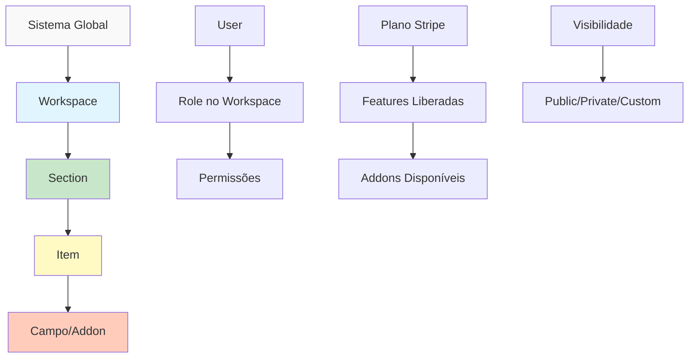

# 🔒 **Sistema de Controle de Acesso - Dashboard Engine**

## 📋 **Sumário Executivo**

Este documento define a arquitetura completa do sistema de controle de acesso do Dashboard Engine, abordando a triangulação entre **Roles**, **Planos** e **Visibilidade**, com foco em criar um sistema **modular**, **escalável** e **comercialmente inteligente**.

### **🎯 Objetivos Principais:**

1. **Controle Granular:** Permitir controle fino sobre quem acessa o quê
2. **Monetização Flexível:** Liberar funcionalidades por plano ou compra avulsa
3. **Multi-tenancy:** Isolamento total entre workspaces
4. **Escalabilidade:** Sistema que cresce com o negócio
5. **UX Intuitiva:** Fácil de configurar e entender

---

## 🔍 **Análise do Sistema Atual**

### **1. O que já existe:**

#### **Workspace & Multi-tenancy ✅**

```javascript
// schemas/index.js - WorkspaceSchema
{
  members: [{
    userId: String,
    role: ["owner", "admin", "editor", "viewer"],
    permissions: {
      canExport: Boolean,
      canInvite: Boolean,
      canManageBilling: Boolean
    }
  }],
  limits: {
    maxUsers: Number,
    maxContentTypes: Number,
    maxSections: Number,
    maxItems: Number
  }
}
```

#### **Sistema de Roles Básico ✅**

```javascript
// contexts/WorkspaceContext.jsx
hasPermission(permission); // Verifica permissão específica
hasRole(role); // Verifica role do usuário
canPerformAction(action); // Verifica limites do plano
```

#### **Integração Stripe ✅**

```javascript
// billing-triangulation.md
- Webhook processando pagamentos
- Sync com Clerk metadata
- Planos ativos no unsafeMetadata
- Histórico de transações
```

### **2. O que falta implementar:**

- ❌ **Controle de acesso por Section**
- ❌ **Visibilidade pública/privada de content**
- ❌ **Addons pagos individualmente**
- ❌ **Permissões por campo/addon**
- ❌ **Sistema de feature flags**
- ❌ **API de permissões**
- ❌ **UI/UX para configurar acessos**

---

## 🏗️ **Arquitetura Proposta**

### **1. Hierarquia de Controle**



### **2. Modelo de Dados Expandido**

#### **Section Schema - Adicionar controles de acesso:**

```javascript
export const SectionSchema = {
  // ... campos existentes ...

  // NOVO: Controles de Acesso
  access: {
    visibility: {
      type: "string",
      enum: ["public", "authenticated", "workspace", "role", "plan", "custom"],
      default: "workspace",
    },

    // Para visibility = "public"
    publicSettings: {
      allowAnonymousView: { type: "boolean", default: false },
      allowAnonymousCreate: { type: "boolean", default: false },
      requireEmail: { type: "boolean", default: false },
    },

    // Para visibility = "role"
    allowedRoles: [{ type: "string" }], // ["editor", "admin"]

    // Para visibility = "plan"
    requiredPlans: [{ type: "string" }], // ["business", "enterprise"]
    minimumPlan: { type: "string" }, // "starter"

    // Para visibility = "custom"
    customRule: { type: "string" }, // ID da regra customizada

    // Mensagens de fallback
    deniedMessage: { type: "string" },
    upgradeUrl: { type: "string" },
  },

  // NOVO: Configurações de monetização
  monetization: {
    isPaid: { type: "boolean", default: false },
    price: { type: "number" }, // Preço one-time
    stripePriceId: { type: "string" }, // Para cobrança recorrente
    purchaseType: {
      type: "string",
      enum: ["one-time", "subscription", "usage-based"],
      default: "one-time",
    },
  },
};
```

#### **ContentType Schema - Controle por campo:**

```javascript
// Expandir o schema de addons
addons: [
  {
    // ... campos existentes ...

    // NOVO: Controle de acesso por campo
    access: {
      view: {
        type: "string",
        enum: ["*", "authenticated", "role", "plan", "custom"],
        default: "*",
      },
      edit: {
        type: "string",
        enum: ["*", "role", "plan", "owner", "custom"],
        default: "role",
      },
      requiredRoles: [{ type: "string" }],
      requiredPlans: [{ type: "string" }],
      isPremium: { type: "boolean", default: false },
      premiumMessage: { type: "string" },
    },
  },
];
```

---

## 🎭 **Sistema de Roles Expandido**

### **1. Roles por Workspace**

```typescript
interface WorkspaceRole {
  // Roles base (existentes)
  owner: OwnerPermissions;
  admin: AdminPermissions;
  editor: EditorPermissions;
  viewer: ViewerPermissions;

  // NOVOS roles
  author: AuthorPermissions; // Cria apenas próprio conteúdo
  contributor: ContributorPerms; // Sugere conteúdo para aprovação
  moderator: ModeratorPerms; // Aprova/rejeita conteúdo
  guest: GuestPermissions; // Acesso temporário limitado
}
```

### **2. Matriz de Permissões Detalhada**

```javascript
const permissionMatrix = {
  // Workspace
  "workspace.view": ["*"],
  "workspace.edit": ["owner", "admin"],
  "workspace.delete": ["owner"],

  // Sections
  "sections.create": ["owner", "admin"],
  "sections.edit": ["owner", "admin", "editor"],
  "sections.delete": ["owner", "admin"],
  "sections.publish": ["owner", "admin", "editor", "moderator"],
  "sections.view": ["*"], // Depende da visibility da section

  // Items
  "items.create": ["owner", "admin", "editor", "author", "contributor"],
  "items.edit.any": ["owner", "admin", "editor"],
  "items.edit.own": ["author", "contributor"],
  "items.delete.any": ["owner", "admin"],
  "items.delete.own": ["editor", "author"],
  "items.publish": ["owner", "admin", "editor", "moderator"],
  "items.approve": ["owner", "admin", "moderator"],

  // Content Types
  "contentTypes.create": ["owner", "admin"],
  "contentTypes.edit": ["owner", "admin"],
  "contentTypes.delete": ["owner"],

  // Billing
  "billing.view": ["owner", "admin"],
  "billing.manage": ["owner"],

  // Members
  "members.invite": ["owner", "admin"],
  "members.remove": ["owner", "admin"],
  "members.changeRole": ["owner"],

  // Exports
  "export.csv": ["*"],
  "export.json": ["editor", "admin", "owner"],
  "export.pdf": ["admin", "owner"], // Ou por plano

  // API
  "api.read": ["editor", "admin", "owner"],
  "api.write": ["admin", "owner"],
  "api.generateKey": ["owner"],
};
```

---

## 💰 **Sistema de Planos e Features**

### **1. Configuração Central de Features**

```javascript
// config/plan-features.js
export const planFeatures = {
  free: {
    // Limites
    limits: {
      workspaces: 1,
      membersPerWorkspace: 1,
      sectionsPerWorkspace: 3,
      itemsPerSection: 50,
      monthlyAPIcalls: 0,
      storage: 100 * 1024 * 1024, // 100MB
    },

    // Addons disponíveis
    addons: {
      fields: ["textInput", "textarea", "numberInput", "checkboxInput"],
      behaviors: [],
      integrations: [],
    },

    // Views disponíveis
    views: ["table"],

    // Features
    features: {
      customDomain: false,
      whiteLabel: false,
      api: false,
      webhooks: false,
      automations: 0,
      customCSS: false,
      advancedSEO: false,
    },

    // Exports
    exports: ["csv"],

    support: {
      type: "community",
      sla: "none",
    },
  },

  starter: {
    // Herda do free e sobrescreve
    ...planFeatures.free,
    limits: {
      workspaces: 3,
      membersPerWorkspace: 5,
      sectionsPerWorkspace: 10,
      itemsPerSection: 200,
      monthlyAPIcalls: 1000,
      storage: 10 * 1024 * 1024 * 1024, // 10GB
    },

    addons: {
      fields: [
        ...planFeatures.free.addons.fields,
        "dateInput",
        "selectInput",
        "imageUpload",
      ],
      behaviors: ["slugField", "autoSave"],
      integrations: [],
    },

    views: ["table", "gallery"],

    features: {
      ...planFeatures.free.features,
      api: "readonly",
      automations: 10,
      advancedSEO: true,
    },

    exports: ["csv", "json"],

    support: {
      type: "email",
      sla: "48h",
    },

    price: {
      monthly: 29,
      yearly: 290, // 2 meses grátis
      currency: "USD",
    },
  },

  business: {
    limits: {
      workspaces: 10,
      membersPerWorkspace: 20,
      sectionsPerWorkspace: 50,
      itemsPerSection: 1000,
      monthlyAPIcalls: 10000,
      storage: 100 * 1024 * 1024 * 1024, // 100GB
    },

    addons: {
      fields: [
        ...planFeatures.starter.addons.fields,
        "cloudinaryUpload",
        "cloudinaryGallery",
        "richText",
        "codeEditor",
        "relationship",
      ],
      behaviors: [
        ...planFeatures.starter.addons.behaviors,
        "versionControl",
        "workflow",
        "approval",
      ],
      integrations: ["zapier", "slack", "email"],
    },

    views: ["table", "gallery", "kanban", "calendar"],

    features: {
      customDomain: true,
      whiteLabel: false,
      api: "full",
      webhooks: true,
      automations: 100,
      customCSS: true,
      advancedSEO: true,
      analytics: true,
      backup: "daily",
    },

    exports: ["csv", "json", "pdf", "xlsx"],

    support: {
      type: "priority",
      sla: "24h",
      phone: true,
    },

    price: {
      monthly: 99,
      yearly: 990,
      currency: "USD",
    },
  },

  enterprise: {
    limits: {
      workspaces: Infinity,
      membersPerWorkspace: Infinity,
      sectionsPerWorkspace: Infinity,
      itemsPerSection: Infinity,
      monthlyAPIcalls: Infinity,
      storage: 1024 * 1024 * 1024 * 1024, // 1TB+
    },

    addons: {
      fields: "*", // Todos
      behaviors: "*",
      integrations: "*",
    },

    views: "*", // Todas, incluindo custom

    features: {
      customDomain: true,
      whiteLabel: true,
      api: "full",
      webhooks: true,
      automations: Infinity,
      customCSS: true,
      advancedSEO: true,
      analytics: true,
      backup: "realtime",
      sso: true,
      audit: true,
      customIntegrations: true,
    },

    exports: "*",

    support: {
      type: "dedicated",
      sla: "1h",
      phone: true,
      slack: true,
      accountManager: true,
    },

    price: {
      monthly: 299,
      yearly: 2990,
      currency: "USD",
      custom: true, // Negociação
    },
  },
};
```

### **2. Addons Pagos Individualmente**

```javascript
// config/paid-addons.js
export const paidAddons = {
  // Addons de Campo
  fields: {
    aiTextGenerator: {
      id: "ai-text-generator",
      name: "AI Text Generator",
      description: "Gere textos com IA baseado em prompts",
      price: {
        monthly: 9.99,
        usage: 0.01, // por geração
      },
      requiredPlan: ["business", "enterprise"],
      stripePriceId: "price_ai_text_monthly",
    },

    advancedFormula: {
      id: "advanced-formula",
      name: "Fórmulas Avançadas",
      description: "Campo de fórmula com funções complexas",
      price: {
        monthly: 4.99,
      },
      requiredPlan: ["starter", "business", "enterprise"],
    },
  },

  // Addons de View
  views: {
    ganttChart: {
      id: "gantt-chart",
      name: "Gantt Chart View",
      description: "Visualização de linha do tempo para projetos",
      price: {
        monthly: 19.99,
      },
      requiredPlan: ["business", "enterprise"],
    },

    kanbanAdvanced: {
      id: "kanban-advanced",
      name: "Kanban Avançado",
      description: "Kanban com automações e swim lanes",
      price: {
        monthly: 14.99,
      },
      requiredPlan: ["business", "enterprise"],
    },
  },

  // Addons de Integração
  integrations: {
    salesforce: {
      id: "salesforce-sync",
      name: "Salesforce Sync",
      description: "Sincronização bidirecional com Salesforce",
      price: {
        monthly: 49.99,
      },
      requiredPlan: ["enterprise"],
    },

    customWebhooks: {
      id: "custom-webhooks",
      name: "Webhooks Ilimitados",
      description: "Webhooks customizados sem limites",
      price: {
        monthly: 29.99,
      },
      requiredPlan: ["business", "enterprise"],
    },
  },

  // Pacotes de Créditos
  credits: {
    aiCredits: {
      id: "ai-credits-pack",
      name: "Pacote de Créditos IA",
      packages: {
        small: { credits: 100, price: 9.99 },
        medium: { credits: 500, price: 39.99 },
        large: { credits: 2000, price: 99.99 },
      },
    },

    exportCredits: {
      id: "export-credits",
      name: "Créditos de Exportação",
      packages: {
        small: { credits: 50, price: 4.99 },
        medium: { credits: 200, price: 14.99 },
        large: { credits: 1000, price: 49.99 },
      },
    },
  },
};
```

---

## 🔐 **Sistema de Visibilidade e Acesso**

### **1. Configuração de Section**

```javascript
// models/section-access.js
class SectionAccess {
  constructor(section, user, workspace) {
    this.section = section;
    this.user = user;
    this.workspace = workspace;
  }

  canView() {
    const { visibility } = this.section.access;

    switch (visibility) {
      case 'public':
        return true;

      case 'authenticated':
        return !!this.user;

      case 'workspace':
        return this.isWorkspaceMember();

      case 'role':
        return this.hasRequiredRole();

      case 'plan':
        return this.hasRequiredPlan();

      case 'custom':
        return this.evaluateCustomRule();

      default:
        return false;
    }
  }

  canCreate() {
    if (!this.canView()) return false;

    // Verificar limites do plano
    const limits = planFeatures[this.workspace.plan].limits;
    const currentItems = await this.countSectionItems();

    if (currentItems >= limits.itemsPerSection) {
      throw new Error(`Limite de ${limits.itemsPerSection} items atingido`);
    }

    // Verificar permissão do role
    return this.user.can('items.create');
  }

  canEdit(item = null) {
    if (!this.canView()) return false;

    if (item) {
      // Edição de item específico
      if (item.createdBy === this.user.id) {
        return this.user.can('items.edit.own');
      }
      return this.user.can('items.edit.any');
    }

    // Edição da section
    return this.user.can('sections.edit');
  }

  getAccessDeniedReason() {
    const { visibility, deniedMessage } = this.section.access;

    if (deniedMessage) return deniedMessage;

    switch (visibility) {
      case 'authenticated':
        return 'Faça login para acessar esta seção';

      case 'role':
        return `Acesso restrito a: ${this.section.access.allowedRoles.join(', ')}`;

      case 'plan':
        const minPlan = this.section.access.minimumPlan;
        return `Disponível a partir do plano ${minPlan}`;

      default:
        return 'Você não tem permissão para acessar esta seção';
    }
  }
}
```

### **2. Configuração de Campo/Addon**

```javascript
// models/field-access.js
class FieldAccess {
  constructor(field, user, workspace, item) {
    this.field = field;
    this.user = user;
    this.workspace = workspace;
    this.item = item;
  }

  canView() {
    const { view } = this.field.access;

    if (view === "*") return true;
    if (view === "authenticated" && !this.user) return false;

    if (view === "role") {
      return this.field.access.requiredRoles.some((role) =>
        this.user.hasRole(role)
      );
    }

    if (view === "plan") {
      return this.field.access.requiredPlans.some(
        (plan) =>
          this.workspace.plan === plan ||
          this.isPlanHigherThan(this.workspace.plan, plan)
      );
    }

    if (view === "custom" && typeof view === "function") {
      return view(this.user, this.item, this.workspace);
    }

    return false;
  }

  canEdit() {
    if (!this.canView()) return false;

    const { edit } = this.field.access;

    if (edit === "*") return true;
    if (edit === "owner") return this.item?.createdBy === this.user.id;

    // Similar lógica do canView mas para edição
    return this.checkEditPermission(edit);
  }

  getFieldValue() {
    if (!this.canView()) {
      if (this.field.access.isPremium) {
        return {
          blocked: true,
          message: this.field.access.premiumMessage || "Campo Premium",
          upgradeUrl: `/upgrade?feature=${this.field.id}`,
        };
      }
      return null;
    }

    return this.item.data[this.field.id];
  }
}
```

---

## 🛠️ **Implementação Técnica**

### **1. Middleware de Autorização**

```javascript
// middleware/access-control.js
export const accessControl = {
  // Middleware para rotas da API
  requireAuth: async (req, res, next) => {
    const { userId } = await auth();
    if (!userId) {
      return res.status(401).json({ error: "Unauthorized" });
    }
    req.userId = userId;
    next();
  },

  requireWorkspaceMember: async (req, res, next) => {
    const workspaceId = req.headers["x-workspace-id"];
    const workspace = await db.findOne("workspaces", {
      _id: workspaceId,
      "members.userId": req.userId,
    });

    if (!workspace) {
      return res.status(403).json({ error: "Not a workspace member" });
    }

    req.workspace = workspace;
    req.userRole = workspace.members.find((m) => m.userId === req.userId).role;
    next();
  },

  requirePermission: (resource, action) => async (req, res, next) => {
    const permission = `${resource}.${action}`;
    const allowed = permissionMatrix[permission];

    if (!allowed || !allowed.includes(req.userRole)) {
      return res.status(403).json({
        error: "Insufficient permissions",
        required: permission,
        userRole: req.userRole,
      });
    }

    next();
  },

  requirePlan: (minimumPlan) => async (req, res, next) => {
    const planHierarchy = { free: 0, starter: 1, business: 2, enterprise: 3 };
    const userPlanLevel = planHierarchy[req.workspace.plan] || 0;
    const requiredLevel = planHierarchy[minimumPlan] || 0;

    if (userPlanLevel < requiredLevel) {
      return res.status(403).json({
        error: "Plan upgrade required",
        currentPlan: req.workspace.plan,
        requiredPlan: minimumPlan,
        upgradeUrl: "/billing",
      });
    }

    next();
  },

  checkSectionAccess: async (req, res, next) => {
    const sectionId = req.params.sectionId || req.body.sectionId;
    const section = await db.findOne("sections", { _id: sectionId });

    if (!section) {
      return res.status(404).json({ error: "Section not found" });
    }

    const access = new SectionAccess(section, req.user, req.workspace);

    if (!access.canView()) {
      return res.status(403).json({
        error: "Access denied",
        reason: access.getAccessDeniedReason(),
      });
    }

    req.section = section;
    req.sectionAccess = access;
    next();
  },
};
```

### **2. Hooks React para Controle de Acesso**

```javascript
// hooks/useAccessControl.js
import { useUser } from "@clerk/nextjs";
import { useWorkspace } from "@/contexts/WorkspaceContext";
import { planFeatures, paidAddons } from "@/config";

export function useAccessControl() {
  const { user } = useUser();
  const { currentWorkspace } = useWorkspace();

  const checkPermission = useCallback(
    (resource, action) => {
      if (!user || !currentWorkspace) return false;

      const member = currentWorkspace.members.find((m) => m.userId === user.id);
      if (!member) return false;

      const permission = `${resource}.${action}`;
      const allowed = permissionMatrix[permission];

      return (
        allowed?.includes(member.role) ||
        allowed?.includes("*") ||
        member.role === "owner"
      );
    },
    [user, currentWorkspace]
  );

  const checkPlanFeature = useCallback(
    (feature) => {
      if (!currentWorkspace) return false;

      const plan = planFeatures[currentWorkspace.plan];
      if (!plan) return false;

      // Verificar em diferentes categorias
      if (feature.startsWith("addon.")) {
        const addonType = feature.split(".")[1];
        const addonId = feature.split(".")[2];
        return (
          plan.addons[addonType]?.includes(addonId) ||
          plan.addons[addonType] === "*"
        );
      }

      if (feature.startsWith("view.")) {
        const viewType = feature.replace("view.", "");
        return plan.views.includes(viewType) || plan.views === "*";
      }

      if (feature.startsWith("export.")) {
        const exportType = feature.replace("export.", "");
        return plan.exports.includes(exportType) || plan.exports === "*";
      }

      // Features gerais
      return plan.features[feature] === true;
    },
    [currentWorkspace]
  );

  const checkAddonPurchased = useCallback(
    (addonId) => {
      if (!currentWorkspace) return false;

      // Verificar se está incluído no plano
      const planIncluded = Object.values(planFeatures).some((plan) => {
        return Object.values(plan.addons).flat().includes(addonId);
      });

      if (planIncluded && checkPlanFeature(`addon.${addonId}`)) {
        return true;
      }

      // Verificar se foi comprado separadamente
      return currentWorkspace.purchasedAddons?.includes(addonId);
    },
    [currentWorkspace]
  );

  const getUpgradeOptions = useCallback(
    (feature) => {
      const options = [];

      // Verificar em quais planos está disponível
      Object.entries(planFeatures).forEach(([planName, planConfig]) => {
        if (planName === currentWorkspace?.plan) return;

        let hasFeature = false;

        if (feature.startsWith("addon.")) {
          const [, type, id] = feature.split(".");
          hasFeature =
            planConfig.addons[type]?.includes(id) ||
            planConfig.addons[type] === "*";
        } else if (feature.startsWith("view.")) {
          const viewType = feature.replace("view.", "");
          hasFeature =
            planConfig.views.includes(viewType) || planConfig.views === "*";
        } else {
          hasFeature = planConfig.features[feature] === true;
        }

        if (hasFeature) {
          options.push({
            plan: planName,
            price: planConfig.price,
          });
        }
      });

      // Verificar se pode ser comprado separadamente
      const [, addonType, addonId] = feature.split(".");
      if (addonType && addonId && paidAddons[addonType]?.[addonId]) {
        const addon = paidAddons[addonType][addonId];
        if (addon.requiredPlan.includes(currentWorkspace?.plan)) {
          options.push({
            type: "addon",
            addon: addon,
            price: addon.price,
          });
        }
      }

      return options;
    },
    [currentWorkspace]
  );

  return {
    can: checkPermission,
    hasFeature: checkPlanFeature,
    hasAddon: checkAddonPurchased,
    getUpgradeOptions,

    // Shortcuts úteis
    canCreateSection: checkPermission("sections", "create"),
    canEditSection: checkPermission("sections", "edit"),
    canDeleteSection: checkPermission("sections", "delete"),
    canCreateItem: checkPermission("items", "create"),
    canEditAnyItem: checkPermission("items", "edit.any"),
    canManageBilling: checkPermission("billing", "manage"),

    // Info do plano
    currentPlan: currentWorkspace?.plan || "free",
    planLimits: planFeatures[currentWorkspace?.plan || "free"]?.limits,
  };
}
```

### **3. Componentes de UI para Controle de Acesso**

```jsx
// components/access/ProtectedFeature.jsx
export function ProtectedFeature({
  require,
  fallback = null,
  children,
  showUpgrade = true,
  inline = false
}) {
  const { can, hasFeature, hasAddon, getUpgradeOptions } = useAccessControl();
  const [showUpgradeModal, setShowUpgradeModal] = useState(false);

  // Verificar permissão
  if (require.permission) {
    const [resource, action] = require.permission.split('.');
    if (!can(resource, action)) {
      if (fallback) return fallback;
      if (!showUpgrade) return null;

      return (
        <AccessDenied
          type="permission"
          required={require.permission}
          inline={inline}
        />
      );
    }
  }

  // Verificar feature do plano
  if (require.feature && !hasFeature(require.feature)) {
    const upgradeOptions = getUpgradeOptions(require.feature);

    if (fallback) return fallback;
    if (!showUpgrade) return null;

    return (
      <>
        <UpgradePrompt
          feature={require.feature}
          options={upgradeOptions}
          inline={inline}
          onClick={() => setShowUpgradeModal(true)}
        />
        {showUpgradeModal && (
          <UpgradeModal
            feature={require.feature}
            options={upgradeOptions}
            onClose={() => setShowUpgradeModal(false)}
          />
        )}
      </>
    );
  }

  // Verificar addon
  if (require.addon && !hasAddon(require.addon)) {
    if (fallback) return fallback;
    if (!showUpgrade) return null;

    return (
      <AddonPrompt
        addon={require.addon}
        inline={inline}
      />
    );
  }

  return children;
}

// Uso:
<ProtectedFeature require={{ permission: 'sections.create' }}>
  <Button onClick={handleCreateSection}>Nova Section</Button>
</ProtectedFeature>

<ProtectedFeature
  require={{ feature: 'view.kanban' }}
  fallback={<div>Vista Kanban disponível no plano Business</div>}
>
  <KanbanView items={items} />
</ProtectedFeature>

<ProtectedFeature require={{ addon: 'ai-text-generator' }}>
  <AIGeneratorField />
</ProtectedFeature>
```

```jsx
// components/access/SectionAccessConfig.jsx
export function SectionAccessConfig({ section, onChange }) {
  const [config, setConfig] = useState(
    section.access || {
      visibility: "workspace",
      publicSettings: {},
      allowedRoles: [],
      requiredPlans: [],
    }
  );

  const handleVisibilityChange = (visibility) => {
    setConfig((prev) => ({ ...prev, visibility }));
    onChange({ ...config, visibility });
  };

  return (
    <div className="space-y-4">
      <div>
        <label className="block text-sm font-medium mb-2">
          Visibilidade da Section
        </label>
        <select
          value={config.visibility}
          onChange={(e) => handleVisibilityChange(e.target.value)}
          className="w-full px-3 py-2 border rounded-lg"
        >
          <option value="workspace">Apenas membros do workspace</option>
          <option value="public">Pública (qualquer pessoa)</option>
          <option value="authenticated">Usuários autenticados</option>
          <option value="role">Roles específicos</option>
          <option value="plan">Planos específicos</option>
          <option value="custom">Regra customizada</option>
        </select>
      </div>

      {config.visibility === "public" && (
        <div className="space-y-2 p-4 bg-blue-50 rounded-lg">
          <h4 className="font-medium">Configurações Públicas</h4>
          <label className="flex items-center space-x-2">
            <input
              type="checkbox"
              checked={config.publicSettings.allowAnonymousView}
              onChange={(e) =>
                setConfig((prev) => ({
                  ...prev,
                  publicSettings: {
                    ...prev.publicSettings,
                    allowAnonymousView: e.target.checked,
                  },
                }))
              }
            />
            <span>Permitir visualização anônima</span>
          </label>

          <label className="flex items-center space-x-2">
            <input
              type="checkbox"
              checked={config.publicSettings.allowAnonymousCreate}
              onChange={(e) =>
                setConfig((prev) => ({
                  ...prev,
                  publicSettings: {
                    ...prev.publicSettings,
                    allowAnonymousCreate: e.target.checked,
                  },
                }))
              }
            />
            <span>Permitir criação anônima</span>
          </label>

          {config.publicSettings.allowAnonymousCreate && (
            <label className="flex items-center space-x-2 ml-6">
              <input
                type="checkbox"
                checked={config.publicSettings.requireEmail}
                onChange={(e) =>
                  setConfig((prev) => ({
                    ...prev,
                    publicSettings: {
                      ...prev.publicSettings,
                      requireEmail: e.target.checked,
                    },
                  }))
                }
              />
              <span>Exigir email</span>
            </label>
          )}
        </div>
      )}

      {config.visibility === "role" && (
        <div className="space-y-2">
          <label className="block text-sm font-medium">Roles permitidos</label>
          <div className="space-y-1">
            {["viewer", "author", "editor", "admin"].map((role) => (
              <label key={role} className="flex items-center space-x-2">
                <input
                  type="checkbox"
                  checked={config.allowedRoles.includes(role)}
                  onChange={(e) => {
                    if (e.target.checked) {
                      setConfig((prev) => ({
                        ...prev,
                        allowedRoles: [...prev.allowedRoles, role],
                      }));
                    } else {
                      setConfig((prev) => ({
                        ...prev,
                        allowedRoles: prev.allowedRoles.filter(
                          (r) => r !== role
                        ),
                      }));
                    }
                  }}
                />
                <span className="capitalize">{role}</span>
              </label>
            ))}
          </div>
        </div>
      )}

      {config.visibility === "plan" && (
        <div className="space-y-2">
          <label className="block text-sm font-medium">Planos com acesso</label>
          <select
            value={config.minimumPlan || "starter"}
            onChange={(e) =>
              setConfig((prev) => ({
                ...prev,
                minimumPlan: e.target.value,
                requiredPlans: getPlansFromMinimum(e.target.value),
              }))
            }
            className="w-full px-3 py-2 border rounded-lg"
          >
            <option value="starter">Starter e superiores</option>
            <option value="business">Business e superiores</option>
            <option value="enterprise">Apenas Enterprise</option>
          </select>
        </div>
      )}

      <div>
        <label className="block text-sm font-medium mb-2">
          Mensagem de acesso negado (opcional)
        </label>
        <textarea
          value={config.deniedMessage || ""}
          onChange={(e) =>
            setConfig((prev) => ({
              ...prev,
              deniedMessage: e.target.value,
            }))
          }
          placeholder="Ex: Esta seção está disponível apenas para membros premium"
          className="w-full px-3 py-2 border rounded-lg"
          rows={2}
        />
      </div>

      {/* Preview */}
      <div className="p-4 bg-gray-100 rounded-lg">
        <h4 className="font-medium mb-2">Preview de Acesso</h4>
        <AccessPreview config={config} />
      </div>
    </div>
  );
}
```

---

## 📊 **Sistema de Monitoramento e Analytics**

### **1. Tracking de Tentativas de Acesso**

```javascript
// services/access-analytics.js
class AccessAnalytics {
  async trackAccessAttempt(userId, resource, action, result) {
    const event = {
      userId,
      workspaceId: getCurrentWorkspaceId(),
      resource,
      action,
      result, // 'allowed', 'denied_permission', 'denied_plan', 'denied_limit'
      timestamp: new Date(),
      metadata: {
        userPlan: getUserPlan(),
        userRole: getUserRole(),
        feature: `${resource}.${action}`,
      },
    };

    // Salvar no banco
    await db.insertOne("access_logs", event);

    // Enviar para analytics
    await analytics.track("access_attempt", event);

    // Verificar padrões para upsell
    if (result.startsWith("denied_")) {
      await this.checkUpsellOpportunity(userId, resource, action);
    }
  }

  async checkUpsellOpportunity(userId, resource, action) {
    // Contar tentativas negadas nos últimos 7 dias
    const deniedAttempts = await db.count("access_logs", {
      userId,
      result: { $regex: "^denied_" },
      timestamp: { $gte: new Date(Date.now() - 7 * 24 * 60 * 60 * 1000) },
    });

    if (deniedAttempts >= 3) {
      // Trigger campanha de upsell
      await this.triggerUpsellCampaign(userId, {
        reason: "multiple_access_denials",
        features: await this.getMostDeniedFeatures(userId),
      });
    }
  }

  async getAccessMetrics(workspaceId, period = "30d") {
    const startDate = this.getStartDate(period);

    const metrics = await db.aggregate("access_logs", [
      {
        $match: {
          workspaceId,
          timestamp: { $gte: startDate },
        },
      },
      {
        $group: {
          _id: {
            resource: "$resource",
            action: "$action",
            result: "$result",
          },
          count: { $sum: 1 },
        },
      },
      {
        $group: {
          _id: "$_id.resource",
          actions: {
            $push: {
              action: "$_id.action",
              result: "$_id.result",
              count: "$count",
            },
          },
          totalAttempts: { $sum: "$count" },
        },
      },
    ]);

    return this.formatMetrics(metrics);
  }
}
```

### **2. Dashboard de Permissões (Admin)**

```jsx
// components/admin/PermissionsDashboard.jsx
export function PermissionsDashboard() {
  const { currentWorkspace } = useWorkspace();
  const [metrics, setMetrics] = useState(null);
  const [period, setPeriod] = useState("7d");

  useEffect(() => {
    loadMetrics();
  }, [period, currentWorkspace]);

  const loadMetrics = async () => {
    const data = await fetch(`/api/admin/access-metrics?period=${period}`);
    setMetrics(await data.json());
  };

  return (
    <div className="space-y-6">
      <div className="flex justify-between items-center">
        <h2 className="text-2xl font-bold">Dashboard de Permissões</h2>
        <select
          value={period}
          onChange={(e) => setPeriod(e.target.value)}
          className="px-4 py-2 border rounded-lg"
        >
          <option value="24h">Últimas 24 horas</option>
          <option value="7d">Últimos 7 dias</option>
          <option value="30d">Últimos 30 dias</option>
        </select>
      </div>

      {/* Cards de métricas */}
      <div className="grid grid-cols-4 gap-4">
        <MetricCard
          title="Total de Acessos"
          value={metrics?.totalAccess || 0}
          change={metrics?.accessChange}
        />
        <MetricCard
          title="Acessos Negados"
          value={metrics?.deniedAccess || 0}
          change={metrics?.deniedChange}
          color="red"
        />
        <MetricCard
          title="Taxa de Sucesso"
          value={`${metrics?.successRate || 0}%`}
          change={metrics?.successRateChange}
        />
        <MetricCard
          title="Features Mais Negadas"
          value={metrics?.topDeniedFeature || "-"}
          subtitle={`${metrics?.topDeniedCount || 0} tentativas`}
        />
      </div>

      {/* Gráfico de tentativas por feature */}
      <div className="bg-white p-6 rounded-lg shadow">
        <h3 className="text-lg font-medium mb-4">
          Tentativas de Acesso por Feature
        </h3>
        <AccessChart data={metrics?.featureAttempts} />
      </div>

      {/* Lista de usuários com mais negações */}
      <div className="bg-white p-6 rounded-lg shadow">
        <h3 className="text-lg font-medium mb-4">
          Usuários com Mais Acessos Negados
        </h3>
        <p className="text-sm text-gray-600 mb-4">
          Potenciais candidatos para upgrade
        </p>
        <UserDenialsList users={metrics?.topDeniedUsers} />
      </div>

      {/* Recomendações de upsell */}
      <div className="bg-white p-6 rounded-lg shadow">
        <h3 className="text-lg font-medium mb-4">Recomendações de Upsell</h3>
        <UpsellRecommendations data={metrics?.upsellOpportunities} />
      </div>
    </div>
  );
}
```

---

## 🚀 **Roadmap de Implementação**

### **Fase 1: Foundation (2-3 semanas)**

#### **Semana 1-2: Backend Core**

- [ ] Expandir schemas com campos de acesso
- [ ] Implementar sistema de permissões base
- [ ] Criar middleware de autorização
- [ ] Integrar com Clerk metadata
- [ ] Testes unitários das permissões

#### **Semana 3: Frontend Foundation**

- [ ] Hook useAccessControl
- [ ] Componente ProtectedFeature
- [ ] UI de configuração de acesso básica
- [ ] Integração com componentes existentes

### **Fase 2: Plan Integration (2-3 semanas)**

#### **Semana 4-5: Feature Flags**

- [ ] Configuração central de features por plano
- [ ] Sistema de verificação de limites
- [ ] API de verificação de features
- [ ] Cache de permissões

#### **Semana 6: UI/UX de Planos**

- [ ] Componentes de upgrade prompt
- [ ] Modal de comparação de planos
- [ ] Integração com Stripe checkout
- [ ] Testes de fluxo de upgrade

### **Fase 3: Advanced Features (3-4 semanas)**

#### **Semana 7-8: Addons System**

- [ ] CRUD de addons pagos
- [ ] Sistema de ativação/desativação
- [ ] Integração com cobrança
- [ ] UI de marketplace de addons

#### **Semana 9: Access Customization**

- [ ] Editor de regras customizadas
- [ ] Sistema de permissões por campo
- [ ] Override de permissões
- [ ] Herança de permissões

#### **Semana 10: Public Access**

- [ ] Sistema de sections públicas
- [ ] Formulários anônimos
- [ ] Rate limiting
- [ ] Captcha integration

### **Fase 4: Analytics & Optimization (2 semanas)**

#### **Semana 11: Monitoring**

- [ ] Sistema de tracking de acessos
- [ ] Dashboard de analytics
- [ ] Alertas de tentativas suspeitas
- [ ] Relatórios de uso

#### **Semana 12: Performance**

- [ ] Otimização de queries
- [ ] Cache distribuído (Redis)
- [ ] CDN para assets públicos
- [ ] Load testing

---

## 🧪 **Plano de Testes**

### **1. Testes Unitários**

```javascript
// tests/permissions.test.js
describe("Permission System", () => {
  it("should allow owner all permissions", () => {
    const user = { role: "owner" };
    expect(canPerform(user, "workspace.delete")).toBe(true);
  });

  it("should deny viewer from creating items", () => {
    const user = { role: "viewer" };
    expect(canPerform(user, "items.create")).toBe(false);
  });

  it("should respect plan limits", () => {
    const workspace = { plan: "free", sections: 3 };
    expect(canCreateSection(workspace)).toBe(false);
  });
});
```

### **2. Testes de Integração**

```javascript
// tests/access-control.integration.test.js
describe("Access Control Integration", () => {
  it("should block public access to private section", async () => {
    const response = await request(app)
      .get("/api/sections/private-section/items")
      .expect(401);

    expect(response.body.error).toBe("Unauthorized");
  });

  it("should allow plan features correctly", async () => {
    const response = await request(app)
      .get("/api/export/pdf")
      .set("Authorization", "Bearer FREE_PLAN_TOKEN")
      .expect(403);

    expect(response.body.requiredPlan).toBe("business");
  });
});
```

### **3. Testes E2E**

```javascript
// tests/e2e/upgrade-flow.test.js
describe("Upgrade Flow", () => {
  it("should show upgrade prompt and redirect to billing", async () => {
    await page.goto("/dashboard/sections");
    await page.click('[data-test="create-section"]');

    // Should see limit reached message
    await expect(page).toHaveText("Limite de 3 sections atingido");

    // Click upgrade
    await page.click('[data-test="upgrade-button"]');

    // Should redirect to billing
    await expect(page).toHaveURL("/billing?plan=starter");
  });
});
```

---

## 📚 **Documentação de API**

### **Endpoints de Controle de Acesso**

```typescript
// GET /api/access/check
interface CheckAccessRequest {
  resource: string;
  action: string;
  context?: {
    sectionId?: string;
    itemId?: string;
    workspaceId?: string;
  };
}

interface CheckAccessResponse {
  allowed: boolean;
  reason?: "permission" | "plan" | "limit" | "custom";
  message?: string;
  upgradeOptions?: UpgradeOption[];
}

// GET /api/access/user-permissions
interface UserPermissionsResponse {
  role: string;
  permissions: string[];
  plan: string;
  planFeatures: PlanFeatures;
  addons: string[];
  limits: PlanLimits;
  usage: {
    workspaces: number;
    sections: number;
    items: number;
    storage: number;
  };
}

// POST /api/access/override
interface OverridePermissionRequest {
  userId: string;
  permissions: {
    [resource: string]: string[];
  };
  expiresAt?: Date;
}

// GET /api/features/available
interface AvailableFeaturesResponse {
  plan: string;
  features: {
    addons: AddonInfo[];
    views: ViewInfo[];
    exports: string[];
    limits: PlanLimits;
  };
  purchasedAddons: string[];
  upgradeOptions: UpgradeOption[];
}
```

---

## 🎯 **Conclusão e Benefícios**

### **Para o Negócio:**

1. **Monetização Flexível:** Venda por plano, addon ou uso
2. **Upsell Inteligente:** Analytics mostram oportunidades
3. **Redução de Churn:** Usuários veem valor em fazer upgrade
4. **Escalabilidade:** Atende de free a enterprise

### **Para os Usuários:**

1. **Transparência:** Sempre sabem o que podem acessar
2. **Flexibilidade:** Compram apenas o que precisam
3. **Segurança:** Dados protegidos por níveis apropriados
4. **Progressão Clara:** Caminho óbvio de upgrade

### **Para o Desenvolvimento:**

1. **Modular:** Fácil adicionar novos tipos de controle
2. **Testável:** Cada parte pode ser testada isoladamente
3. **Performático:** Cache e otimizações incluídas
4. **Manutenível:** Código organizado e documentado

Este sistema transforma o Dashboard Engine em uma plataforma verdadeiramente enterprise-ready, com controle fino de acesso e múltiplas formas de monetização.
