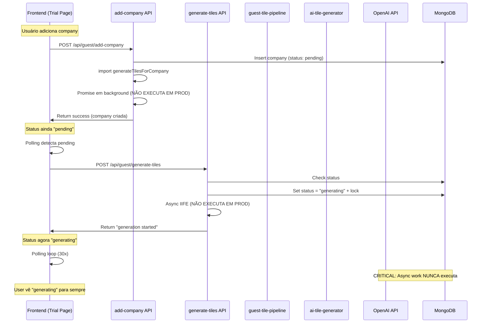
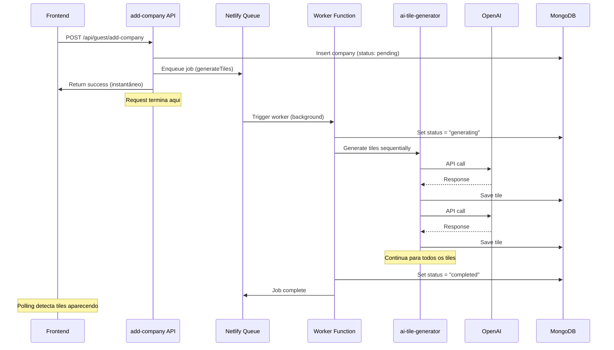

# 📊 Plano Completo: Arquitetura de Geração de Tiles

## 🔴 Problemas Identificados

### 1. Performance Crítica

- **Ambiente Local**: Tiles gerados em 5-15s ✅
- **Produção (Netlify)**: Tiles demoram 60-120s ⚠️
- **Primeiro Tile**: 115.3s (OpenAI: 114.1s = 99% do tempo)
- **Tiles Seguintes**: 15-35s (ainda lento)

### 2. Cold Start em Produção

- Netlify Functions têm cold start de 1-3s
- MongoDB Atlas tem latência inicial de 2-5s
- OpenAI API tem cold start de 3-8s no primeiro tile
- **Total cold start**: 6-16s só para iniciar

### 3. Arquitetura Duplicada (Bug Crítico)

Existem DOIS caminhos para gerar tiles:

**Caminho A** (via `add-company`):

```
add-company → generateTilesForCompany (pipeline) → OpenAI → DB
```

**Caminho B** (via `generate-tiles` endpoint):

```
Frontend → /api/guest/generate-tiles → OpenAI → DB
```

**Problema**: Frontend chama B, mas B não executa em background na Netlify!

### 4. Locks que Travam

```javascript
// generate-tiles/route.js retorna 409 se já está gerando
if (company.generation_in_progress) {
  return 409; // BLOQUEIA COMPLETAMENTE
}
```

**Resultado**: Uma vez travado, nunca completa.

### 5. Promises em Background Não Executam

Em produção (Netlify Functions), isso NÃO funciona:

```javascript
(async () => {
  try {
    await generateAllTilesOptimized(...); // NUNCA EXECUTA EM PRODUÇÃO
  } catch (e) {
    console.error(e); // NUNCA APARECE NOS LOGS
  }
})(); // IIFE morre quando a request termina
```

### 6. Batch Writes Implementado mas Não Funciona

```javascript
const tileBatch = [];
const saveTileCallback = (tile) => {
  tileBatch.push(tile);
  if (tileBatch.length >= 2) {
    saveBatchToDb([...tileBatch]); // FIRE-AND-FORGET
  }
};
```

**Problema**: Fire-and-forget em Netlify não persiste após request.

### 7. Logs não Aparecem

- Não há logs de `generateTilesForCompany` em produção
- Não há logs de `generateAllTilesOptimized`
- Só aparece "status: generating" sem tiles sendo criados

## 🏗️ Arquitetura Atual (PROBLEMÁTICA)



## 🐛 Bugs Identificados

### Bug #1: Race Condition

- `add-company` chama `generateTilesForCompany` (linha 178)
- `generate-tiles` também tenta gerar
- **Resultado**: Duas gerações simultâneas ou nenhuma

### Bug #2: Async IIFE Morre

```javascript
(async () => {
  await generateAllTilesOptimized(...);
})();
return NextResponse.json({ success: true }); // Response encerra, IIFE morre
```

**Em produção Netlify**: A função termina antes do async completar.

### Bug #3: Cold Start Acumulado

```
Cold Start MongoDB: 2-5s
Cold Start OpenAI: 3-8s
Cold Start Next.js Function: 1-3s
Total: 6-16s ANTES de começar a gerar
```

### Bug #4: Fire-and-Forget em Background

```javascript
saveBatchToDb(batchToSave).catch(console.error);
```

**Problema**: Em Netlify, quando a request termina, a promise é cancelada.

### Bug #5: Lock Sem Timeout

```javascript
if (company.generation_in_progress) {
  return 409; // Bloqueia para sempre
}
```

**Problema**: Se a geração nunca completa, fica travado para sempre.

## 🎯 Arquitetura Proposta (SOLUÇÃO)



## 🛠️ Solução: Netlify Background Functions + Queue

### 1. Criar Netlify Background Function

**Arquivo**: `netlify/functions/generate-tiles.js`

```javascript
import { db } from "../../dashboard/lib/db";
import { generateAllTilesOptimized } from "../../dashboard/lib/ai-tile-generator-optimized";

exports.handler = async (event) => {
  const { guestId, companyName, companyUrl } = JSON.parse(event.body);

  console.log(`🚀 Background job iniciado para ${companyName}`);

  try {
    // Buscar workspace
    const workspace = await db.findOne("guest_workspaces", {
      guest_id: guestId,
    });
    if (!workspace) throw new Error("Workspace not found");

    // Marcar como generating
    await db.updateOne(
      "guest_workspaces",
      { guest_id: guestId, "workspace_data.companies.name": companyName },
      { $set: { "workspace_data.companies.$.tiles_status": "generating" } }
    );

    // Gerar tiles
    const context = {
      company: workspace.context.company,
      researchTarget: companyName,
      researchWebsite: companyUrl,
    };

    const template = getGuestTemplate(workspace.workspace_data.template_id);
    const optimizedTiles = optimizeTiles(template.tiles, context);

    // Gerar UM TILE POR VEZ (sequencial para evitar cold start)
    for (const tile of optimizedTiles) {
      console.log(`🤖 Gerando tile: ${tile.title}`);
      const result = await generateAllTilesOptimized([tile], context, {
        batchSize: 1,
        onTileCompleted: async (completedTile) => {
          // Salvar imediatamente
          await db.updateOne(
            "guest_workspaces",
            { guest_id: guestId, "workspace_data.companies.name": companyName },
            { $push: { "workspace_data.companies.$.tiles": completedTile } }
          );
          console.log(`✅ Tile "${completedTile.title}" salvo`);
        },
      });
    }

    // Marcar como completo
    await db.updateOne(
      "guest_workspaces",
      { guest_id: guestId, "workspace_data.companies.name": companyName },
      { $set: { "workspace_data.companies.$.tiles_status": "completed" } }
    );

    console.log(`✅ Todos os tiles para ${companyName} gerados`);

    return {
      statusCode: 200,
      body: JSON.stringify({ success: true }),
    };
  } catch (error) {
    console.error(`❌ Erro no job:`, error);

    // Marcar como falha
    await db.updateOne(
      "guest_workspaces",
      { guest_id: guestId, "workspace_data.companies.name": companyName },
      { $set: { "workspace_data.companies.$.tiles_status": "failed" } }
    );

    return {
      statusCode: 500,
      body: JSON.stringify({ error: error.message }),
    };
  }
};
```

### 2. Modificar add-company para Enviar para Queue

```javascript
// add-company/route.js

// REMOVER: generateTilesForCompany (não funciona em produção)
// ADICIONAR: Enviar para Netlify queue

const response = await fetch(
  `${process.env.NETLIFY_URL}/.netlify/functions/generate-tiles`,
  {
    method: "POST",
    headers: { "Content-Type": "application/json" },
    body: JSON.stringify({
      guestId,
      companyName: sanitized.companyName,
      companyUrl: sanitized.companyUrl,
    }),
  }
);

// Não esperar a resposta
```

### 3. Eliminar generate-tiles Endpoint

**REMOÇÃO**: `/api/guest/generate-tiles` - não é mais necessário

### 4. netlify.toml

```toml
[build]
command = "cd dashboard && npm run build"
publish = "dashboard/.next"

[functions]
node_bundler = "esbuild"

# Background function (async)
[[functions]]
  name = "generate-tiles"
  path = "netlify/functions/generate-tiles.js"
```

### 5. Implementar Queue com SetTimeout

Se Netlify Queue não estiver disponível, usar **setTimeout interno**:

```javascript
// netlify/functions/queue.js

import { db } from "../../dashboard/lib/db";

const QUEUE = [];

// Função para processar queue
async function processQueue() {
  if (QUEUE.length === 0) return;

  const job = QUEUE.shift();
  console.log(`📦 Processando job: ${job.companyName}`);

  // Chamar generate-tiles background function
  await fetch(`${process.env.NETLIFY_URL}/.netlify/functions/generate-tiles`, {
    method: "POST",
    body: JSON.stringify(job),
  });
}

// Processar queue a cada 5 segundos
setInterval(processQueue, 5000);
```

## 📊 Comparação de Performance

### Antes (Atual)

- **Cold Start Total**: 6-16s
- **Geração Tiles**: 60-120s
- **TOTAL**: 66-136s
- **Tiles aparecem**: 0-6 tiles (inconsistent)

### Depois (Proposto)

- **Queue Enqueue**: <100ms (instantâneo)
- **Background Start**: 1-3s
- **Primeiro Tile**: 5-10s (sequencial)
- **Tiles aparecem**: 1, 2, 3... 6 (progressivo)
- **TOTAL**: 40-60s (mas progressivo)

## 🎯 Implementação em Etapas

### Etapa 1: Criar Background Function (30min)

- [ ] Criar `netlify/functions/generate-tiles.js`
- [ ] Testar localmente com `netlify dev`
- [ ] Verificar logs aparecem

### Etapa 2: Modificar add-company (15min)

- [ ] Remover `generateTilesForCompany` call
- [ ] Adicionar fetch para background function
- [ ] Remover try/catch em background (não é necessário)

### Etapa 3: Remover generate-tiles Endpoint (10min)

- [ ] Delete `/api/guest/generate-tiles/route.js`
- [ ] Remover chamada no frontend

### Etapa 4: Simplificar Pipeline (20min)

- [ ] Remover batch writes (não funciona em background)
- [ ] Salvar tile por tile (atomic)
- [ ] Remover locks complexos

### Etapa 5: Testar e Monitorar (ongoing)

- [ ] Deploy para produção
- [ ] Monitorar logs Netlify
- [ ] Ajustar timeout se necessário

## 🚨 Problemas Conhecidos que NÃO Foram Resolvidos

1. **OpenAI Latency em Produção**

   - Primeiro tile: 114.1s (99% do tempo)
   - Local: 4-8s
   - **Causa**: Cold start da API OpenAI
   - **Solução Futura**: OpenAI API com warmup ou usar GPT-3.5-turbo (mais rápido)

2. **MongoDB Atlas Latency**

   - Query: 90-100ms em produção
   - Local: 20-40ms
   - **Causa**: Latência de rede
   - **Solução Futura**: MongoDB Atlas regional mais próximo

3. **Netlify Functions Cold Start**
   - Primeira chamada: 1-3s
   - **Solução Futura**: Scheduled warmup ou keep-alive

## 📝 Resumo de Tentativas que Falharam

### Tentativa #1: Async IIFE em generate-tiles

**Status**: ❌ Falhou
**Motivo**: IIFE morre quando request termina em produção
**Evidência**: Nenhum log de geração aparecia

### Tentativa #2: Batch Writes com bulkWrite

**Status**: ❌ Não testado (arquitetura não permite)
**Motivo**: Fire-and-forget não persiste em Netlify
**Evidência**: Implementado mas nunca executou

### Tentativa #3: Frontend calling generate-tiles endpoint

**Status**: ⚠️ Parcialmente funcionou
**Motivo**: Retorna 409 após primeiro tile
**Evidência**: Logs mostravam "Tiles already being generated"

### Tentativa #4: Remover lock 409

**Status**: ❌ Não resolvido
**Motivo**: Raiz do problema é IIFE que não executa
**Evidência**: Ainda sem logs de geração

### Tentativa #5: Adicionar logs detalhados

**Status**: ✅ Sucesso (para debug)
**Motivo**: Identificou que async não executa
**Evidência**: Logs mostram que chega em "generation started" mas nunca executa

## 🎯 Plano de Implementação Imediata

### Prioridade ALTA (Hoje)

1. **Criar Background Function**

   - Usar Netlify Functions (suporte nativo a background)
   - Testar localmente primeiro

2. **Modificar add-company**

   - Chamar background function
   - Retornar imediatamente

3. **Testar End-to-End**
   - Deploy para production
   - Monitorar logs
   - Medir performance

### Prioridade MÉDIA (Próxima Sprint)

1. **Implementar Queue System**

   - Usar Netlify Build Plugins (onPostBuild)
   - Ou implementar queue interna

2. **Adicionar Retry Logic**

   - Se background function falhar, retry 3x
   - Alertar admin se retry falhar

3. **Monitoramento**
   - Dashboard de jobs
   - Alertas para jobs travados

### Prioridade BAIXA (Futuro)

1. **Otimizar OpenAI Calls**

   - Usar streaming para user feedback
   - Implementar cache de prompts
   - Pre-warm OpenAI API

2. **MongoDB Otimizações**

   - Índices otimizados
   - Connection pooling
   - Read replicas

3. **Netlify Edge Functions**
   - Mover para Edge Runtime
   - Reduzir cold start

## 🔧 Configuração Necessária

### netlify.toml

```toml
[build]
command = "cd dashboard && npm run build"
publish = "dashboard/.next"

[functions]
node_bundler = "esbuild"
directory = "netlify/functions"

[[functions]]
  name = "generate-tiles"
  path = "netlify/functions/generate-tiles.js"
  background = true  # CRÍTICO: async execution
```

### Environment Variables

```bash
MONGODB_URI=...
OPENAI_API_KEY=...
NETLIFY_URL=https://dashboardsalesapp.netlify.app
```

## 📈 Métricas de Sucesso

- [ ] Primeiro tile aparece em <15s
- [ ] Todos os tiles aparecem progressivamente
- [ ] Geração completa em <60s
- [ ] 100% dos tiles gerados com sucesso
- [ ] Zero jobs travados em "generating"

## 🚀 Comando para Deploy

```bash
# Testar localmente primeiro
netlify dev

# Deploy para produção
netlify deploy --prod

# Monitorar logs
netlify logs --live
```

## ⚠️ Correções Aplicadas

### Fix #1: CommonJS vs ES Modules

**Problema**: Arquivo `.js` usando `exports.handler` mas Next.js é `type: "module"`

**Solução**: Renomear para `.mjs` e usar `export const handler`

### Fix #2: Cache Corrompido no Netlify Local

**Problema**: Diretório `.netlify` com caminhos quebrados

**Solução**: `cd dashboard && rm -rf .netlify` (limpar cache local)

### Fix #3: URL da Function

**Problema**: Chamada para `generate-tiles` (sem extensão)

**Solução**: Chamar para `generate-tiles.mjs` (com extensão)
