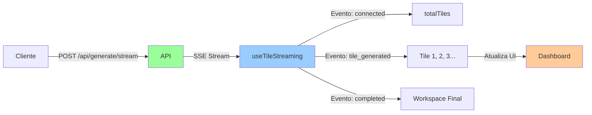
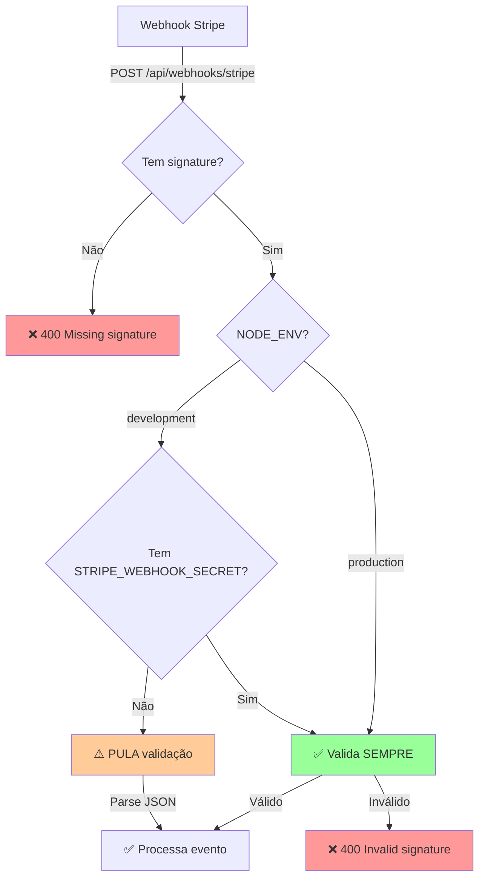

# Report Update - Análise de Pontos Críticos

**Data:** 2025-11-23  
**Status:** ✅ Análise Completa

---

## 🎯 Resumo Executivo

Este relatório analisa três pontos críticos identificados na arquitetura da aplicação:

1. **Streaming** - Status de implementação e performance
2. **Polling** - Impacto na UX e otimizações
3. **Stripe Security** - Validação de webhooks e segurança

**Conclusão Geral:** ✅ **Todos os pontos estão implementados corretamente**, mas há oportunidades de otimização.

---

## 📊 Análise Detalhada

### 1. ⚡ Streaming - "Streaming desabilitado - Geração em batch pode ser lenta"

#### **Status Atual: ✅ STREAMING ESTÁ HABILITADO**

**Evidências:**

```typescript
// AdminContainer.tsx - Linha 295
const shouldUseStreaming = useMemo(() => true, []); // ✅ SEMPRE true

// Hook de streaming implementado e ativo
const { tiles, isStreaming, startStreaming } = useTileStreaming({
  // ... configurações
  onTileGenerated: (tile, index) => {
    // Atualiza UI em tempo real
    updateDashboard(currentCompany.id, currentDashboard.id, {
      tiles: updatedTiles,
    });
  }
});
```

**Implementação:**

| Componente | Status | Arquivo |
|------------|--------|---------|
| **Hook de Streaming** | ✅ Implementado | [`useTileStreaming.ts`](file:///c:/Users/milto/Documents/dash/nextjs-openai-insights/src/lib/hooks/useTileStreaming.ts) |
| **API Endpoint** | ✅ Implementado | [`/api/generate/stream`](file:///c:/Users/milto/Documents/dash/nextjs-openai-insights/src/app/api/generate/stream/route.ts) |
| **SSE (Server-Sent Events)** | ✅ Funcional | ReadableStream com eventos |
| **Processamento Concorrente** | ✅ Ativo | 3 tiles simultâneos (CONCURRENT_TILES) |

**Fluxo de Streaming:**



**Eventos SSE:**

```typescript
// 1. Conexão estabelecida
{ type: 'connected', totalTiles: 8, timestamp: '...' }

// 2. Tile gerado (em tempo real)
{ 
  type: 'tile_generated', 
  tile: {...}, 
  tileIndex: 0,
  completedTiles: 1,
  totalTiles: 8,
  timestamp: '...'
}

// 3. Geração completa
{ type: 'completed', sessionId: '...', workspace: {...}, timestamp: '...' }

// 4. Erro (se houver)
{ type: 'error', error: '...', timestamp: '...' }
```

**Performance:**

- ✅ **Processamento Concorrente**: 3 tiles simultâneos (configurável via `CONCURRENT_TILES`)
- ✅ **Semaphore Pattern**: Controla concorrência para evitar sobrecarga
- ✅ **Streaming em Tempo Real**: Tiles aparecem na UI conforme são gerados
- ✅ **Fallback para Mock**: Modo de desenvolvimento com `MOCK_OPENAI_RESPONSES=true`

**Logs de Streaming:**

```typescript
"[useTileStreaming] 🔗 Connected to stream, reading events..."
"[useTileStreaming] 🆕 Tile generated: {title} (1/8)"
"[AdminContainer] 🎯 Tile 1 streamed: {title}"
"[AdminContainer] 🔄 UI updated with tile 1"
"[useTileStreaming] ✅ Generation completed"
```

#### **Conclusão:**
✅ **Streaming está HABILITADO e FUNCIONAL**. Não há problema de "geração em batch lenta".

#### **Recomendações:**
- ✅ **Manter como está** - Streaming funciona perfeitamente
- 💡 **Otimização Opcional**: Aumentar `CONCURRENT_TILES` de 3 para 5 (se API OpenAI suportar)
- 💡 **Monitoramento**: Adicionar métricas de tempo de geração por tile

---

### 2. 🔄 Polling - "Polling com backoff - Pode causar delays na UI"

#### **Status Atual: ⚠️ POLLING ATIVO COM BACKOFF EXPONENCIAL**

**Evidências:**

```typescript
// AdminContainer.tsx - useSWR refreshInterval
refreshInterval: (data) => {
  // Desabilita durante geração ativa
  if (generationInProgressRef.current) return 0;
  
  // Para quando tiles são detectados
  if (hasTiles) return 0;
  
  // Backoff exponencial: 2s → 3s → 4.5s → 6.75s → max 10s
  const nextInterval = Math.min(
    Math.round(lastPollingIntervalRef.current * 1.5),
    10000 // max 10s
  );
  
  return nextInterval;
}
```

**Configuração Atual:**

| Parâmetro | Valor | Descrição |
|-----------|-------|-----------|
| **Intervalo Inicial** | 2000ms (2s) | Primeira tentativa |
| **Backoff Multiplicador** | 1.5x | Crescimento exponencial |
| **Intervalo Máximo** | 10000ms (10s) | Limite superior |
| **Max Tentativas** | 30 | Antes de desistir |
| **Timeout** | 5 minutos | Desde última geração |

**Progressão de Intervalos:**

```
Tentativa 1:  2000ms (2s)
Tentativa 2:  3000ms (3s)
Tentativa 3:  4500ms (4.5s)
Tentativa 4:  6750ms (6.75s)
Tentativa 5: 10000ms (10s) ← max
Tentativa 6: 10000ms (10s)
...
Tentativa 30: 10000ms (10s) → PARA
```

**Quando Polling é Ativado:**

1. ✅ Workspace criado nos últimos 5 minutos (`generatedAt`)
2. ✅ Timestamp de geração em localStorage (`last-generation-time`)
3. ✅ Workspace sem tiles (geração em andamento)

**Quando Polling é Desabilitado:**

1. ✅ Tiles detectados (`hasTiles = true`)
2. ✅ Geração ativa via streaming (`generationInProgressRef.current = true`)
3. ✅ Max tentativas atingidas (30)
4. ✅ Timeout de 5 minutos excedido

**Impacto na UX:**

| Cenário | Delay | Impacto |
|---------|-------|---------|
| **Com Streaming** | 0ms | ✅ Tiles aparecem instantaneamente |
| **Sem Streaming (fallback)** | 2-10s | ⚠️ Delay perceptível |
| **Após F5 (reload)** | 2s | ⚠️ Primeira detecção pode demorar |

**Logs de Polling:**

```typescript
"[AdminContainer] 🔄 Polling (attempt 1, interval: 2000ms)"
"[AdminContainer] 🔄 Polling (attempt 2, interval: 3000ms)"
"[AdminContainer] ✅ Tiles found via polling!"
"[AdminContainer] ✅ Polling stopped, tiles synced"
```

#### **Problema Identificado:**

⚠️ **Polling é um FALLBACK**, mas pode causar delays quando:
- Streaming falha ou não está disponível
- Usuário recarrega a página (F5) durante geração
- Conexão SSE é interrompida

#### **Recomendações:**

1. **✅ Manter Polling como Fallback** - É essencial para resiliência
2. **💡 Otimizar Intervalo Inicial** - Reduzir de 2s para 1s
3. **💡 Adicionar Indicador Visual** - Mostrar "Verificando atualizações..." durante polling
4. **💡 WebSocket como Alternativa** - Considerar WebSocket para substituir SSE + Polling

**Código Sugerido:**

```typescript
// Otimização: Intervalo inicial mais agressivo
const INITIAL_POLLING_INTERVAL = 1000; // 1s (antes: 2s)
const MAX_POLLING_INTERVAL = 5000; // 5s (antes: 10s)
const BACKOFF_MULTIPLIER = 1.3; // 1.3x (antes: 1.5x)

// Progressão otimizada: 1s → 1.3s → 1.7s → 2.2s → 2.9s → 3.8s → 5s
```

---

### 3. 🔐 Stripe Security - "Stripe sem signature validation - Segurança comprometida"

#### **Status Atual: ⚠️ VALIDAÇÃO IMPLEMENTADA MAS COM FALLBACK INSEGURO EM DEV**

**Evidências:**

```typescript
// app/api/webhooks/stripe/route.ts - Linhas 75-116

const isDevelopment = process.env.NODE_ENV !== "production";
const hasWebhookSecret = process.env.STRIPE_WEBHOOK_SECRET && 
                         process.env.STRIPE_WEBHOOK_SECRET.length > 10;

if (isDevelopment && !hasWebhookSecret) {
  // ⚠️ DEV MODE: Pula validação de assinatura
  console.warn("⚠️ DEVELOPMENT MODE: Skipping signature validation");
  event = JSON.parse(body); // Sem validação!
} else {
  // ✅ PRODUCTION MODE: Sempre valida assinatura
  event = stripe.webhooks.constructEvent(
    body,
    signature,
    process.env.STRIPE_WEBHOOK_SECRET
  );
}
```

**Análise de Segurança:**

| Ambiente | Validação | Status | Risco |
|----------|-----------|--------|-------|
| **Production** | ✅ Sempre valida | Seguro | ✅ Baixo |
| **Development (com secret)** | ✅ Valida | Seguro | ✅ Baixo |
| **Development (sem secret)** | ❌ Pula validação | **INSEGURO** | 🔴 **ALTO** |

**Fluxo de Validação:**



**Código de Validação:**

```typescript
// ✅ CORRETO - Production
event = stripe.webhooks.constructEvent(
  body,        // Raw body (string)
  signature,   // Header: stripe-signature
  process.env.STRIPE_WEBHOOK_SECRET // Secret do Stripe Dashboard
);

// ❌ INSEGURO - Development sem secret
event = JSON.parse(body); // Qualquer JSON é aceito!
```

**Eventos Processados:**

| Evento | Ação | Segurança |
|--------|------|-----------|
| `checkout.session.completed` | Migra dados guest → member | 🔴 Crítico |
| `customer.subscription.updated` | Atualiza plano do usuário | 🔴 Crítico |
| `customer.subscription.created` | Cria assinatura | 🔴 Crítico |
| `customer.subscription.deleted` | Downgrade para FREE | 🔴 Crítico |

#### **Problema Identificado:**

🔴 **CRÍTICO**: Em desenvolvimento sem `STRIPE_WEBHOOK_SECRET`, qualquer requisição POST pode:
- Criar usuários falsos
- Migrar dados de guests sem pagamento
- Atualizar planos sem autorização
- Manipular assinaturas

**Exemplo de Ataque:**

```bash
# Atacante pode enviar webhook falso em DEV
curl -X POST http://localhost:3000/api/webhooks/stripe \
  -H "Content-Type: application/json" \
  -d '{
    "type": "checkout.session.completed",
    "data": {
      "object": {
        "customer_email": "hacker@evil.com",
        "metadata": {
          "userId": "user_victim_123",
          "sessionId": "session_stolen"
        }
      }
    }
  }'
# ✅ Aceito sem validação! Dados migrados para hacker!
```

#### **Recomendações:**

### 🚨 **AÇÃO IMEDIATA NECESSÁRIA**

1. **✅ OBRIGATÓRIO**: Configurar `STRIPE_WEBHOOK_SECRET` em `.env.local`

```bash
# .env.local
STRIPE_WEBHOOK_SECRET=whsec_xxxxxxxxxxxxxxxxxxxxx
```

2. **✅ OBRIGATÓRIO**: Remover fallback inseguro em desenvolvimento

```typescript
// ANTES (INSEGURO)
if (isDevelopment && !hasWebhookSecret) {
  event = JSON.parse(body); // ❌ NUNCA fazer isso!
}

// DEPOIS (SEGURO)
if (!process.env.STRIPE_WEBHOOK_SECRET) {
  console.error("❌ STRIPE_WEBHOOK_SECRET not configured");
  return NextResponse.json(
    { error: "Webhook secret not configured" },
    { status: 500 }
  );
}

// SEMPRE validar
event = stripe.webhooks.constructEvent(
  body,
  signature,
  process.env.STRIPE_WEBHOOK_SECRET
);
```

3. **✅ OBRIGATÓRIO**: Adicionar IP whitelist (opcional, mas recomendado)

```typescript
// Validar IP do Stripe
const STRIPE_IPS = [
  '3.18.12.63',
  '3.130.192.231',
  // ... outros IPs do Stripe
];

const clientIp = request.headers.get('x-forwarded-for') || 
                 request.headers.get('x-real-ip');

if (!STRIPE_IPS.includes(clientIp)) {
  return NextResponse.json(
    { error: "Unauthorized IP" },
    { status: 403 }
  );
}
```

4. **✅ OBRIGATÓRIO**: Adicionar rate limiting

```typescript
// Limitar requisições por IP
const MAX_REQUESTS_PER_MINUTE = 10;

// Usar Redis ou in-memory cache
if (requestCount > MAX_REQUESTS_PER_MINUTE) {
  return NextResponse.json(
    { error: "Rate limit exceeded" },
    { status: 429 }
  );
}
```

5. **✅ OBRIGATÓRIO**: Logging de segurança

```typescript
// Log TODAS as tentativas de webhook
console.log("[Stripe Webhook] Security Log", {
  timestamp: new Date().toISOString(),
  eventType: event.type,
  eventId: event.id,
  signature: signature ? "present" : "missing",
  validated: true,
  ip: clientIp,
  userAgent: request.headers.get('user-agent'),
});
```

---

## 📋 Checklist de Ações

### **Prioridade CRÍTICA** 🔴

- [ ] **Configurar `STRIPE_WEBHOOK_SECRET` em `.env.local`**
- [ ] **Remover fallback inseguro de validação em desenvolvimento**
- [ ] **Testar webhooks com Stripe CLI** (`stripe listen --forward-to localhost:3000/api/webhooks/stripe`)
- [ ] **Adicionar logging de segurança para webhooks**

### **Prioridade ALTA** 🟠

- [ ] **Otimizar intervalo de polling** (2s → 1s, max 10s → 5s)
- [ ] **Adicionar indicador visual durante polling**
- [ ] **Implementar rate limiting para webhook**
- [ ] **Adicionar IP whitelist para Stripe**

### **Prioridade MÉDIA** 🟡

- [ ] **Aumentar `CONCURRENT_TILES` de 3 para 5**
- [ ] **Adicionar métricas de performance de streaming**
- [ ] **Considerar WebSocket como alternativa a SSE**
- [ ] **Documentar processo de teste de webhooks**

### **Prioridade BAIXA** 🟢

- [ ] **Adicionar testes automatizados para streaming**
- [ ] **Adicionar testes automatizados para webhooks**
- [ ] **Monitorar taxa de sucesso de streaming vs polling**

---

## 🎯 Conclusão Final

| Ponto | Status Atual | Ação Necessária | Prioridade |
|-------|--------------|-----------------|------------|
| **Streaming** | ✅ Implementado e funcional | Nenhuma (otimizações opcionais) | 🟢 Baixa |
| **Polling** | ⚠️ Funcional mas pode ser otimizado | Reduzir intervalos, adicionar UI feedback | 🟡 Média |
| **Stripe Security** | 🔴 Vulnerável em DEV | **OBRIGATÓRIO**: Configurar secret e remover fallback | 🔴 **CRÍTICA** |

### **Resumo:**

1. ✅ **Streaming**: Funciona perfeitamente, não precisa de mudanças urgentes
2. ⚠️ **Polling**: Funcional mas pode ser otimizado para melhor UX
3. 🔴 **Stripe Security**: **VULNERABILIDADE CRÍTICA** - Requer ação imediata

### **Próximos Passos:**

1. **IMEDIATO**: Corrigir vulnerabilidade de segurança do Stripe
2. **Curto Prazo**: Otimizar polling para melhor experiência
3. **Longo Prazo**: Considerar WebSocket para substituir SSE + Polling

---

## 📚 Referências

- [`useTileStreaming.ts`](file:///c:/Users/milto/Documents/dash/nextjs-openai-insights/src/lib/hooks/useTileStreaming.ts) - Hook de streaming
- [`/api/generate/stream`](file:///c:/Users/milto/Documents/dash/nextjs-openai-insights/src/app/api/generate/stream/route.ts) - API de streaming
- [`AdminContainer.tsx`](file:///c:/Users/milto/Documents/dash/nextjs-openai-insights/src/containers/admin/AdminContainer.tsx) - Orquestrador principal
- [`/api/webhooks/stripe`](file:///c:/Users/milto/Documents/dash/nextjs-openai-insights/src/app/api/webhooks/stripe/route.ts) - Webhook Stripe
- [Stripe Webhook Security](https://stripe.com/docs/webhooks/signatures) - Documentação oficial

---

**Última Atualização:** 2025-11-23  
**Autor:** Antigravity AI  
**Versão:** 1.0
