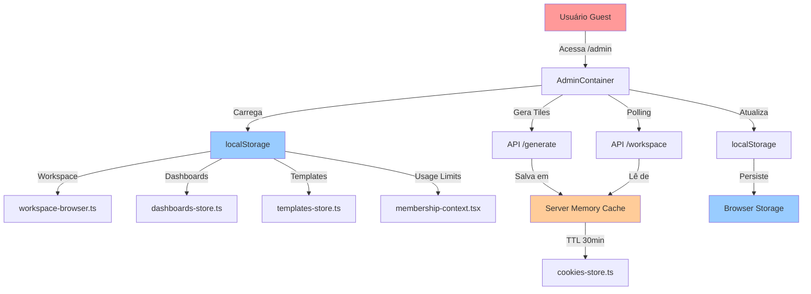
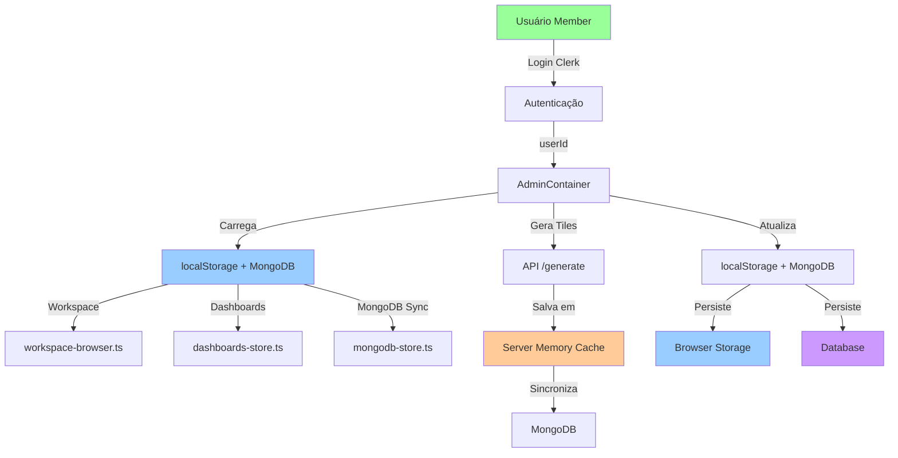
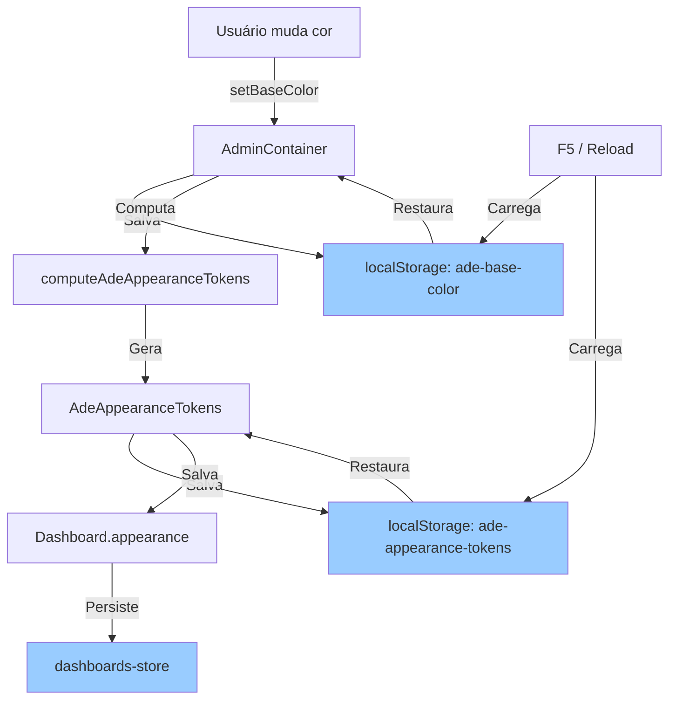

# Orquestração de Estados e Dados

## Visão Geral

Este documento detalha a arquitetura de gerenciamento de estado e armazenamento de dados da aplicação Next.js OpenAI Insights, incluindo os fluxos para usuários **Guest** (visitantes) e **Members** (autenticados).

---

## 🎯 Premissas Fundamentais

### 1. **Cookies foram ABANDONADOS**
- ❌ **Não utilizamos cookies para armazenamento de dados do usuário**
- ✅ **Motivo**: Problemas de compatibilidade com Apple Mobile (Safari/iOS)
- ⚠️ **Exceção**: Cookie de sessão do Clerk (autenticação) - gerenciado automaticamente pelo Clerk

### 2. **Dois Perfis de Usuário Distintos**

#### **Guest (Visitante)**
- Sem autenticação (userId === null)
- Dados armazenados **exclusivamente em localStorage** (client-side)
- **Não tem acesso ao MongoDB**
- Limites de uso controlados por localStorage
- Dados persistem apenas no navegador local

#### **Member (Autenticado)**
- Autenticado via Clerk (userId !== null)
- Dados sincronizados com **MongoDB** (server-side)
- Acesso completo sem limites
- Dados persistem no banco de dados
- Pode acessar dados de múltiplos dispositivos

---

## 📦 Camadas de Armazenamento

### 1. **Client-Side Storage (Browser)**

#### **localStorage**
Armazenamento persistente no navegador do usuário.

**Chaves de Armazenamento:**

| Chave | Tipo | Descrição | Usuários |
|-------|------|-----------|----------|
| `insights_workspace_{sessionId}` | WorkspaceSnapshot | Workspace completo com tiles, notes, contacts | Guest + Member |
| `insights_workspace_index` | string[] | Índice de sessionIds armazenados | Guest + Member |
| `insights_workspace_last` | string | Último sessionId acessado | Guest + Member |
| `insights_dashboards` | CompanyWithDashboards[] | Companies com dashboards | Guest + Member |
| `insights_active_dashboard` | {companyId, dashboardId} | Dashboard ativo | Guest + Member |
| `insights_templates` | Template[] | Templates customizados | Guest + Member |
| `insights_template_configs` | TemplateConfig[] | Configurações de templates | Guest + Member |
| `insights_editable_templates` | Template[] | Templates editáveis | Guest + Member |
| `insights_membership_status` | "guest" \| "member" | Status de membership | Guest + Member |
| `insights_guest_usage_v1` | StoredUsageData | Contadores de uso para guests | Guest |
| `ade-base-color` | string (hex) | Cor base do tema | Guest + Member |
| `ade-appearance-tokens` | AdeAppearanceTokens | Tokens de aparência completos | Guest + Member |
| `insights_test_logging_enabled` | "true" \| "false" | Flag de logging para testes | Dev |
| `last-generation-time` | timestamp | Timestamp da última geração | Guest + Member |

**Arquivos Responsáveis:**
- [`workspace-browser.ts`](file:///c:/Users/milto/Documents/dash/nextjs-openai-insights/src/lib/storage/workspace-browser.ts) - Gerenciamento de workspaces
- [`dashboards-store.ts`](file:///c:/Users/milto/Documents/dash/nextjs-openai-insights/src/lib/storage/dashboards-store.ts) - Gerenciamento de dashboards
- [`templates-store.ts`](file:///c:/Users/milto/Documents/dash/nextjs-openai-insights/src/lib/storage/templates-store.ts) - Gerenciamento de templates
- [`membership-context.tsx`](file:///c:/Users/milto/Documents/dash/nextjs-openai-insights/src/lib/state/membership-context.tsx) - Gerenciamento de membership
- [`usage-tracking.ts`](file:///c:/Users/milto/Documents/dash/nextjs-openai-insights/src/lib/usage-tracking.ts) - Tracking de uso

### 2. **Server-Side Storage**

#### **A. In-Memory Cache (Server)**
Cache temporário em memória do servidor Next.js.

**Implementação:** [`cookies-store.ts`](file:///c:/Users/milto/Documents/dash/nextjs-openai-insights/src/lib/cookies-store.ts)

```typescript
// Cache global em memória do servidor
const globalStore = globalThis as typeof globalThis & {
  __WORKSPACE_CACHE__?: Map<string, CacheEntry>;
};

interface CacheEntry {
  snapshot: WorkspaceSnapshot;
  updatedAt: number;
}
```

**Características:**
- TTL: 30 minutos (CACHE_TTL_MS = 1000 * 60 * 30)
- Purga automática de entradas expiradas
- Usado para workspaces ativos (geração em andamento)
- **Não persiste** entre restarts do servidor
- Cookie de sessão (`insightsWorkspaceSession`) mapeia sessionId → cache

**Funções Principais:**
- `readWorkspace()` - Lê do cache
- `writeWorkspace()` - Escreve no cache
- `updateWorkspace()` - Atualiza workspace
- `clearWorkspace()` - Limpa cache e cookie

#### **B. MongoDB (Database)**
Armazenamento persistente para usuários autenticados.

**Collections:**

| Collection | Document Type | Descrição | Segurança |
|------------|---------------|-----------|-----------|
| `workspaces` | WorkspaceDocument | Workspaces de usuários | userId obrigatório |
| `dashboards` | DashboardDocument | Dashboards de companies | userId obrigatório |
| `users` | UserDocument | Dados de usuários | clerkUserId único |
| `usageCounters` | UsageCounterDocument | Contadores de uso | userId opcional |
| `templates` | TemplateDocument | Templates customizados | userId opcional |

**Implementação:** [`mongodb-store.ts`](file:///c:/Users/milto/Documents/dash/nextjs-openai-insights/src/lib/storage/mongodb-store.ts)

**Regras de Segurança:**
```typescript
// ✅ SEMPRE filtrar por userId
await db.findOne<WorkspaceDocument>("workspaces", { 
  sessionId, 
  userId // Security: Filter by userId
});

// ❌ NUNCA permitir guests (userId === null)
if (!userId) {
  console.log("⚠️ Tentativa de acessar MongoDB sem userId (guest), ignorando");
  return null;
}
```

**Funções Principais:**
- `loadCompaniesWithDashboardsFromMongo()` - Carrega companies (apenas members)
- `saveCompanyToMongo()` - Salva company (apenas members)
- `syncWorkspaceTilesToMongo()` - Sincroniza tiles (apenas members)
- `syncWorkspaceContactsToMongo()` - Sincroniza contacts (apenas members)
- `syncWorkspaceNotesToMongo()` - Sincroniza notes (apenas members)

---

## 🔄 Fluxo de Dados

### **Fluxo Guest (Visitante)**



**Características:**
- ✅ Dados persistem **apenas no navegador**
- ✅ Workspace armazenado em **localStorage** (client) e **memory cache** (server)
- ✅ Limites de uso controlados por **localStorage**
- ❌ **Não acessa MongoDB**
- ❌ Dados **não sincronizam** entre dispositivos

### **Fluxo Member (Autenticado)**



**Características:**
- ✅ Dados persistem em **localStorage** (cache) e **MongoDB** (persistente)
- ✅ Sincronização automática entre client e server
- ✅ Acesso **sem limites**
- ✅ Dados **sincronizam** entre dispositivos
- ✅ Isolamento por **userId** (segurança)

---

## 🎭 Orquestradores de Estado

### 1. **AdminContainer** (Client-Side Orchestrator)
**Arquivo:** [`AdminContainer.tsx`](file:///c:/Users/milto/Documents/dash/nextjs-openai-insights/src/containers/admin/AdminContainer.tsx)

**Responsabilidades:**
- Gerencia estado global da aplicação
- Coordena sincronização entre localStorage e server
- Controla geração de tiles (streaming + polling)
- Gerencia dashboards e workspaces
- Aplica tema e aparência

**Estados Principais:**
```typescript
// Estado de geração
const [generationState, setGenerationState] = useState({
  isGenerating: boolean,
  sessionId: string | null,
  startedAt: number | null,
  tilesGenerated: number,
  totalTiles: number
});

// Estado de workspace
const [currentCompany, setCurrentCompany] = useState<CompanyWithDashboards | null>(null);
const [currentDashboard, setCurrentDashboard] = useState<Dashboard | null>(null);

// Estado de tema
const [baseColor, setBaseColor] = useState(DEFAULT_BASE_COLOR);
const appearanceTokens = useMemo(() => computeAdeAppearanceTokens(baseColor), [baseColor]);
```

**Polling Inteligente:**
```typescript
// Polling com backoff exponencial
refreshInterval: (data) => {
  if (generationInProgressRef.current) return 0; // Desabilita durante geração
  if (hasTiles) return 0; // Para quando tiles são detectados
  
  // Backoff: 2s → 3s → 4.5s → 6.75s → max 10s
  const nextInterval = Math.min(
    Math.round(lastPollingIntervalRef.current * 1.5),
    10000
  );
  return nextInterval;
}
```

### 2. **Dashboard Sync Manager** (Data Synchronization)
**Arquivo:** [`dashboard-sync-manager.ts`](file:///c:/Users/milto/Documents/dash/nextjs-openai-insights/src/lib/storage/dashboard-sync-manager.ts)

**Responsabilidades:**
- Sincroniza Workspace → Company/Dashboards
- Previne race conditions com locks
- Garante single source of truth
- Preserva dados existentes

**Regras de Sincronização:**
```typescript
// ✅ Só sincroniza tiles no "Default Dashboard"
if (isDefaultDashboard && existingTiles.length === 0) {
  activeDashboard.tiles = workspaceTiles;
}

// ✅ Sempre preserva dashboards existentes
// ❌ NUNCA deleta ou substitui dashboards

// ✅ Sempre sincroniza notes e contacts
activeDashboard.notes = workspace.company.notes;
activeDashboard.contacts = workspace.company.contacts;
```

**Lock Mechanism:**
```typescript
interface SyncLock {
  companyId: string;
  timestamp: number;
}

// Timeout de 2 segundos
const SYNC_LOCK_TIMEOUT = 2000;

// Previne sincronizações simultâneas
if (!acquireSyncLock(companyId)) {
  return getCompanyById(companyId);
}
```

### 3. **Membership Context** (Usage Control)
**Arquivo:** [`membership-context.tsx`](file:///c:/Users/milto/Documents/dash/nextjs-openai-insights/src/lib/state/membership-context.tsx)

**Responsabilidades:**
- Gerencia status Guest vs Member
- Controla limites de uso para guests
- Persiste contadores em localStorage
- Reset automático a cada 24h

**Limites para Guests:**
```typescript
const DEFAULT_LIMITS: Record<GuestAction, number> = {
  tileChat: 5,        // 5 chats por tile
  contactChat: 5,     // 5 chats por contact
  regenerate: 5,      // 5 regenerações
  createContact: 5,   // 5 contacts criados
  createWorkspace: 3  // 3 workspaces criados
};
```

**Funções Principais:**
```typescript
// Verifica se ação é permitida (sem consumir)
evaluateUsage(action: GuestAction): UsageResult

// Consome uso e atualiza contadores
consumeUsage(action: GuestAction): UsageResult

// Marca usuário como member
markMember(): void

// Reseta contadores de guest
resetGuestUsage(): void
```

### 4. **Workspace Browser** (Client Storage Manager)
**Arquivo:** [`workspace-browser.ts`](file:///c:/Users/milto/Documents/dash/nextjs-openai-insights/src/lib/storage/workspace-browser.ts)

**Responsabilidades:**
- Gerencia workspaces em localStorage
- Mantém índice de sessionIds
- Limita número de workspaces (max 5)
- Pruning automático de workspaces antigos

**Funções Principais:**
```typescript
loadWorkspace(sessionId: string): WorkspaceSnapshot | null
saveWorkspace(sessionId: string, snapshot: WorkspaceSnapshot): void
deleteWorkspace(sessionId: string): void
listStoredWorkspaces(limit: number): Array<{sessionId, snapshot}>
getLastSessionId(): string | null
clearAllWorkspaces(): void
```

---

## 🔐 Autenticação e Segurança

### **Clerk Authentication**

**Middleware:** [`proxy.ts`](file:///c:/Users/milto/Documents/dash/nextjs-openai-insights/src/proxy.ts)

**Rotas Públicas (sem autenticação):**
```typescript
const isPublicRoute = createRouteMatcher([
  '/',
  '/admin',              // Guests podem usar admin panel
  '/test-limits',        // Testes sem autenticação
  '/sign-in(.*)',
  '/sign-up(.*)',
  '/api/webhooks/stripe(.*)',
  '/api/generate(.*)',   // Guests podem gerar workspaces
  '/api/workspace(.*)',  // Guests podem acessar workspace APIs
])
```

**Helper de Autenticação:** [`get-auth.ts`](file:///c:/Users/milto/Documents/dash/nextjs-openai-insights/src/lib/auth/get-auth.ts)

```typescript
export async function getAuth(): Promise<{
  userId: string | null;
  isAuthenticated: boolean;
}> {
  const { userId } = await auth(); // Clerk
  return {
    userId: userId || null,
    isAuthenticated: !!userId,
  };
}
```

**Isolamento de Dados:**
```typescript
// MongoDB - SEMPRE filtrar por userId
const filter = { userId }; // Security isolation

// Guests (userId === null) → localStorage apenas
if (!userId) {
  return []; // Não acessa MongoDB
}
```

---

## 📊 Agregadores de Dados

### 1. **Company/Dashboard Aggregator**
**Arquivo:** [`dashboards-store.ts`](file:///c:/Users/milto/Documents/dash/nextjs-openai-insights/src/lib/storage/dashboards-store.ts)

**Estrutura de Dados:**
```typescript
interface CompanyWithDashboards {
  id: string;              // sessionId
  name: string;
  website: string;
  dashboards: Dashboard[];
  createdAt: string;
  updatedAt: string;
}

interface Dashboard {
  id: string;
  name: string;
  companyId: string;
  templateId?: string;
  tiles: Tile[];
  notes: Note[];
  contacts: Contact[];
  appearance?: AdeAppearanceTokens;
  contrastMode: boolean;
  createdAt: string;
  updatedAt: string;
  isActive: boolean;
}
```

**Funções de Agregação:**
```typescript
// Carrega todas companies com dashboards
loadCompaniesWithDashboards(): CompanyWithDashboards[]

// Cria ou atualiza company a partir de workspace
getOrCreateCompanyFromWorkspace(workspace: WorkspaceSnapshot): CompanyWithDashboards

// Cria novo dashboard
createDashboard(companyId: string, name: string, templateId?: string): Dashboard

// Atualiza dashboard
updateDashboard(companyId: string, dashboardId: string, updates: Partial<Dashboard>): void

// Deleta dashboard
deleteDashboard(companyId: string, dashboardId: string): void

// Dashboard ativo
getActiveDashboard(companyId: string): Dashboard | null
setActiveDashboard(companyId: string, dashboardId: string): void
```

### 2. **Usage Tracking Aggregator**
**Arquivo:** [`usage-tracking.ts`](file:///c:/Users/milto/Documents/dash/nextjs-openai-insights/src/lib/usage-tracking.ts)

**Estrutura de Dados:**
```typescript
interface UsageRecord {
  sessionId: string;
  timestamp: number;
  endpoint: string;
  tilesGenerated?: number;
}

interface UsageLimits {
  maxTilesPerDay: number;      // 1000
  maxTilesPerHour: number;     // 200
  maxRequestsPerMinute: number; // 10
}
```

**Funções de Tracking:**
```typescript
// Registra uso
recordUsage(sessionId: string, endpoint: string, tilesGenerated?: number): void

// Verifica limites
checkUsageLimits(sessionId: string, limits?: UsageLimits): {
  allowed: boolean;
  reason?: string;
  currentUsage?: {
    tilesToday: number;
    tilesThisHour: number;
    requestsThisMinute: number;
  }
}

// Limpa registros
clearUsageRecords(sessionId: string): void
```

### 3. **Template Store Aggregator**
**Arquivo:** [`templates-store.ts`](file:///c:/Users/milto/Documents/dash/nextjs-openai-insights/src/lib/storage/templates-store.ts)

**Funções:**
```typescript
// Templates customizados
loadCustomTemplates(): Template[]
saveCustomTemplates(templates: Template[]): void

// Configurações de templates
loadTemplateConfigs(): TemplateConfig[]
saveTemplateConfigs(configs: TemplateConfig[]): void

// Templates editáveis
loadEditableTemplates(): Template[]
saveEditableTemplates(templates: Template[]): void

// Limpar tudo
clearAllTemplates(): void
```

---

## 🔄 Sincronização de Dados

### **Client → Server (Guests)**

```typescript
// 1. Geração inicial (Home → Admin)
POST /api/generate
  → Cria workspace em memory cache
  → Retorna sessionId
  → localStorage.setItem('last-generation-time', Date.now())

// 2. Polling para detectar tiles
GET /api/workspace (a cada 2-10s)
  → Lê de memory cache
  → Retorna workspace com tiles

// 3. Sincronização local
AdminContainer
  → Detecta tiles via polling
  → Sincroniza para localStorage
  → Atualiza dashboard ativo
```

### **Client → Server → MongoDB (Members)**

```typescript
// 1. Geração inicial
POST /api/generate
  → Cria workspace em memory cache
  → Sincroniza para MongoDB (se userId)
  → Retorna sessionId

// 2. Sincronização automática
AdminContainer
  → Detecta tiles via polling/streaming
  → Atualiza localStorage (cache)
  → Sincroniza para MongoDB (background)

// 3. Carregamento multi-device
GET /api/workspace
  → Tenta memory cache primeiro
  → Fallback para MongoDB (se userId)
  → Retorna workspace sincronizado
```

---

## 🎨 Gerenciamento de Tema

### **Fluxo de Cores**



**Prioridade de Carregamento:**
1. **localStorage** (`ade-appearance-tokens`) - Acesso imediato após F5
2. **Dashboard.appearance** - Valores salvos no dashboard
3. **Computação** - Calcula se não houver valores salvos

**Persistência:**
```typescript
// 1. Salva cor base
localStorage.setItem('ade-base-color', baseColor);

// 2. Salva tokens completos
localStorage.setItem('ade-appearance-tokens', JSON.stringify(tokens));

// 3. Salva no dashboard
updateDashboard(companyId, dashboardId, {
  appearance: tokens
});
```

---

## 📝 Resumo de Armazenamento por Tipo de Dado

| Tipo de Dado | Guest | Member | Persistência |
|--------------|-------|--------|--------------|
| **Workspace** | localStorage | localStorage + MongoDB | Browser / DB |
| **Dashboards** | localStorage | localStorage + MongoDB | Browser / DB |
| **Tiles** | localStorage | localStorage + MongoDB | Browser / DB |
| **Notes** | localStorage | localStorage + MongoDB | Browser / DB |
| **Contacts** | localStorage | localStorage + MongoDB | Browser / DB |
| **Templates** | localStorage | localStorage + MongoDB | Browser / DB |
| **Usage Limits** | localStorage | N/A (sem limites) | Browser |
| **Membership Status** | localStorage | localStorage | Browser |
| **Tema/Cores** | localStorage | localStorage | Browser |
| **Session Cache** | Server Memory | Server Memory | Memória (30min) |

---

## 🚀 Fluxo Completo de Geração

### **1. Usuário Preenche Formulário (Home)**
```typescript
// components/home/HomeForm.tsx
handleSubmit()
  → POST /api/generate
  → { company, website, valueProposition, tilesToGenerate }
```

### **2. API Gera Workspace**
```typescript
// app/api/generate/route.ts
POST /api/generate
  → Cria workspace com sessionId
  → Salva em memory cache (cookies-store)
  → Inicia geração de tiles (background)
  → Retorna { sessionId, workspace }
```

### **3. Redirect para Admin**
```typescript
// Home
router.push(`/admin?session=${sessionId}`)
localStorage.setItem('last-generation-time', Date.now())
```

### **4. Admin Carrega Workspace**
```typescript
// AdminContainer
useEffect(() => {
  // Carrega de localStorage (se existir)
  const cached = loadCachedWorkspace(sessionId);
  
  // Polling para detectar tiles
  useSWR('/api/workspace', fetchWorkspace, {
    refreshInterval: 2000 // Polling a cada 2s
  });
});
```

### **5. Sincronização de Tiles**
```typescript
// AdminContainer - Polling detecta tiles
if (data.company.tiles.length > 0) {
  // Sincroniza para dashboard
  updateDashboard(companyId, dashboardId, {
    tiles: data.company.tiles
  });
  
  // Salva em localStorage
  saveCompaniesWithDashboards(companies);
  
  // Se member, sincroniza para MongoDB
  if (userId) {
    syncWorkspaceTilesToMongo(sessionId, userId, tiles);
  }
}
```

---

## 🔍 Debugging e Logs

### **Console Logs Importantes**

```typescript
// Workspace loading
"[AdminContainer] 🔍 Polling check"
"[AdminContainer] ✅ Tiles found via polling!"
"[AdminContainer] 🔄 Syncing tiles to current dashboard"

// Data sync
"[DataSync] 🔍 Syncing workspace to existing company"
"[DataSync] ✅ Syncing tiles to Default Dashboard"
"[DataSync] 🔒 Preserving dashboard tiles"

// MongoDB
"[MongoDB Store] ⚠️ Tentativa de acessar MongoDB sem userId (guest)"
"[MongoDB Store] ✅ Workspace synced to MongoDB"

// Theme
"[AdminContainer] 🎨 Loading appearance from localStorage"
"[AdminContainer] ✅ appearanceTokens FINAL"

// Sync Manager
"[SyncManager] 🔒 Acquired sync lock"
"[SyncManager] ✅ Sync completed"
```

---

## 🎯 Conclusão

A arquitetura de estados e dados foi projetada para:

1. ✅ **Suportar Guests e Members** com fluxos distintos
2. ✅ **Abandonar cookies** (exceto autenticação Clerk)
3. ✅ **Persistir dados** em localStorage (guests) e MongoDB (members)
4. ✅ **Sincronizar automaticamente** entre client e server
5. ✅ **Isolar dados** por userId (segurança)
6. ✅ **Controlar limites** para guests
7. ✅ **Prevenir race conditions** com locks e queues
8. ✅ **Garantir single source of truth** com orquestradores

**Arquivos Principais:**
- [`AdminContainer.tsx`](file:///c:/Users/milto/Documents/dash/nextjs-openai-insights/src/containers/admin/AdminContainer.tsx) - Orquestrador principal
- [`cookies-store.ts`](file:///c:/Users/milto/Documents/dash/nextjs-openai-insights/src/lib/cookies-store.ts) - Memory cache (server)
- [`workspace-browser.ts`](file:///c:/Users/milto/Documents/dash/nextjs-openai-insights/src/lib/storage/workspace-browser.ts) - localStorage (client)
- [`mongodb-store.ts`](file:///c:/Users/milto/Documents/dash/nextjs-openai-insights/src/lib/storage/mongodb-store.ts) - MongoDB (database)
- [`dashboards-store.ts`](file:///c:/Users/milto/Documents/dash/nextjs-openai-insights/src/lib/storage/dashboards-store.ts) - Dashboards (client)
- [`dashboard-sync-manager.ts`](file:///c:/Users/milto/Documents/dash/nextjs-openai-insights/src/lib/storage/dashboard-sync-manager.ts) - Sincronização
- [`membership-context.tsx`](file:///c:/Users/milto/Documents/dash/nextjs-openai-insights/src/lib/state/membership-context.tsx) - Membership
