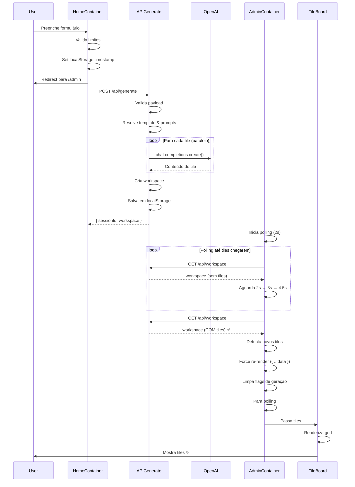

# Fluxo de Requisição OpenAI - Geração de Tiles

**Versão**: 1.0  
**Data**: 2025-11-21  
**Autor**: Sistema de Documentação Automática

---

## Visão Geral

Este documento descreve o fluxo completo de uma requisição de geração de insights, desde o momento em que o usuário submete o formulário até a renderização final dos tiles no dashboard.

## Arquitetura de Geração

Existem **dois modos** de geração de tiles:

1. **Batch Mode** (`/api/generate`) - Gera todos os tiles de uma vez
2. **Streaming Mode** (`/api/generate/stream`) - Gera tiles progressivamente (SSE)

Atualmente, o sistema está usando **Batch Mode** por padrão.

---

## Fluxo Completo - Batch Mode

### 1. Submissão do Formulário (Frontend)

**Arquivo**: [`src/containers/home/HomeContainer.tsx`](file:///c:/Users/milto/Documents/dash/nextjs-openai-insights/src/containers/home/HomeContainer.tsx)

```typescript
// Linha 51-173
const handleSubmit = async ({ company, companyWebsite, solution, ... }) => {
  // 1.1. Validar limites de uso (guest vs member)
  if (!isMember) {
    const preview = evaluateUsage("createWorkspace");
    if (!preview.allowed) {
      // Mostrar modal de upgrade
      return;
    }
  }

  // 1.2. Marcar timestamp de geração (para polling)
  window.localStorage.setItem("last-generation-time", Date.now().toString());

  // 1.3. Redirect imediato para /admin
  router.push("/admin");

  // 1.4. Iniciar geração em background
  const response = await fetch("/api/generate", {
    method: "POST",
    body: JSON.stringify(payload),
  });
}
```

**Dados Enviados**:
```json
{
  "salesRepCompany": "Instituto",
  "salesRepWebsite": "https://io-landing.netlify.app",
  "solution": "Mentorship Career Program",
  "targetCompany": "NBA",
  "targetWebsite": "https://www.nba.com",
  "templateId": "template_1",
  "model": "gpt-5-nano",
  "agentId": "ade_research_analyst",
  "responseLength": "medium",
  "promptVariables": [],
  "bulkPrompts": []
}
```

---

### 2. Processamento no Backend (API Route)

**Arquivo**: [`src/app/api/generate/route.ts`](file:///c:/Users/milto/Documents/dash/nextjs-openai-insights/src/app/api/generate/route.ts)

#### 2.1. Validação e Preparação

```typescript
// Linha 172-230
export async function POST(request: NextRequest) {
  // 2.1.1. Parse e validação do payload
  const parseResult = requestSchema.safeParse(payload);
  
  // 2.1.2. Verificar limites de uso
  const usageCheck = await checkUsageMiddleware(payload, request.headers, estimatedTiles);
  if (!usageCheck.allowed) {
    return new Response(JSON.stringify({ error: "Usage limit exceeded" }), { status: 429 });
  }

  // 2.1.3. Carregar template e configurações
  const template = getGuestTemplate(templateId); // Ex: template_1
  const agentDefinition = getPromptAgent(requestedPromptAgent);
  const model = resolveModel(requestedModel ?? agentDefinition.defaultModel);
}
```

#### 2.2. Resolução de Prompts

```typescript
// Linha 246-286
const normalizedContext = normalizeContext({
  salesRepCompany,
  salesRepWebsite,
  solution,
  targetCompany,
  targetWebsite,
  // ...
});

const resolvedTiles = resolveTemplateTiles(template, {
  templateId,
  agentId,
  responseLength,
  promptVariables,
  bulkPrompts,
});

// Processar variáveis nos prompts
const prompts = resolvedTiles.map((item) => {
  const runtimeContext = {
    ...normalizedContext,
    tile: {
      id: item.id,
      title: item.title,
      category: item.category,
      // ...
    },
  };

  return {
    ...item,
    prompt: processPromptVariables(item.prompt, runtimeContext),
  };
});
```

**Exemplo de Prompt Processado**:
```
Original: "Research {{company.name}}'s business goals for 2025..."
Processado: "Research NBA's business goals for 2025..."
```

#### 2.3. Geração de Tiles (OpenAI)

```typescript
// Linha 288-400
if (USE_MOCK_OPENAI) {
  // Modo Mock (desenvolvimento/testes)
  tiles = prompts.map((item, i) => {
    const generation = generateMockTileContent({
      prompt: item.prompt,
      title: item.title,
      model,
      orderIndex: i,
    });
    return composeTileFromGeneration(generation, { ... });
  });
} else {
  // Modo Real (produção)
  const openai = new OpenAI({ apiKey: process.env.OPENAI_API_KEY });
  
  // Processar tiles em paralelo (concorrência controlada)
  const semaphore = new Semaphore(CONCURRENT_TILES); // Default: 3
  
  const tilePromises = prompts.map(async (item, orderIndex) => {
    await semaphore.acquire();
    
    try {
      const generation = await generateTileContent({
        client: openai,
        prompt: item.prompt,
        title: item.title,
        model,
        maxTokens: getMaxTokensForTile(item.templateTileId),
      });
      
      return composeTileFromGeneration(generation, { ... });
    } finally {
      semaphore.release();
    }
  });
  
  tiles = await Promise.all(tilePromises);
}
```

**Chamada OpenAI** ([`src/lib/ai/tile-generation.ts`](file:///c:/Users/milto/Documents/dash/nextjs-openai-insights/src/lib/ai/tile-generation.ts)):
```typescript
const completion = await client.chat.completions.create({
  model: resolvedModel,
  messages: [
    {
      role: "system",
      content: "You are a helpful AI assistant specialized in business research and insights.",
    },
    {
      role: "user",
      content: prompt,
    },
  ],
  max_tokens: maxTokens,
  temperature: 0.7,
});

const content = completion.choices[0]?.message?.content?.trim() ?? "";
```

#### 2.4. Criação do Workspace

```typescript
// Linha 402-440
const workspace: WorkspaceSnapshot = {
  sessionId: `session_${randomUUID()}`,
  generatedAt: new Date().toISOString(),
  tilesToGenerate: tiles.length,
  company: {
    id: `company_${randomUUID()}`,
    name: targetCompany,
    website: targetWebsite,
    tiles: tiles,
    notes: [],
    contacts: [],
  },
  appearance: {
    baseColor: process.env.NEXT_PUBLIC_ADE_BASE_COLOR ?? "#f5f5f0",
  },
  promptSettings: {
    templateId,
    model,
    promptAgent: agentId,
    responseLength,
    // ...
  },
};

// Salvar workspace (localStorage para guests, MongoDB para members)
const sessionId = await writeWorkspace(workspace);
```

#### 2.5. Resposta ao Cliente

```typescript
// Linha 442-465
return Response.json({
  sessionId,
  workspace,
  tilesGenerated: tiles.length,
  generatedAt: workspace.generatedAt,
});
```

---

### 3. Polling e Detecção de Tiles (Frontend)

**Arquivo**: [`src/containers/admin/AdminContainer.tsx`](file:///c:/Users/milto/Documents/dash/nextjs-openai-insights/src/containers/admin/AdminContainer.tsx)

#### 3.1. Configuração do SWR com Polling

```typescript
// Linha 119-260
const { data, error, isLoading, mutate } = useSWR<WorkspaceResponse>(
  "/api/workspace",
  fetchWorkspace,
  {
    refreshInterval: (data) => {
      // Desabilitar polling se geração em progresso
      if (generationInProgressRef.current) {
        return 0;
      }

      // Verificar se há tiles
      const hasTiles = data?.company?.tiles && data.company.tiles.length > 0;
      
      if (hasTiles) {
        // Parar polling quando tiles chegarem
        console.log("[AdminContainer] ✅ Polling stopped, tiles synced");
        return 0;
      }

      // Verificar timestamp de geração recente
      const lastGenerationTime = window.localStorage.getItem("last-generation-time");
      if (lastGenerationTime) {
        const genTime = parseInt(lastGenerationTime, 10);
        const now = Date.now();
        const fiveMinutesAgo = now - 5 * 60 * 1000;
        
        if (genTime > fiveMinutesAgo) {
          // Continuar polling com backoff exponencial
          const nextInterval = Math.min(
            Math.round(lastPollingIntervalRef.current * 1.5),
            10000 // max 10s
          );
          console.log(`[AdminContainer] 🔄 Polling (interval: ${nextInterval}ms)`);
          return nextInterval;
        }
      }

      // Parar polling
      return 0;
    },
  }
);
```

**Sequência de Polling**:
```
T+0s:   Polling inicia (2s)
T+2s:   1ª tentativa - sem tiles - próximo em 3s
T+5s:   2ª tentativa - sem tiles - próximo em 4.5s
T+9.5s: 3ª tentativa - sem tiles - próximo em 6.75s
T+16s:  4ª tentativa - TILES ENCONTRADOS! ✅
        Polling para, tiles renderizados
```

#### 3.2. Detecção de Novos Tiles

```typescript
// Linha 810-930
useEffect(() => {
  if (!data) return;
  
  const hasTiles = data.company?.tiles && data.company.tiles.length > 0;
  
  if (hasTiles) {
    // CRITICAL: Force state update quando tiles chegam
    if (localWorkspace?.sessionId === data.sessionId) {
      const currentTileCount = localWorkspace?.company?.tiles?.length || 0;
      const newTileCount = data.company?.tiles?.length || 0;
      
      if (newTileCount > currentTileCount) {
        console.log(
          `[AdminContainer] 🎨 New tiles detected (${currentTileCount} → ${newTileCount}), forcing UI update`
        );
        
        // Forçar re-render criando nova referência
        setLocalWorkspace({ ...data });
        saveCachedWorkspace(data.sessionId, data);
      }
    }
    
    // Limpar flags de geração
    generationInProgressRef.current = false;
    setGenerationState(prev => ({
      ...prev,
      isGenerating: false,
    }));
    
    // Limpar timestamp
    window.localStorage.removeItem("last-generation-time");
  }
}, [data]);
```

---

### 4. Sincronização com Dashboard

**Arquivo**: [`src/containers/admin/AdminContainer.tsx`](file:///c:/Users/milto/Documents/dash/nextjs-openai-insights/src/containers/admin/AdminContainer.tsx)

#### 4.1. Criação/Atualização de Company e Dashboard

```typescript
// Linha 1050-1200
useEffect(() => {
  if (!workspace) return;
  
  // Criar/carregar company do localStorage
  const company = getOrCreateCompanyFromWorkspace(workspace);
  
  // Obter dashboard ativo
  const activeDashboard = getActiveDashboard(company.id);
  
  if (activeDashboard) {
    // Sincronizar tiles do workspace para o dashboard
    if (activeDashboard.tiles.length === 0 && workspace.company.tiles.length > 0) {
      console.log("[DataSync] 🔄 Syncing tiles to dashboard");
      updateDashboard(company.id, activeDashboard.id, {
        tiles: workspace.company.tiles,
      });
    }
  }
  
  setCurrentCompany(company);
  setCurrentDashboard(activeDashboard);
}, [workspace]);
```

#### 4.2. Extração de Tiles para Renderização

```typescript
// Linha 1380-1430
const tiles: Tile[] = useMemo(() => {
  // Prioridade 1: Tiles do dashboard atual
  if (currentDashboard) {
    console.log("[TilesSource] 📊 Using tiles from currentDashboard");
    return currentDashboard.tiles
      .map((tile) => ({
        ...tile,
        id: tile.id,
        title: tile.title,
        content: tile.content ?? "",
      }))
      .sort((a, b) => a.orderIndex - b.orderIndex);
  }
  
  // Prioridade 2: Tiles do workspace
  if (workspace?.company?.tiles) {
    console.log("[TilesSource] 📊 Using tiles from workspace");
    return workspace.company.tiles
      .map((tile) => ({
        ...tile,
        id: tile.id,
        title: tile.title,
        content: tile.content ?? "",
      }))
      .sort((a, b) => a.orderIndex - b.orderIndex);
  }
  
  // Sem tiles
  console.log("[TilesSource] 🚫 No tiles available");
  return [];
}, [workspace, currentDashboard]);
```

---

### 5. Renderização dos Tiles

**Arquivo**: [`src/containers/admin/ade/TileGridAde.tsx`](file:///c:/Users/milto/Documents/dash/nextjs-openai-insights/src/containers/admin/ade/TileGridAde.tsx)

```typescript
export function TileGridAde({
  appearance,
  tiles,
  onDeleteTile,
  onReorderTiles,
  onOpenTile,
  isReordering,
  onRegenerateTile,
  regeneratingTileIds,
  onAddPrompt,
  onBulkUploadPrompts,
  animateEntrance,
}: TileGridAdeProps) {
  return (
    <TileBoard
      tiles={tiles}
      variant="ade"
      onDeleteTile={onDeleteTile}
      onReorderTiles={onReorderTiles}
      onOpenTile={onOpenTile}
      isReordering={isReordering}
      onRegenerateTile={onRegenerateTile}
      regeneratingTileIds={regeneratingTileIds}
      appearance={appearance}
      onAddPrompt={onAddPrompt}
      onBulkUploadPrompts={onBulkUploadPrompts}
      animateEntrance={animateEntrance}
    />
  );
}
```

**Arquivo**: [`src/components/ui/prompt-tiles/TileBoard.tsx`](file:///c:/Users/milto/Documents/dash/nextjs-openai-insights/src/components/ui/prompt-tiles/TileBoard.tsx)

```typescript
// Linha 314-538
export function TileBoard({ tiles, variant, ... }: TileBoardProps) {
  const sortedTiles = useMemo(() => sortTilesByOrder(tiles), [tiles]);
  const [items, setItems] = useState(sortedTiles);
  
  // Animação de entrada progressiva (se habilitada)
  const [visibleTileIds, setVisibleTileIds] = useState<Set<string>>(new Set());
  
  useEffect(() => {
    if (animateEntrance && sortedTiles.length > 0) {
      setVisibleTileIds(new Set()); // Reset
      
      // Mostrar tiles com delay escalonado
      sortedTiles.forEach((tile, index) => {
        if (tile?.id) {
          setTimeout(() => {
            setVisibleTileIds(prev => new Set([...prev, tile.id]));
          }, index * 150); // 150ms entre cada tile
        }
      });
    } else {
      // Mostrar todos imediatamente
      setVisibleTileIds(new Set(sortedTiles.filter(tile => tile?.id).map(tile => tile.id)));
    }
  }, [sortedTiles, animateEntrance]);
  
  return (
    <DndContext onDragEnd={handleDragEnd}>
      <SortableContext items={items.filter(item => item?.id).map(item => item.id)}>
        <div className="grid gap-5 sm:grid-cols-2 xl:grid-cols-3">
          {items.map((tile) => (
            <SortableTile
              key={tile.id}
              tile={tile}
              variant={variant}
              onDeleteTile={onDeleteTile}
              onOpenTile={onOpenTile}
              onRegenerateTile={onRegenerateTile}
              isRegenerating={regeneratingSet.has(tile.id)}
              isVisible={animateEntrance ? visibleTileIds.has(tile.id) : true}
            />
          ))}
        </div>
      </SortableContext>
    </DndContext>
  );
}
```

---

## Diagrama de Sequência



---

## Estrutura de Dados

### WorkspaceSnapshot
```typescript
interface WorkspaceSnapshot {
  sessionId: string;              // "session_34840a8e-e443-4e85-94ee-ec14c11f67f8"
  generatedAt: string;            // "2025-11-21T09:03:40.056Z"
  tilesToGenerate: number;        // 8
  company: {
    id: string;                   // "company_773ab390-1ef5-46e3-ac51-1ee25ef4850d"
    name: string;                 // "NBA"
    website: string;              // "https://www.nba.com"
    tiles: Tile[];                // Array de tiles gerados
    notes: Note[];                // []
    contacts: Contact[];          // []
  };
  appearance: {
    baseColor: string;            // "#f5f5f0"
  };
  promptSettings: {
    templateId: string;           // "template_1"
    model: string;                // "gpt-5-nano"
    promptAgent: string;          // "ade_research_analyst"
    responseLength: string;       // "medium"
    promptVariables: string[];    // []
    bulkPrompts: string[];        // []
    target: string;               // "NBA"
    sellingSolutionsFor: string;  // "Mentorship Career Program"
    targetWebsite: string;        // "https://www.nba.com"
  };
}
```

### Tile
```typescript
interface Tile {
  id: string;                     // "tile_a1b2c3d4-..."
  title: string;                  // "Business Goals 2025"
  content: string;                // "NBA's primary goals for 2025..."
  prompt: string;                 // Prompt original usado
  templateId: string;             // "template_1"
  templateTileId?: string;        // "business_goals_2025"
  category?: string;              // "Research"
  model: string;                  // "gpt-5-nano"
  orderIndex: number;             // 0, 1, 2, ...
  createdAt: string;              // "2025-11-21T09:03:35.123Z"
  updatedAt: string;              // "2025-11-21T09:03:35.123Z"
  totalTokens?: number;           // 450
  attempts: number;               // 1
  history?: TileHistoryEntry[];   // Histórico de chat
  agentId?: string;               // "ade_research_analyst"
  responseLength?: string;        // "medium"
  promptVariables?: string[];     // []
}
```

---

## Configurações e Variáveis de Ambiente

### Variáveis Necessárias

```env
# OpenAI
OPENAI_API_KEY=sk-...

# Mock (desenvolvimento)
MOCK_OPENAI_RESPONSES=false

# Concorrência
CONCURRENT_TILE_GENERATION=3

# Aparência
NEXT_PUBLIC_ADE_BASE_COLOR=#f5f5f0
```

### Configurações de Geração

- **Modelo padrão**: `gpt-5-nano`
- **Max tokens**: 400-1600 (dependendo do tamanho)
- **Temperature**: 0.7
- **Concorrência**: 3 tiles simultâneos
- **Timeout**: 10 minutos

---

## Otimizações e Performance

### 1. Geração Paralela
- Usa `Semaphore` para controlar concorrência
- Default: 3 tiles simultâneos
- Reduz tempo total de geração

### 2. Polling Inteligente
- Backoff exponencial: 2s → 3s → 4.5s → 6.75s → 10s (max)
- Para automaticamente quando tiles chegam
- Timeout de 5 minutos

### 3. Cache e Persistência
- Workspace salvo em localStorage (guests)
- Workspace salvo em MongoDB (members)
- Cache de aparência para evitar re-computação

### 4. Re-render Otimizado
- Usa `useMemo` para evitar re-computações
- Force re-render apenas quando tiles mudam
- Animação de entrada opcional

---

## Troubleshooting

### Problema: Tiles não aparecem
**Causa**: Polling desabilitado ou `generationInProgressRef` travado  
**Solução**: Verificar logs do console, limpar localStorage

### Problema: "tile.id is undefined"
**Causa**: Tiles sem `id` no array  
**Solução**: Adicionar null checks (`tile?.id`)

### Problema: Streaming não funciona
**Causa**: Usando `/api/generate` em vez de `/api/generate/stream`  
**Solução**: Mudar endpoint no `HomeContainer`

### Problema: Timeout OpenAI
**Causa**: Prompt muito longo ou modelo lento  
**Solução**: Reduzir `max_tokens`, usar modelo mais rápido

---

## Próximos Passos

1. **Implementar Streaming Mode** - Tiles aparecem um por um
2. **Adicionar Progress Bar** - Mostrar progresso de geração
3. **Melhorar Error Handling** - Retry automático, fallbacks
4. **Otimizar Prompts** - Reduzir tokens, melhorar qualidade
5. **Cache de Tiles** - Evitar re-geração desnecessária

---

## Referências

- [OpenAI API Documentation](https://platform.openai.com/docs/api-reference)
- [SWR Documentation](https://swr.vercel.app/)
- [Next.js API Routes](https://nextjs.org/docs/api-routes/introduction)
- [Server-Sent Events (SSE)](https://developer.mozilla.org/en-US/docs/Web/API/Server-sent_events)
