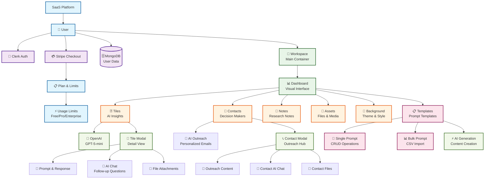

# 🎨 Design System & Data Flow Architecture

Documento visual que explica a hierarquia topológica de dados, fluxos de interface e arquitetura SaaS do produto.

---

## 🏗️ Hierarquia Topológica de Dados

### Diagrama Mermaid



---

## 📊 Explicação Visual da Hierarquia

### 🏢 **Nível 1: Plataforma SaaS**
```
SaaS Platform
├── 👤 User (Conta do usuário)
├── 🔐 Clerk Auth (Autenticação)
├── 💳 Stripe Checkout (Pagamentos)
├── 🗄️ MongoDB (Banco de dados)
└── 📋 Plan & Limits (Planos e limites)
```

### 🏗️ **Nível 2: Core Product**
```
👤 User
└── 🏢 Workspace (Container principal)
    └── 📊 Dashboard (Interface visual)
```

### 🎯 **Nível 3: Dashboard Components**
```
📊 Dashboard
├── 🃏 Tiles (Insights de IA)
├── 👥 Contacts (Tomadores de decisão)
├── 📝 Notes (Notas de pesquisa)
├── 📎 Assets (Arquivos e mídia)
└── 🎨 Background (Tema e estilo)
```

### 🤖 **Nível 4: AI & Templates**
```
📊 Dashboard
└── 📋 Templates (Templates de prompt)
    ├── 💬 Single Prompt (Operações CRUD únicas)
    └── 📊 Bulk Prompt (Importação CSV)
```

### 💬 **Nível 5: Modal System**
```
🃏 Tiles → 📖 Tile Modal
├── 💭 Prompt & Response (Conteúdo original)
├── 💬 AI Chat (Perguntas follow-up)
└── 📎 File Attachments (Anexos)

👥 Contacts → 📞 Contact Modal
├── 📧 Outreach Content (Conteúdo de outreach)
├── 💬 Contact AI Chat (Chat com IA)
└── 📎 Contact Files (Arquivos do contato)
```

---

## 🖥️ Layout da Interface

### 📱 **Mobile Layout** (Breakpoint < 1024px)
```
┌─────────────────────────────────┐
│ [☰] [Company Name] [⋯]          │ ← Header com hamburger esquerdo
├─────────────────────────────────┤
│                                 │
│         Main Content            │ ← Tiles, Contacts, Notes, etc.
│                                 │
└─────────────────────────────────┘
```
- **Sidebar**: Escondido por padrão, acessível via hamburger (☰) no canto esquerdo
- **Overlay**: Aparece quando sidebar está aberto
- **Click outside**: Fecha o sidebar automaticamente

### 💻 **Desktop Layout** (Breakpoint ≥ 1024px)
```
┌─────────────────────────────────────────────────┐
│ Sidebar          │ Header                       │
│ ┌─────────────┐  │ ├─────────────────────────┤  │
│ │ Company     │  │ │ [Company] / Dashboard     │  │
│ │             │  │ │ [🎨] [📋] [Login] [↑]      │  │
│ │ • Earn      │  │ └─────────────────────────┘  │
│ │   Credits   │  └──────────────────────────────┤
│ │             │                                 │
│ │ • Companies │         Main Content            │
│ │   /Entities │         ┌─────────────────┐     │
│ │             │         │ 🃏 Tile Cards    │     │
│ │ • Contacts  │         │ 👥 Contact Cards │     │
│ │             │         │ 📝 Note Cards    │     │
│ │ • Profile   │         │ 📎 Asset Cards   │     │
│ │ • Settings  │         └─────────────────┘     │
│ └─────────────┘                                 │
└─────────────────────────────────────────────────┘
```

---

## 🔄 Fluxos de Dados

### 1. **Geração Inicial** (Home → Admin)
```
Home Form → POST /api/generate → Cookies Store → Redirect /admin
    ↓
Admin Container → useSWR(/api/workspace) → Render Dashboard
```

### 2. **CRUD Operations**
```
UI Action → API Call → Cookies Store Update → SWR Revalidate → UI Update
```

### 3. **AI Generation**
```
User Input → OpenAI API → Store Response → Update UI → Dual-write MongoDB
```

### 4. **Authentication Flow**
```
Guest User → Stripe Checkout → Webhook → Create Clerk Account → MongoDB User → Apply Plan Limits
```

### 5. **Modal Interactions**
```
Tile/Contact Click → Modal Open → AI Chat → Store Messages → Update Component State
```

---

## 🎨 Estados Condicionais da UI

### **Header Buttons** (Login/Upgrade)
```typescript
// Estados baseados em isMember (do useMembership hook)
if (isMember) {
  // Usuário logado → Mostrar botão de upgrade se plano gratuito
  showUpgradeButton = userPlan === 'free'
} else {
  // Guest → Mostrar botão de login
  showLoginButton = true
}
```

### **Feature Access**
```typescript
// Tiles e Contacts sempre disponíveis
// Notes sempre disponíveis
// Assets só para membros logados
if (isMember) {
  showAssetsSection = true
  assetsMessage = "File uploads available on Pro plan. Upgrade..."
} else {
  showAssetsSection = true  // Mostra placeholder
  assetsMessage = "Sign in to upload and manage files..."
}
```

### **Usage Limits**
```typescript
// Aplicado em todas as operações
const canPerform = checkLimit(userId, action)
if (!canPerform.allowed) {
  showUpgradeModal(reason)
  return
}
```

---

## 🔐 Sistema de Autenticação & Limites

### **Guest Mode**
- ✅ Acesso completo ao core product
- ✅ Limites de uso (tiles, contacts, etc.)
- ✅ Dados armazenados em cookies/localStorage
- ❌ Sem acesso a assets/files
- ❌ Sem persistência avançada

### **Member Mode** (Após Stripe Checkout)
- ✅ Tudo do Guest Mode
- ✅ Acesso a assets/files
- ✅ Persistência em MongoDB
- ✅ Limites baseados no plano
- ✅ Sincronização cross-device

### **Upgrade Flow**
```
Guest User → Click Upgrade → Stripe Checkout → Success → Webhook → Create Account → Apply Limits
```

---

## 📱 Responsividade Mobile

### **Breakpoints**
- **Mobile**: `< 1024px` (lg)
- **Desktop**: `≥ 1024px`

### **Mobile Behaviors**
- **Sidebar**: Escondido por padrão, slide-in da esquerda
- **Header**: Hamburger esquerdo + conteúdo direito
- **Touch**: Click outside fecha sidebar
- **Navigation**: Mantém todas as funcionalidades

---

## 🎯 Component Architecture

### **Atomic Design Pattern**
```
Atoms: Button, Input, Icon, Badge
Molecules: Card, Modal, Form Field, Toast
Organisms: Sidebar, Header, Tile Grid, Contact List
Templates: Admin Layout, Home Layout
Pages: Admin Dashboard, Home Landing
```

### **State Management**
```
Local State: useState (component-specific)
Server State: SWR (API data)
Global State: Context (theme, membership, toast)
Persistent: Cookies, localStorage, MongoDB
```

---

*Última atualização: Novembro/2025*
