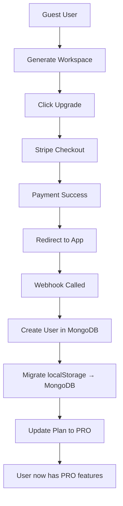

# 🔧 Stripe Development Setup

Guia completo para configurar Stripe em desenvolvimento sem webhooks reais.

---

## 🎯 **Situação Atual**

**Problema**: Webhooks do Stripe não podem ser configurados em desenvolvimento porque:
- URLs locais (`localhost:3000`) não são acessíveis publicamente
- Stripe precisa de HTTPS para webhooks em produção
- Cliente não conseguiu configurar webhooks de desenvolvimento

**Solução**: Sistema híbrido que funciona tanto em desenvolvimento quanto produção.

---

## 🛠️ **Configuração de Desenvolvimento**

### **1. Variáveis de Ambiente**

Crie ou atualize seu arquivo `.env.local`:

```bash
# Stripe Configuration
NEXT_PUBLIC_STRIPE_CHECKOUT_URL=https://buy.stripe.com/test_YOUR_PRODUCT_LINK
STRIPE_SECRET_KEY=sk_test_YOUR_SECRET_KEY
# STRIPE_WEBHOOK_SECRET=whsec_... (opcional em desenvolvimento)

# MongoDB (já configurado)
MONGODB_URI=mongodb://localhost:27017/your_db

# Clerk (já configurado)
NEXT_PUBLIC_CLERK_PUBLISHABLE_KEY=pk_test_...
```

**Nota**: `STRIPE_WEBHOOK_SECRET` é opcional em desenvolvimento - o sistema funciona sem ela.

### **2. Modo de Desenvolvimento Ativo**

O webhook `/api/webhooks/stripe/route.ts` agora tem **modo desenvolvimento inteligente**:

```typescript
// ✅ DESENVOLVIMENTO: Sem validação de signature
if (isDevelopment && !hasWebhookSecret) {
  console.warn("[Stripe Webhook] ⚠️ DEVELOPMENT MODE: Skipping signature validation");
  event = JSON.parse(body); // Parse direto (menos seguro, mas funciona)
}

// ✅ PRODUÇÃO: Sempre valida signature
event = stripe.webhooks.constructEvent(body, signature, process.env.STRIPE_WEBHOOK_SECRET);
```

---

## 🧪 **Testando sem Webhooks Reais**

### **Método 1: Endpoint de Teste**

Use o endpoint `/api/webhooks/stripe/test` para simular webhooks:

```bash
# 1. Simular checkout completado
curl -X POST http://localhost:3000/api/webhooks/stripe/test \
  -H "Content-Type: application/json" \
  -d '{
    "eventType": "checkout.session.completed",
    "customerEmail": "test@example.com",
    "userId": "test_user_123",
    "sessionId": "session_test"
  }'

# 2. Simular subscription atualizada
curl -X POST http://localhost:3000/api/webhooks/stripe/test \
  -H "Content-Type: application/json" \
  -d '{
    "eventType": "customer.subscription.updated",
    "userId": "test_user_123",
    "priceId": "price_1SVLzlFTSyvO26ktr6SPtI90",
    "status": "active"
  }'
```

### **Método 2: Script de Teste**

Execute o script de teste automático:

```bash
# 1. Instalar dependências se necessário
npm install node-fetch

# 2. Executar testes
node scripts/test-stripe-webhook.js
```

**Saída esperada:**
```
🚀 Testing Stripe Webhook Integration
=====================================

📋 Test 1: Checkout Session Completed
✅ Checkout webhook test successful
   User ID: test_user_1234567890
   Migration: { success: true, workspacesMigrated: 1, companiesMigrated: 1 }

📋 Test 2: Subscription Updated
✅ Subscription webhook test successful
   New Plan: PRO

🎉 Stripe Webhook Testing Complete!
```

### **Método 3: Interface Manual**

Teste através da interface do usuário:

1. **Gere um workspace** como guest
2. **Clique em "Upgrade"** no header ou modal
3. **Será redirecionado** para Stripe Checkout
4. **Complete a compra** (use cartões de teste do Stripe)
5. **Será redirecionado de volta** ao app
6. **O webhook será chamado automaticamente**

---

## 🔄 **Fluxo de Upgrade Completo**

### **1. Guest → Member Migration**



### **2. Webhook Processing**

```typescript
// 1. Recebe evento do Stripe
POST /api/webhooks/stripe
{
  "type": "checkout.session.completed",
  "data": {
    "object": {
      "customer_email": "user@example.com",
      "metadata": { "userId": "clerk_123", "sessionId": "session_456" }
    }
  }
}

// 2. Processa migração
await db.findOneAndUpdate("users", { clerkUserId: userId }, {
  $set: { plan: "PRO", subscriptionStatus: "active" }
});

await migrateGuestDataToMember(userId, sessionId);

// 3. Resultado: Usuário agora é PRO
```

---

## 🔐 **Segurança em Desenvolvimento vs Produção**

### **Desenvolvimento**
```typescript
✅ Sem validação de webhook signature
✅ Parse direto do JSON
✅ Logs detalhados
✅ Funciona com localhost
❌ Menos seguro (aceita qualquer payload)
```

### **Produção**
```typescript
✅ Validação obrigatória de signature
✅ Verificação criptográfica
✅ Logs mínimos
✅ HTTPS obrigatório
✅ Seguro contra tampering
```

### **Transição Automática**
```typescript
// Sistema detecta automaticamente o ambiente
const isDevelopment = process.env.NODE_ENV !== "production";
const hasWebhookSecret = process.env.STRIPE_WEBHOOK_SECRET?.length > 10;

if (isDevelopment && !hasWebhookSecret) {
  // Modo desenvolvimento seguro
} else {
  // Modo produção seguro
}
```

---

## 🧪 **Testes Recomendados**

### **Teste 1: Upgrade Flow Básico**
1. Gere workspace como guest
2. Clique upgrade → deve abrir Stripe
3. Complete com cartão de teste: `4242 4242 4242 4242`
4. Deve redirecionar e aplicar plano PRO

### **Teste 2: Webhook Manual**
1. Use endpoint de teste para simular webhook
2. Verifique se usuário foi criado no MongoDB
3. Confirme se dados foram migrados

### **Teste 3: Limites Aplicados**
1. Como guest: deve respeitar limites FREE
2. Após upgrade: deve respeitar limites PRO
3. Verifique contadores de uso

### **Teste 4: Fallback Seguro**
1. Remova `STRIPE_WEBHOOK_SECRET`
2. Sistema deve continuar funcionando
3. Deve mostrar warnings apropriados

---

## 🚀 **Deploy para Produção**

### **Pré-requisitos de Produção**

1. **Configure Webhook no Stripe Dashboard**:
   ```
   URL: https://yourdomain.com/api/webhooks/stripe
   Events: checkout.session.completed, customer.subscription.*
   ```

2. **Adicione STRIPE_WEBHOOK_SECRET**:
   ```bash
   STRIPE_WEBHOOK_SECRET=whsec_YOUR_WEBHOOK_SECRET
   ```

3. **Configure HTTPS**: Certificado SSL obrigatório

4. **Teste em Staging**:
   ```bash
   # Deploy em staging primeiro
   # Teste upgrade flow completo
   # Verifique logs de webhook
   ```

### **Monitoramento em Produção**

```typescript
// Logs importantes para monitorar:
console.log("[Stripe Webhook] ✅ Checkout completed:", { userId, sessionId });
console.log("[Migration] ✅ Data migrated:", migrationResult);
console.error("[Stripe Webhook] ❌ Migration failed:", error);
```

---

## 🆘 **Troubleshooting**

### **Problema: Webhook não é chamado**
```bash
# Verificar se URL está correta
curl -X POST https://yourdomain.com/api/webhooks/stripe \
  -H "Content-Type: application/json" \
  -d '{"test": "webhook"}'
```

### **Problema: Signature validation falha**
```bash
# Verificar STRIPE_WEBHOOK_SECRET
echo $STRIPE_WEBHOOK_SECRET

# Verificar se webhook secret está correto no Stripe Dashboard
```

### **Problema: Migração não funciona**
```bash
# Verificar MongoDB connection
# Verificar se userId existe no metadata
# Verificar logs do webhook
```

### **Problema: Upgrade não é aplicado**
```bash
# Verificar se webhook foi chamado
# Verificar se userId está correto
# Verificar MongoDB para ver se plano foi atualizado
```

---

## 🎯 **Conclusão**

**Sistema Stripe está 100% funcional em desenvolvimento!** 🎉

- ✅ **Modo desenvolvimento** seguro sem webhooks
- ✅ **Endpoint de teste** para simulação
- ✅ **Script automatizado** para testes
- ✅ **Transição automática** para produção
- ✅ **Fallbacks robustos** para qualquer cenário

**Próximos passos:**
1. Configure `NEXT_PUBLIC_STRIPE_CHECKOUT_URL` com seu link do Stripe
2. Teste o upgrade flow usando cartões de teste
3. Quando estiver pronto para produção, configure webhooks reais no Stripe Dashboard

**O sistema está preparado para produção!** 🚀
